# CI/CD with GitHub Actions

This tutorial will demonstrate how you can create a continuous integration pipeline using GitHub 
Actions and set up some external tools that will be used in the pipeline. 

In this tutorial, you will learn how to:

*   Create a GitHub Actions workflow file.
*   Run your pipeline in the cloud.
*   Set up automated builds and testing.
*   Add useful external tools:
    *   Sonar static analysis
    *   Doxygen
    *   Database migration using Microsoft Entity Framework

## Before you start
Before you start working through this tutorial, it might be useful to take a look at the notes 
about Continuous Integration/Deployment, and DevOps in general. This will explain the concepts we 
use in this tutorial. You can find these here: [DevOps notes](https://edinburgh-napier.github.io/remote_test/notes/unit7_devops/).

To work through the steps outlined in this document, you need to have a dotnet project. This 
pipeline should work with any dotnet project, but for this module, make sure you have completed 
the first tutorial on setting up a MAUI project, which you can find here: 
[Getting started with MAUI](https://edinburgh-napier.github.io/remote_test/tutorials/csharp/maui/maui.html).

## 1. GitHub Actions
GitHub Actions is a powerful CI/CD solution integrated into GitHub repositories. It allows 
developers to create workflows that run when certain events occur within a repository. A workflow 
is GitHub's name for a pipeline. For example, you can have a workflow that runs anytime new code 
is pushed to the master branch and checks whether the code builds and runs correctly. 

GitHub Actions can be used for free by anyone as long as the project is open-source. That means 
that the repository that hosts your code must be public. Otherwise, every workflow run incurs 
additional costs.

You can check that your repository for this project is public by going to its main page in 
GitHub. If it is, a "Public" badge will be displayed next to the repository's name.

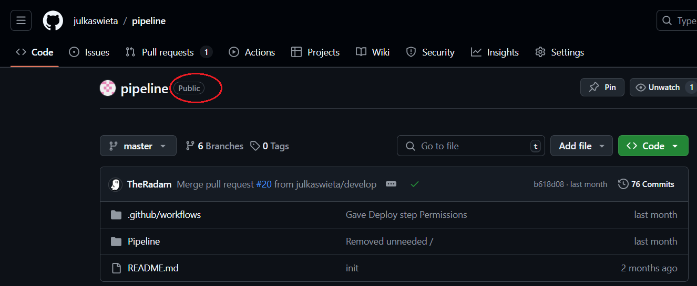

### Workflow File
Creating a standard workflow in GitHub Actions is easy. GitHub provides a wide array of templates 
for creating a new workflow. It can even suggest the most suitable template based on the languages 
you use in your project.  In every GitHub repository, there is an **Actions** tab where you can 
set up a new workflow or monitor your current ones. 

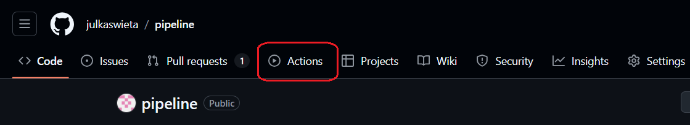

In this tutorial, you will write your own workflow file from scratch to get an in-depth 
understanding of what each line does. If you decide you want to know a bit more about Actions, 
GitHub has a very comprehensive documentation, which you can find here: 
[GitHub Actions documentation](https://docs.github.com/en/actions). 

Every workflow file is in the YAML format, which is commonly used for configuration and uses 
minimal syntax. YAML files can have either the .yaml or .yml extension. Both are accepted by 
GitHub Actions - the choice is personal preference. 

### Syntax
Even though most CI/CD runners use YAML files for their step definitions, each requires a 
different syntax. GitHub Actions is event-oriented, which means that it defines the event that 
will trigger the jobs first. The table below outlines different keywords used in GitHub's 
workflow files that will be used in this tutorial. A full list is available in the documentation: 
[GitHub Actions Syntax Docs](https://docs.github.com/en/actions/writing-workflows/workflow-syntax-for-github-actions).

| Keyword         | Description                                                                                                                                                                   |
|-----------------|-------------------------------------------------------------------------------------------------------------------------------------------------------------------------------|
| **name**        | Sets the name of the workflow, which is used by GitHub Actions to identify specific workflows.                                                                                |
| **on**          | Declares what events will cause the pipeline defined in the file to run. There can be one or more of these. Examples of events include pushes or pull requests.               |
| **jobs**        | A collection of high-level stages in the pipeline. Each job has a set of steps to execute. For example, you can have a build job and a deploy job.                            |
| **runs-on**     | Specifies which operating system will run your job.                                                                                                                           |
| **steps**       | List of steps contained in a job. Each step starts with `- name: <name of step>`. Each step has its own commands to run or configurations to set up.                          |
| **uses**        | Specifies an existing action to be used within the step. They can come from GitHub's marketplace or a repository.                                                             |
| **run**         | Runs a command or script. Tip: You can run a sequence of commands using pipes.                                                                                                |
| **with**        | Typically used in conjunction with **uses**, it provides input parameters for an action to configure how it runs.                                                             |
| **if**          | Adds a conditional statement to a job or a step.                                                                                                                              |
| **env**         | Defines environment variables for a job or a step. This can be used to pass parameters to a command, script or action.                                                        | 
| **permissions** | Specifies what resources the job can access within the repository.                                                                                                            |
| **needs**       | Specifies job dependencies, which means that the job after the keyword must run first in order for this job to run successfully. Essentially declares the order of execution. |

> Note: When you specify multiple events after the `on` keyword, all jobs contained in the same 
> workflow file will run whenever any of those events occur. If you need different workflows to 
> run on occurrence of different events, you will need to include multiple workflow files.

Here is a template for a basic workflow file:

``` yml
name: <Name of your pipeline> 

# What events cause the pipeline to run
on:
  push:
    branches:
      - master # Will only run when a change is made to master (including a merge)

jobs:
  <Name of job>:

    # The OS that the runner will use
    runs-on: windows-latest

    # A list of steps to run
    steps:
      - name: <Name of step>
        run: echo "Some command" 
```

### Secrets and environment variables
You might sometimes need to use sensitive values to configure your CI/CD pipelines successfully. 
Since they should be kept private, it is a very bad idea to commit them to a repository, 
especially if it's public. Locally, you can manually create configuration files and fill in the 
sensitive information yourself, or if you are working in a company this might be sent to you over 
secure channels. 

CI/CD pipelines run automatically in the cloud so they don't have access to those local files. 
GitHub provides us with **secrets**. They are encrypted values used to store sensitive information 
securely. They are not visible in the repository, but Actions can still access them. 

You should use secrets for anything that could be exploited to gain unauthorised access, e.g. 
connection strings, API keys, passwords, access tokens etc. We'll flag it up when you need to do 
this for this project.

## 2. Basic workflow setup
Now that you understand the syntax used in workflow files, you can move on to implementing your 
own workflow. 

> It might be a good idea to create a new branch before you start making any changes, e.g. 
> `feature/workflow`. 

### Setting up your workflow file
To set up your first GitHub Actions workflow manually, create a `.github` directory in the root 
folder of your project (note the leading dot) and a `workflows` directory inside it. Then, create 
a file named `build.yml` which will store all instructions for your pipeline. Any `.yml` or 
`.yaml` file in this folder will be interpreted as a workflow in GitHub Actions. Your file 
structure should look like this:

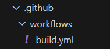

The first step in creating pipelines is deciding what events will trigger the runs. It could run 
anytime something is pushed to any of the branches, or only to some selected branches. Another 
option is to run the workflow on pull requests, which we will use as an example in this tutorial. 
A full breakdown can be found in the documentation: [Triggering a workflow](https://docs.github.com/en/actions/writing-workflows/choosing-when-your-workflow-runs/triggering-a-workflow). 

Start defining you workflow by putting the following code in the `build.yml` file:

```yml
name: Build & Test # Name can be anything else you want

on: 
  [pull_request]
```

### Setting up the environment
You can now move on to defining what jobs and actions will be executed in the workflow. You also need to decide what operating system will be used for the runner. For this project, we will use the lastest version of Windows. Add this code to your workflow file:

```yml
jobs:
  build: # This is just the name of the job, it can be changed to something else if you wish
    
    runs-on: windows-latest
```

Now you can start defining the order of the steps in the job. Usually, the starting point is ensuring that the workflow can access the source code. In GitHub Actions, you can use a standard action that checks out the code from the repository. You can do this by using this code:

```yml
jobs:
  build:

    runs-on: windows-latest

    steps:
    - name: Checkout code
      uses: actions/checkout@v4
```

The next step is ensuring that the environment is set up properly and all tools needed to build the code are installed. In .NET projects, this involves setting up the .NET SDK, and restoring workloads and dependencies. 

To set up the SDK, you can use a standard action and provide it with the version of .NET that you require, in this case 8.0:

``` yml
    - name: Setup .NET
      uses: actions/setup-dotnet@v4
      with:
        dotnet-version: 8.0
```

Workloads in .NET projects are various additional tools, libraries or features that are not included in the SDK by default, for example, MAUI. They are defined in the `.csproj` file so the command needs a correct path to that file. 

> It's important to remember that all commands in the workflow will be executed from the root of your project, so you must supply a relative path to your `.csproj` file, e.g. `./Project/Project.csproj`. Make sure the paths are relative to the root of the project, not the workflows folder. 

```yml
    - name: Restore workloads
      run: dotnet workload restore <Path to .csproj>
```

Apart from restoring workloads, you must also restore dependencies to ensure the project works properly. This can be done by adding this step:

```yml
    - name: Restore dependencies
      run: dotnet restore <Path to .csproj>
```

### Building the project
Now that you've got the source code checked out and the environment set up, you can move on to building the project. This is done by running `dotnet build` like so:

``` yml
    - name: Build project
      run: dotnet build <path to .csproj file>
```
> Note: When building a MAUI app, you might need to specify what framework to use for the build. You can do this by appending the `--framework` argument to the command above like so: `--framework net8.0`

### Optional: Adding environment variables to GitHub
You might notice that you are reusing certain values throughout your pipeline, such as the path to your project file. To encourage reuse, you can set up a variable in GitHub to make future modifications more efficient.

To add a variable, navigate to the Settings tab in the repository 

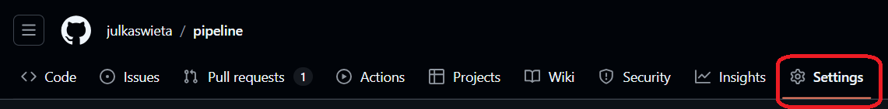

In the menu on the left, navigate to `Secrets and variables` > `Actions`


Switch to the `Variables` tab and select `New repository variable`.

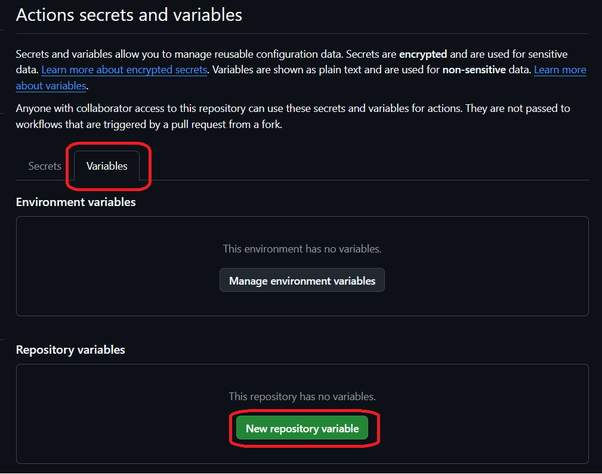

This will take you to a page where you give a name to your variable, e.g. `CSPROJ_PATH`, and the value, which is the path to your `.csproj` file in this example.

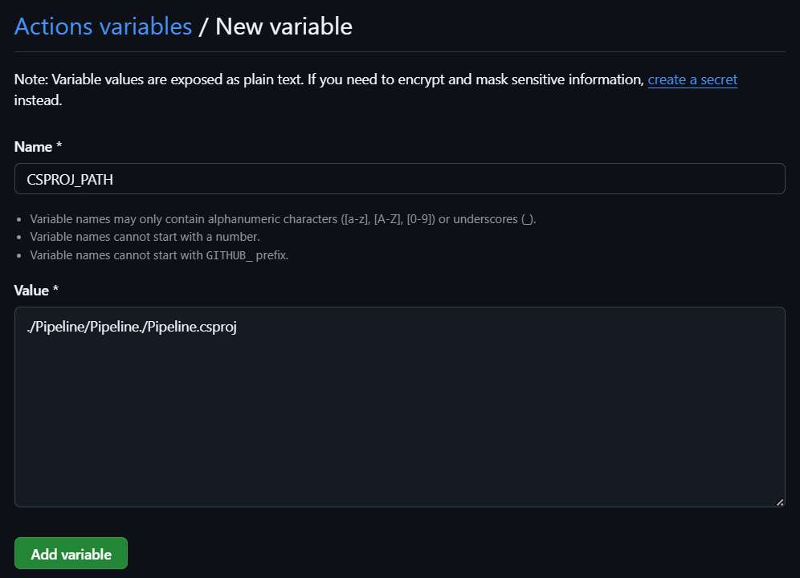

After you add the variable in GitHub, you can use it in your workflow file like this:

```yml
- name: Build
  run: dotnet build ${{ vars.CSPROJ_PATH }}
```

### Testing the code
Testing is a critical element of any CI/CD pipeline. Automatically running a suite of tests speeds up development significantly, while ensuring that the application remains fully functional and the recent changes have not introduced any bugs (or at least the bugs covered by tests).

In GitHub Actions, you can run tests as part of the workflow. Usually, you'll want to have a separate step for this after the build step. To test a .NET project, you can use this command, which will run all tests included in the entire solution. 

> Note: in all previous steps, you needed a path to the `.csproj` file, but in this case, it's the `.sln` file because tests will usually be defined in a separate project that makes use of the base project. The solution file brings them both together so they can communicate. 

``` yml
    - name: test
      run: dotnet test <path to .sln>
```

### Checking whether your pipeline works
At this point, you can commit your changes and push them to the remote repository. Then, when you open a pull request to merge your changes to another branch, you will trigger your workflow run. You should know how to open a pull request from previous tutorials. 

If your workflow is set up correctly, you should be able to see it on the pull request page after a few seconds. If you click on `Details`, it will take you to the summary of the run in the Actions tab.

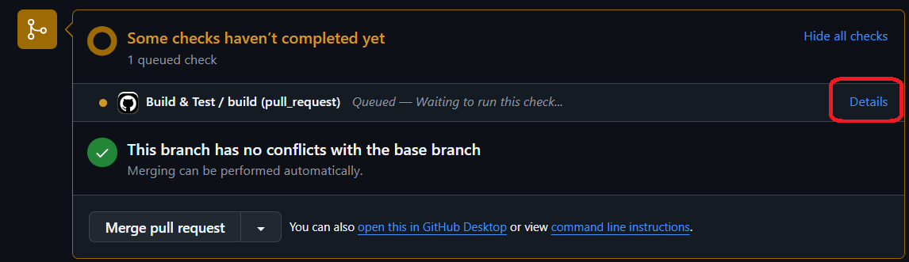

You will see a screen similar to this: 

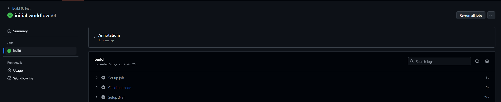

In the panel on the left, from the top, you can see:
- the name of the workflow, 
- the name of the pull request the run is part of and the status of the entire workflow
- Summary tab
- list of jobs with their statuses
- Run details such as resource usage and the workflow file that was used for the run

If all statuses are green, that means your pipeline ran successfully. 

In the bigger panel on the right, you can see a list of steps that were executed in the run. Have a look at it to verify that all steps you expect to see are there. You can expand each step to see what its output was by pressing the `>` next to the step's name.


## 3. Extending your pipeline with external tools
You now know how to create a basic pipeline that builds and tests your code. You can expand the pipeline by adding external tools for static code analysis, database migrations, documentation generation or many other things that will add value to the automatic runs.

### Static code analysis with SonarQube Cloud
Static code analysis can tell us a lot about the quality of the code written. SonarQube Cloud is a cloud-based version of the SonarQube code analyser. You can find information about the local usage of SonarQube in this tutorial: [SonarQube](https://edinburgh-napier.github.io/remote_test/tutorials/tools/sonarqube/).

#### Setting up a SonarCloud account, organization and project
To use the cloud version of Sonar, you have to create an account on their website. You can find it here: [SonarQube Cloud signup](https://www.sonarsource.com/products/sonarcloud/signup/). Since we are using GitHub to store the repository, you should sign up using GitHub. If you do that, you will be asked to authorize SonarCloud to gain access to certain details of your GitHub account, which you should accept by pressing the `Authorize SonarCloud` button. 


Once your account is ready, you will be taken to the getting started screen, where you can import the organization that owns your repository from GitHub. You should have that set up if you worked through the first tutorial. If not, you can manually create an organization in Sonar by clicking on the underlined `create a project manually`. 

> Setting up a project manually in SonarQube is not recommended as it leads to missing features like analysis feedback in the Pull Request. We recommend you go back and setup an organization in GitHub to host your code. If you still decide against it, you can follow the on-screen instructions to create a manual organisation. 

We're going to assume you have an organisation in GitHub so select `Import an organization`.


On the next page, select which organisation you want to use. Then, you will be asked for permission to intall Sonar on your organisation. Since we only need the analysis on one repository, choose the `Only select repositories` option and select the correct repository, then proceed by pressing `Install`.

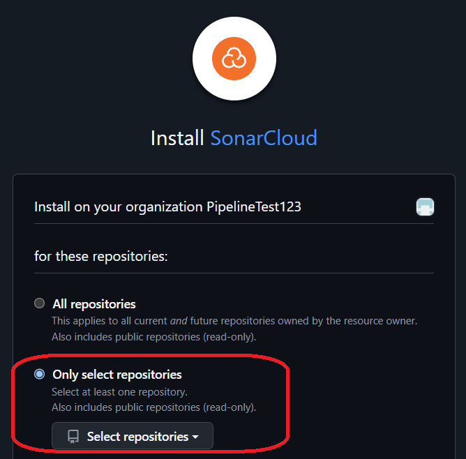

On the next page, you will be asked for the name and the key of the project - keep them as is. You also need to choose the payment plan so make sure to select the free one to avoid any extra costs. Proceed by pressing `Create organization`.

Now that your Sonar organization is set up, you have to select the repositories that will be included in the Sonar project you are creating. Select the correct one and continue by pressing `Set up`. 

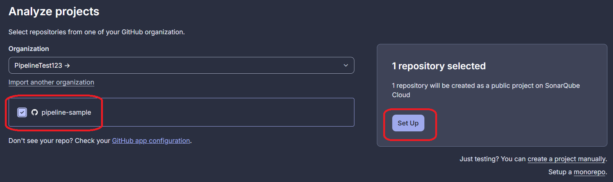

Finally, you need to choose what Sonar considers new code in the repository. You have two choices which are explained in the screenshot below. You should proceed with the `Previous version` one. Then, you can finally create the project.

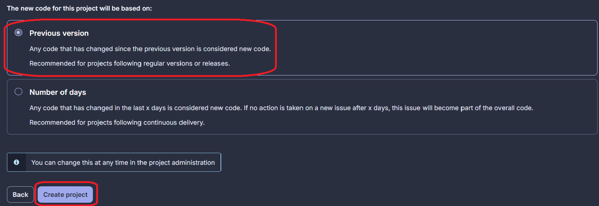

#### Adding Sonar Token as a repository secret
SonarCloud can be integrated with your workflow so that anytime the workflow runs, it will trigger a static code analysis by Sonar. 

The first step to setting this up is adding a secret in GitHub that contains an access token for Sonar. To find out what the token is, follow the steps below:

In your main project page in Sonar, go to `Administration` and then select `Analysis Method`.

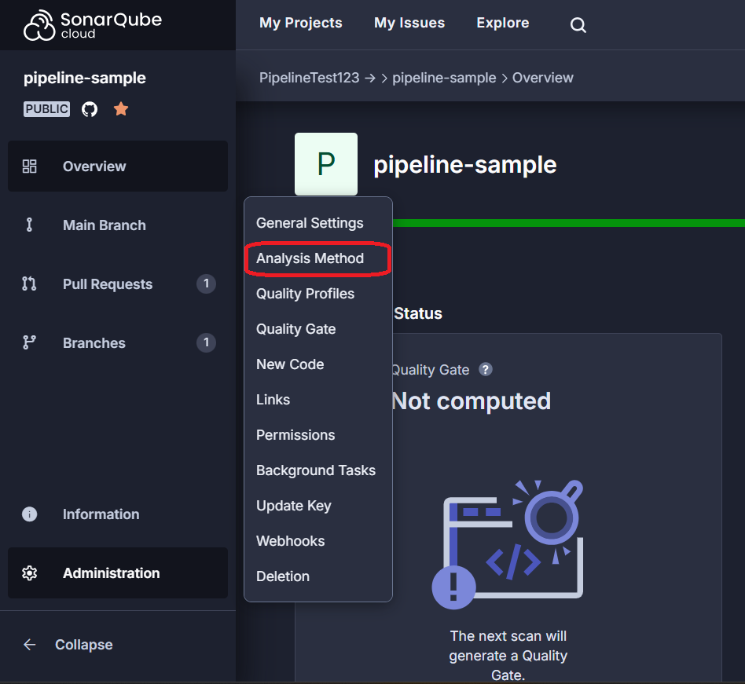

At the bottom of the page, select `With GitHub Actions`.

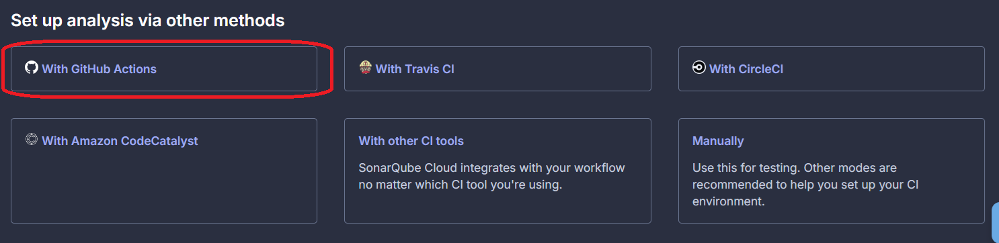

On the final page, make sure you disable automatic analysis and then copy the value of SONAR_TOKEN. 

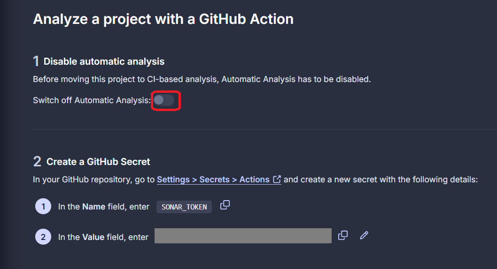

You can now add the secret in GitHub Actions, in a similar way as you previously added the environement variable. Go to the `Actions secrets and variables` tab in the repository settings. Make sure you are in the `Secrets` tab and then add a new secret with the name `SONAR_TOKEN` and the value copied from Sonar. Without this, your workflow will fail as it won't be able to connect to Sonar properly. 

> Don't proceed with adding the steps if you don't have the token as a repository secret.

#### Adding Sonar steps to the workflow
Now it's time to modify the workflow file to include static analysis by SonarCloud. Unfortunately, the setup required before running the scanner is a bit lengthy because Sonar carries its own dependencies and needs to be installed before it can be used. Fortunately, SonarCloud provides all the configuration in their documentation: [SonarQube docs](https://docs.sonarsource.com/sonarqube/10.6/devops-platform-integration/github-integration/adding-analysis-to-github-actions-workflow/)

> **Important!!** In the workflow file, you should set up Sonar at the same stage you are setting up the environment for the project itself. So the following Sonar setup steps should be placed after the `Restore dependencies` step but before the `Build` step. 

The SonarCloud Scanner internally requires a Java runtime environment to execute. Without it, the scanner won't run, even for non-Java projects so the first step in Sonar's environment setup is setting up the JDK, which is done through a standard action. Place the following code in the right place in your workflow file:

``` yml
    #Setup a Java JDK
    - name: Set up JDK 17
      uses: actions/setup-java@v4
      with:
        java-version: 17
        distribution: 'zulu'
```

The next step is to get the cached dependencies. If no dependencies are cached, this step will simply do nothing and all necessary dependencies will need to be installed later. If there are some cached dependencies, they will be restored to speed up the process. Paste the following code below the JDK setup:

```yml
    # Get the SonarCloud dependencies from cache
    - name: Cache SonarCloud packages
      uses: actions/cache@v4
      with:
        path: ~/sonar/cache
        key: ${{ runner.os }}-sonar
        restore-keys: ${{ runner.os }}-sonar
```

In the next two steps, the first one will try to get the SonarCloud scanner from cache but if it's not found, the second one will install it. Paste the following code below the `Cache SonarCloud packages` step. Note that you must provide the path to your project folder in the second step. 

> Your project folder is the one where you have your `.sln` file. 

```yml
    # Get the SonarCloud scanner from cache
    - name: Cache SonarCloud scanner
      id: cache-sonar-scanner
      uses: actions/cache@v4
      with:
        path: ./.sonar/scanner
        key: ${{ runner.os }}-sonar-scanner
        restore-keys: ${{ runner.os }}-sonar-scanner

    # Install the SonarCloud Scanner
    - name: Install SonarCloud scanner
      if: steps.cache-sonar-scanner.outputs.cache-hit != 'true'
      run: |
        mkdir -p ./.sonar/scanner
        cd <Path to your project folder>
        dotnet tool update dotnet-sonarscanner --tool-path ../.sonar/scanner
```

These are all the steps needed to set up SonarCloud. Now you can move on to setting up the analysis. The way it works is you start the scanner, build and test your project, and then stop the scanner. This means that the build and test steps need to be encapsulated by the sonar start and end steps, like in the code below.

> Make sure the build and test steps are between the Sonar start and Sonar end steps. Also make sure to replace the organisation and project keys with your own (see steps below).


```yml
    - name: Start Sonar Analysis
      env:
        SONAR_TOKEN: ${{ secrets.SONAR_TOKEN }}
      run: |
        ./.sonar/scanner/dotnet-sonarscanner begin /k:"<key>" /o:"<organisation>" /d:sonar.token="${{ secrets.SONAR_TOKEN }}" /d:sonar.host.url="https://sonarcloud.io" /d:sonar.scanner.scanAll=false /d:sonar.cs.vscoveragexml.reportsPaths=coverage.xml

    #Build and test steps here
    #
    #
    #

    - name: End Sonar Analysis
      env:
        SONAR_TOKEN: ${{ secrets.SONAR_TOKEN }}
      run: ./.sonar/scanner/dotnet-sonarscanner end /d:sonar.token="${{ secrets.SONAR_TOKEN }}"
```

Make sure that you replace `<organisation>` with Sonar organisation key and `<key>` with your Sonar project key (keep the double quotes around these values). You can find them in the Information tab:

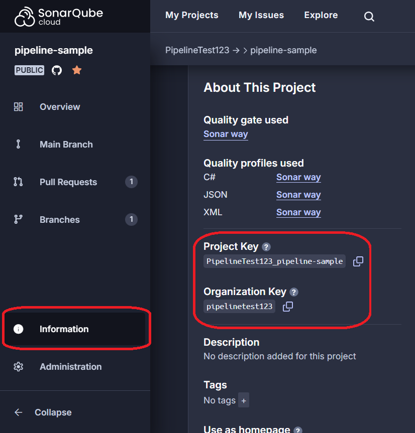

Also, note the use of the `SONAR_TOKEN` secret in the code. Using this notation you can use any other secrets you add to the repository. 

Your workflow should now be set up to automatically run Sonar analysis. Go ahead and commit and push your changes. Then, if you still have a pull request open on the same branch, the workflow will be triggered automatically. If not, you can open a new PR. Make sure to check whether your pipeline ran successfully in the `Actions` tab in GitHub.

The results of the analysis will be available in the SonarCloud interface. 

### Automatic documentation generation with Doxygen
Documentation is important, especially in larger projects with multiple contributors. Doing this manually can be time-consuming but fortunately, it can be sped up by using automatic documentation generators like Doxygen. 

Doxygen is a tool that generates a web-based representation of your project's documentation and takes care of all formatting for you. It takes the comments from your code and produces HTML files with all of the details. You can learn more about Doxygen in this document: [Documentation](https://edinburgh-napier.github.io/remote_test/notes/unit6_applications/documentation.html).

Here is an example of documentation generated by Doxygen:

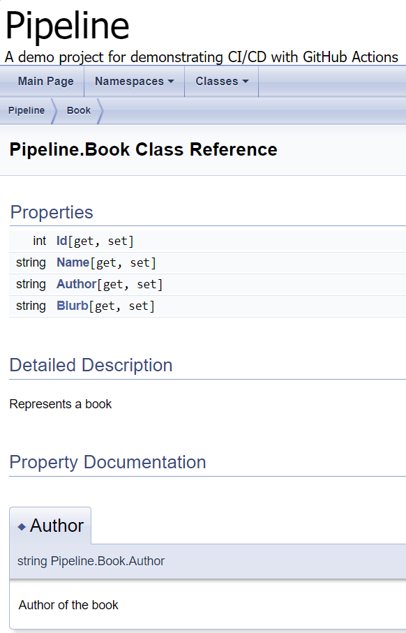

Since documentation should be stable and reflect the stable version of the code, it might be a good idea to include documentation generation in a workflow that runs only when changes are pushed to the master/main branch, which we suggest in this tutorial. 

The current workflow runs on any pull requests, so you need to create a new file in the `workflows` folder. Here is the initial code that checks out code from the repository:

``` yml
name: Documentation 

on:
  push:
    branches:
      - master

jobs:
  generate:
    runs-on: ubuntu-latest 

    steps:
    - name: Checkout code
      uses: actions/checkout@v4
```

Doxygen must be installed on the workflow runner, which can be done with this step:

```yml
    - name: Install Doxygen
      run: sudo apt-get install doxygen -y
```
Doxygen requires the presence of a configuration file called Doxyfile. It defines rules about how the final documentation should be generated, e.g. formatting. You should have a Doxyfile in the project folder, but if you don't, then you can generate the default one by running `doxygen -g`.

Once you are sure you have the Doxyfile, you can generate documentation using the command below. 

> Once again, remember that workflows run in the root folder of your repository so you must provide a path relative to that folder. 

```yml
    - name: Generate Doxygen Documentation
      run: doxygen <path to Doxygen file>
```

#### Automatic deployment of the documentation
The steps above generate the documentation but it would be better if we could access it from the web. You can use GitHub Pages to do this. The generated artefacts can be uploaded and used to deploy the documentation to GitHub Pages.

First you must add a step which will upload the artifacts generated in the previous step to Github Pages. This uses a pre-defined action:

``` yml
    - name: Upload static files as artifact
      uses: actions/upload-pages-artifact@v3 
      with:
        path: html
```

You will need to grant write permissions to the job so it can access Github Pages. To declare this, you can add these lines to the `generate` job like so:

```yml
jobs:
  generate:
    runs-on: ubuntu-latest 

    permissions:
      pages: write
      id-token: write 
```
> The job also needs permissions to generate an OIDC token (`id-token: write`). If you want to learn more about what they are, you can check out this article: [ID Token vs Access Token](https://auth0.com/blog/id-token-access-token-what-is-the-difference/).
 
Now that GitHub Pages has access to the generated documentation, you can add a new job that deploys the documentation. The job also needs the write permissions. Additionally, you should specify the environment to integrate with GitHub Pages and store the URL of the deployed site so you can access it easily. 

> The `needs` keyword specifies that this job requires the `generate` job to run. If the `generate` job fails, the `deploy` job will not run, so the documentation will not be deployed.

``` yml
  deploy:
    needs: generate # will only run after the generate job completes
    runs-on: ubuntu-latest

    permissions:
      pages: write
      id-token: write

    environment:
      name: github-pages
      url: ${{ steps.deployment.outputs.page_url }}

    steps:
      - name: Deploy to GitHub Pages
        id: deployment
        uses: actions/deploy-pages@v4
```
> The deployment can also be bundled with the generation. That would simplify things and remove the need for the step where you upload the static files as artefacts since the deploy step could see them without it. However, to keep things modular, we decided to separate them into two jobs.

The last step to make sure everything works is enabling GitHub Pages in your repository. Navigate to repository Settings and select Pages in the menu on the left. Then, make sure that `GitHub Actions` is selected as the source in the dropdown menu.

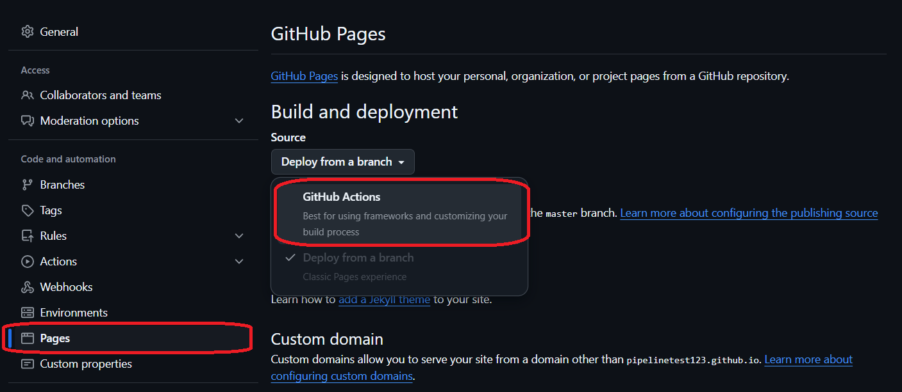

Go ahead and commit and push the changes now. If you still have that pull request from before open, the basic build workflow will be triggered. Then, when you decide to merge it into the master branch, the documentation workflow will be triggered and will deploy the docs to GitHub Pages. Try it out yourself and make sure if your workflows ran successfully in the `Actions` tab. 
