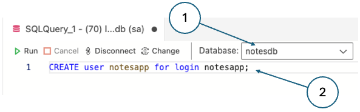

# Adding a database

This tutorial takes you through the process of converting your notes app to use a database instead of 
storing notes as a series of text files. It makes use of the Microsoft 
[sample MAUI apps](https://github.com/dotnet/maui-samples) provided on GitHub.

You need to have completed the initial 
[notes app tutorial](../maui/maui.md) **and** the follow-on [MVVM tutorial](../mvvm/mvvm.md). 
The code that you end up with after the MVVM tutorial provides the starting point for this one.

Here, we will take advantage of the dependency injection framework built into .NET MAUI to manage 
access to the database.

## 1. Preparation

Open the solution in Visual Studio and check that you have the following viewmodels:  

* `AboutViewModel.cs`
* `AllNotesViewModel.cs`
* `NoteViewModel.cs`


{: .note-title}
> <i class="fa-solid fa-circle-info"></i> Note
>
> If you have _NotesModel.cs_ instead of _AllNotesViewModel_, change its name by following these steps:
> 
> 1.  Right-click on the viewmodel in the **Solution Explorer** and select _Rename..._
> 2.  Type in the new name and press ENTER
> 3.  Edit the file and change the name of the class to _AllNotesViewModel_
> 4.  Open the file _AllNotesPage.xaml_ and update the reference to the viewmodel on line 8

Go through each of the viewmodels and make sure that the accessibility level of the main class is 
`public`. Do the same for the _**Note**_ model.

Run the application to check that it behaves as it should.

### Install some new tools

To complete this exercise you will need to install two new tools if you do not yet have them:

* [Docker](https://www.docker.com/): A virtualisation tool that allows you to run software 
  applications in containers rather than install them natively on your computer. 
* [Azure Data Studio](https://learn.microsoft.com/en-us/azure-data-studio/): A Microsoft database 
  management tool.
* [DataGrip](https://www.jetbrains.com/help/datagrip/getting-started.html): A database management tool.

Please follow the instructions provided on the respective websites to install these two tools for 
your operating system

### Install some new NuGet packages

Add the latest versions of the following NuGet packages as you have done before by right-clicking on 
the _Notes_ project in the **Solution Explorer**.

* Microsoft.EntityFrameworkCore
* Microsoft.EntityFrameworkCore.SqlServer
* Microsoft.Extensions.Configuration.Json

Entity Framework (EF) is an object-relational mapper (ORM) that takes care of translating the 
object-oriented structures in the C# code to relational ones and vice versa.

### Pull and run the SQL Server Docker image

Using Docker ensures consistency across different platforms. If you are working on Windows or Linux, a 
native installation of SQL Server is possible. However, later on, we will move to an architecture that 
uses a shared SQL Server database hosted on a Linux machine and using Docker replicates that 
environment locally. Theoretically, it should make no difference to our C# code whether we are using 
a native installation or a containerised one. However, a good rule of thumb is to minimise differences 
between environments where possible.

{: .note-title}
> <i class="fa-solid fa-circle-info"></i> Note
>
> The format of Docker commands is the same on all platforms; however, on Mac or Linux, commands 
> should be prefixed with `sudo`

1.  Pull the SQL Server Express Linux Docker container using the command below at the command line
    
    ``` bash
    docker pull mcr.microsoft.com/mssql/server:2025-latest
    ```
    
2.  Still at the command line, execute the following command to run the Docker container.
    
    ``` bash
    docker run -e "ACCEPT_EULA=Y" -e "MSSQL_SA_PASSWORD=<YourPassw0rd>" -p 1433:1433 --name sql1 --hostname sql1 -d mcr.microsoft.com/mssql/server:2025-latest
    ```
    
{: .note-title}
> <i class="fa-solid fa-circle-info"></i> Notes
>
> * The -e switch sets an environment variable. The first accepts the EULA and the second sets the password for the `sa` user - replace `<YourPassw0rd>` with the password that you want to use.
> * The -p switch maps the default TCP port (1433) to a local port. In this case the same one is used.
> * The --name and --hostname parameters set the name and hostname of the container.
> * The -d switch specifies which image file to use.
> * <i class="fa-brands fa-apple icon"></i> If you are running on an Apple Silicon Mac, you will need to add the additional parameter `--platform=linux/arm64`

The return value from a successful container launch is a long hexadecimal string. Examine any error 
messages and resolve the issues before continuing. For more information, see the 
[Microsoft documentation](https://learn.microsoft.com/en-gb/sql/linux/quickstart-install-connect-docker?view=sql-server-ver16&tabs=cli&pivots=cs1-bash).

## 2. Set up the database

### Connect to the database server

Azure Data Studio]{: .btn .btn-blue .tab-control data-tabset="tools" data-seq="1" }

DataGrip{: .btn .tab-control data-tabset="tools" data-seq="2" }

> This is the first tab
>
>    * Can I still use markdown?
> 
{: .tab data-tabset="tools" data-seq="1" }

> This is the second tab
>
{: .tab data-tabset="tools" data-seq="2" }

Open Azure Data Studio (ADS) and create a new connection. You can use the parameter values shown in 
Fig. 1. to connect to your SQL Server container. The password is the one you specified when you 
started the container.

{: standalone .w30 #fig1 data-title="Creating a local database connection in Azure Data Studio" }

SQL Server is a database _server_. That is, it provides for multiple databases, each of which has its 
own purpose and permissions. After connecting, you can see that only system databases currently exist. 
These are used to manage the server itself and must not be modified. Note too that you are logged in 
as the `sa` user - this is the default system administration account which should not be used for 
routine database tasks.

In the next step, we will set up a user account and database for the Notes app.

### Database setup

Access permissions can be enforced at both the server level and the level of an individual database. 
For this reason, two steps are required to create a database user account with permission to log into 
the server.

1. **Create a new login**

   In ADS, right-click on the master database as shown in Fig. 2 and select _New Query_.

   {: standalone .w30 #fig2 data-title="Starting a new query in Azure Data Studio" }

   The next page provides a field where you can type in 
   [Transact-SQL](https://learn.microsoft.com/en-us/sql/t-sql/language-reference?view=sql-server-ver16) 
   (T-SQL) commands. Enter the following command to create a new server-level login and then click 
   _Run_ as shown in Fig. 3. Note that the password must meet the strength that SQL Server requires by 
   being at least 8 characters long and containing characters from three of the following four sets: 
   Uppercase letters, Lowercase letters, Base 10 digits, and Symbols.

   ``` sql
   CREATE LOGIN notesapp WITH PASSWORD='N0tesApp$';
   ```

   {: standalone .w30 #fig3 data-title="Creating a server-level login in Azure Data Studio" }

2. **Create a new database**

   In the explorer sidebar of ADS, click on the plus sign next to _Databases_ as shown in Fig. 4.

   {: standalone .w30 #fig4 data-title="Creating a new database in Azure Data Studio" }

   Call the new database _notesdb_, and leave all the other options with their default values.

3. **Create a user in the new database**

   A _user_ is defined at the level of an individual database. The first step is therefore to change 
   to the _notesdb_ database as shown in Fig. 5. Then execute the following command

   ```sql
   CREATE user notesapp for login notesapp;
   ```

   {: standalone .w30 #fig5 data-title="Creating a new user for the notesapp login in Azure Data Studio" }

4. **Grant permissions to the new user**

   With the notesdb database still active, execute the following T-SQL command to grant all 
   permission to the notesapp user:

   ```sql
   GRANT control on DATABASE::notesdb to notesapp;
   ```

   Next, disconnect from SQL Server using the icon in the explorer pane and edit the details of the 
   connection. Replace `sa` with `notesapp`, and the sa password with `N0tesApp$`. When you reconnect, 
   you are using the new user account that you set up.

5. **Create the NOTE table**

   Here we recreate the NOTE table as shown in Fig. 6. Use the T-SQL script below to set the table up 
   using ADS.

   {: standalone .w10 #fig6 data-title="The NOTE table" }

   ```sql
   -- Create NOTE table
   CREATE TABLE note (
       id INT IDENTITY(1,1) PRIMARY KEY,
       text NVARCHAR(MAX) NOT NULL,
       date DATETIME2 DEFAULT SYSDATETIME()
   );
   ```

## 3. Change the way the binding context is set

Now that the database is ready we can turn our attention to the application code. Currently, the 
binding context for a content page is set using a xaml element. For reasons that will become clear 
later, we need to modify the code so that the binding context is set in C# code. We can do that by 
removing the relevant lines in each of the two xaml files and replacing them with equivalent 
statements in the related code behind C# files. For more details on setting the binding context, 
see the [Microsoft documentation](https://learn.microsoft.com/en-us/dotnet/maui/fundamentals/data-binding/basic-bindings).

Open _All_NotesPage.xaml_, find the lines below (around line 8) and remove them.

```xml
<ContentPage.BindingContext>
    <viewModels.AllNotesViewModel />
</ContentPage.BindingContext>
```

Open _All_NotesPage.xaml.cs_ and change the constructor so that it matches the code below.

```c#
public AllNotesPage()
{
    this.BindingContext = new AllNotesViewModel();
    InitializeComponent();
}
```

You will also need to add the relevant `using` statement at the top of the file.

Make the equivalent changes in _NotePage.xaml_ and _NotePage.xaml.cs_. We do not need to change 
_AboutPage_ because it does not need to access the database.

Run the app to check that it behaves as expected.

## 4. Create a configuration file

In this step, we create an application configuration file in JSON format using common naming 
conventions.

1. Add a new file `appsettings.json` under the project directory 
2. Paste the code below into the new file replacing `IP_ADDRESS` with the IP address of your computer. 
   Please note that `127.0.0.1` and `localhost` will not work here. That is because the database runs 
   inside a Docker container rather than directly on your machine.

    ```c#
    {
        "ConnectionStrings": {
            "DevelopmentConnection": "Server=IP_ADDRESS;Database=notesdb;User Id=notesapp;Password=N0tesApp$;TrustServerCertificate=True;Encrypt=True;"
        }
    }
    ```

3.  Add the following lines at the end of the _Notes.cproj_ file before the closing `</Project>` tag. 
    The file can be accessed from the **Solution Explorer** by clicking the _Notes_ project node.
    
    ```xml
    <ItemGroup>
        <EmbeddedResource Include="appsettings.json" />
        <None Update="appsettings.json">
            <CopyToOutputDirectory>Always</CopyToOutputDirectory>
        </None>
    </ItemGroup>
    ```
    
4.  Add the following lines at the start of the file MauiProgram.cs
    
    ```c#
    using System.Reflection;
    using Microsoft.Extensions.Configuration;
    ```
    
5.  Add the following lines into MauiProgram.cs after the creation of the builder object
    
    ```c#
    var a = Assembly.GetExecutingAssembly();
    using var stream = a.GetManifestResourceStream("Notes.appsettings.json");
    
    var config = new ConfigurationBuilder()
        .AddJsonStream(stream)
        .Build();
    
    builder.Configuration.AddConfiguration(config);
    ```

Up to this point, your app should still run as it did before. We have made some preparatory changes, 
but we have not changed the way the notes are stored and retrieved.

## 5. Create a database context

A database wrapper class abstracts the data access layer from the rest of the app. This class 
centralises query logic and simplifies the management of database initialization, making it easier 
to refactor or expand data operations as the app grows. Create the wrapper class in a directory 
called _**Data**_ under the project as shown in Fig. 7.

{: standalone #fig7 data-title="Database context file" }

Entity Framework uses the [`DbContext`](https://learn.microsoft.com/en-us/ef/ef6/fundamentals/working-with-dbcontext)
to handle all interactions with the database.

A _derived context_ represents a session with the database, allowing us to query and save data. We 
define a context that derives from `System.Data.Entity.DbContext` and exposes a typed 
`DbSet<TEntity>` for each class in our model. A 
[`DbSet`](https://learn.microsoft.com/en-us/dotnet/api/system.data.entity.dbset-1?view=entity-framework-6.2.0) 
is a set of records of a particular type returned from the database.

Paste the code below into _NotesDbContext.cs_:
    
```c#
using Microsoft.EntityFrameworkCore;
using Notes.Models;

namespace Notes.Data;
public class NotesDbContext : DbContext
{

    public NotesDbContext()
    { }
    public NotesDbContext(DbContextOptions options) : base(options)
    { }

    public DbSet Notes { get; set; }

}
```

Notice that the class constructor enables us to inject options into the `DbContext`. This is how we 
pass in the details from the _appsettings.json_ file that we created earlier.

We also need to register `NotesDbContext` as a service in _MauiProgram.cs_. We will take the 
opportunity to register our views and viewmodels at the same time. Add the following code to the 
file after thr line that loads the configuration. There are three sections related to the services, 
viewmodels and views respectively. Add `using` statements at the top of the file as needed.

```c#    
var connectionString = builder.Configuration.GetConnectionString("DevelopmentConnection");
builder.Services.AddDbContext<NotesDbContext>(options => options.UseSqlServer(connectionString));

builder.Services.AddSingleton<AllNotesViewModel>();
builder.Services.AddTransient<NoteViewModel>();

builder.Services.AddSingleton<AllNotesPage>();
builder.Services.AddTransient<NotePage>();
```

Microsoft's [dependency injection framework](https://learn.microsoft.com/en-us/dotnet/architecture/maui/dependency-injection) 
takes care of the majority of service relationships without you having to write any code. Registering 
the services as shown above makes them available for injection automatically. We will see this in 
action in the section on viewmodels below.

## 6. Update the Note model

The _Note_ model needs to be changed to represent a database item rather than a text file. The 
existing methods that are used to manipulate notes can all be removed because database operations 
will be handled by the _NoteService_. We will also replace the `Filename` property with an `Id` that 
will be used as the primary key in the database table. 

With EF, we can add more information to our models. EF provides two methods for capturing database 
information. The first is to use 
[annotations](https://learn.microsoft.com/en-us/ef/ef6/modeling/code-first/data-annotations) 
in model files, and the second is to use an explicit API called 
[Fluent](https://learn.microsoft.com/en-us/ef/core/modeling/) in the context file. In most cases, 
annotations are simpler and have the advantage that the information is in the same place as the 
model definition itself. Sometimes greater control is needed however, and the Fluent API has to be used.

Replace the content of the _Note.cs_ file with the following:

```c#
using Microsoft.EntityFrameworkCore;
using System.ComponentModel.DataAnnotations;
using System.ComponentModel.DataAnnotations.Schema;

namespace Notes.Models;

[Table("note")]
[PrimaryKey(nameof(Id))]
public class Note
{
    public int Id { get; set; }
    [Required]
    public string Text { get; set; }
    [Required]
    public DateTime Date { get; set; }
}
```

Notice the use of annotations to specify the name of the table, the primary key and the required 
attributes.

The changes to the _**Note**_ model will create errors in the existing viewmodels. These will need 
to be fixed before we can run the app again.

## 7. Update the Note viewmodel

Our goal is to remove references to the old approach of storing notes in a text file and replace 
them with references to our new _NotesDbContext_ that will store them in a database instead. Open the 
file and look at the errors that are highlighted by VSCode. They either refer to the `Filename` 
property or the data maintenance methods which have just been removed. 

As a first step, make sure that the contents of the _Data_ directory are imported by including the
following line at the top of the file.

```c#
using Notes.Data;
```

Next, replace the definition of the class property `Filename` with the line below which defines the 
`Id` property as the corresponding property of the `_note` object;

```c#
public int Id => _note.Id;
```

We next need to inject the _NotesDbContext_ dependency. Do this by defining a private class property, 
adding a parameter to the existing parameterless constructor and setting the internal reference as 
shown below. Notice the use of the interface to decouple the viewmodel from the implementation of 
the service.

```c#
    private NotesDbContext _context;
    
    public NoteViewModel(NotesDbContext notesDbContext)
    {
        _context = notesDbContext;
        _note = new Note();
    }
    public NoteViewModel(NotesDbContext notesDbContext, Note note)
    {
        _note = note;
        _context = notesDbContext;
    }
```

There is a second constructor that takes a new note object as a parameter. You need to make the 
equivalent changes to that constructor as shown.

We can now resolve the remaining errors by replacing the calls to the deleted methods with calls to 
the appropriate service methods. This is shown in the code snippet below which can be pasted directly 
into the file.

```c#
[RelayCommand]
private async Task Save()
{
    _note.Date = DateTime.Now;
    if (_note.Id == 0)
    {
        _context.Notes.Add(_note);
    }
    _context.SaveChanges();
    await Shell.Current.GoToAsync($"..?saved={_note.Id}");
}

[RelayCommand]
private async Task Delete()
{
    _context.Remove(_note);
    _context.SaveChanges();
    await Shell.Current.GoToAsync($"..?deleted={_note.Id}");
}

void IQueryAttributable.ApplyQueryAttributes(IDictionary<string, object> query)
{
    if (query.ContainsKey("load"))
    {
        _note = _context.Notes.Single(n => n.Id == int.Parse(query["load"].ToString()));
        RefreshProperties();
    }
}

public void Reload()
{
    _context.Entry(_note).Reload();
    RefreshProperties();
}
```

In `Save()`, the condition tests whether the note object already exists. If its `Id` value is zero 
then it is a new object; it will be assigned a value by the database engine when it is saved since 
the database column is defined as an 
[identity](https://learn.microsoft.com/en-us/sql/t-sql/statements/create-table-transact-sql-identity-property).

The call to `Add()` adds the newly created note to the local context so that any further 
modifications are tracked along with all other notes that were retrieved from the database. 
The call to `SaveChanges()` adds the new note to the database and saves any other pending changes 
as well.

The [`IQueryAttributable.ApplyQueryAttributes()`](https://learn.microsoft.com/en-us/dotnet/maui/fundamentals/shell/navigation target=) 
method provides a mechanism for passing data between the elements of a Maui application.

Note the use of the `Shell.Current.GoToAsync()` command to go back to the list page after a save 
or delete operation.

{: .note-title}
> <i class="fa-solid fa-triangle-exclamation"></i> Note
>
> The `[RelayCommand]` annotations are provided by the _CommunityToolkitMvvm_ 
> NuGet package and trigger the generation of standard code for assigning methods to commands. 
> To use annotations, the class must be declared as `partial`. The annotations take the place of 
> the lines shown below which can be removed.
>
> ```c#
> public ICommand SaveCommand { get; private set; }
> public ICommand DeleteCommand { get; private set; }
>
> SaveCommand = new AsyncRelayCommand(Save);
> DeleteCommand = new AsyncRelayCommand(Delete);
> ```

## 8. Update the AllNotes ViewModel

The _AllNotes_ ViewModel requires similar changes to the _Note_ ViewModel.

1.  Add the reference `using Notes.Data` at the top of the file.
    
2.  Inject the dependency on _NotesDbContext_ using the following code snippet:
    
    ```c#
    private NotesDbContext _context;
    public AllNotesViewModel(NotesDbContext notesContext)
    {
        _context = notesDbContext;
        AllNotes = new ObservableCollection(_context.Notes.ToList().Select(n => new NoteViewModel(_context, n)));
        NewCommand = new AsyncRelayCommand(NewNoteAsync);
        SelectNoteCommand = new AsyncRelayCommand(SelectNoteAsync);
    }
    ```
3.  Ensure that `IQueryAttributable.ApplyQueryAttributes` uses the _NotesDbContext_:
    
    ```c#
    AllNotes.Insert(0, new NoteViewModel(_context, _context.Notes.Single(n => n.Id == int.Parse(noteId))));
    ```

Note that the last two lines of the file could be eliminated by using annotations for the command 
methods. This is left as an exercise. If you decide to do this, you must remember that the name of 
the command generated is related to the name of the method. `NewNoteAsync()`, for example, will 
generate a command called `NewNoteCommand`. You will therefore need to update the reference to the 
command in _AllNotesPage.xaml_ so that it matches. You will also need to make sure that the class
is declared as `partial`.

The remaining errors refer to the `Identifier` property of the note object  which was previously set 
to the note filename and now replaced by the `Id` property. To resolve these issues, you need to 
replace `Identifier` with `Id`. This causes a new error, however, because the new `Id` property is 
an integer whereas the old `Identifer` (= `Filename`) was a string. This can be fixed by converting 
the value passed in the query to an integer as shown below.

```c#
NoteViewModel matchedNote = AllNotes.Where((n) => n.Id == int.Parse(noteId)).FirstOrDefault();
```

{: .tip-title }
> <i class="fa-regular fa-lightbulb"></i> Tip
>
> If VSCode continues to report an error when it should not, close the editor and restart it to 
> clear the contextual data.

The changes to the viewmodels will create some new errors in the views that refer to them. These 
will need to be fixed before the app will run.

## 9. Updating the views

In an early conversion step, we changed the way the binding context was set for a page by moving 
the operation from the xaml to the C# code. That created a tight dependency between the view and the 
viewmodel which we can now delegate to the dependency injection framework. We do this by simply 
adding the dependency as a parameter to the constructor. Because we registered the appropriate 
services in _MauiProgram.cs_, the dependency injection framework will pick them up automatically 
for us.

Replace the constructor in _All_NotesPage.xaml.cs_ with the following.

```c#
public AllNotesPage(AllNotesViewModel viewModel)
{
    this.BindingContext = viewModel;   
    InitializeComponent();
}
```

Then replace the constructor in _NotePage.xaml.cs_ with the following.

```c#
public NotePage(NoteViewModel viewModel)
{
    this.BindingContext = viewModel;   
    InitializeComponent();
}
```

## 10. Conclusion

You should now be able to run the app. When it is first started, any notes that you had created will 
have disappeared because the app is now looking for them in the database. You should be able to 
create, update and delete notes as before.

The complete code for this app can be found in 
[GitHub](https://github.com/coillarach/notes_tutorial/tree/Version_4_orm).
