# Install the SQL Server Docker image

These instructions take you through the installation of an instance of SQL Server as a
Docker image. This cross-platform approach is preferred because it avoids operating
system-specific complications.

You will need to install two new tools if you do not yet have them:

* [Docker](https://www.docker.com/): A virtualisation tool that allows you to run software 
  applications in containers rather than install them natively on your computer. 
* [DataGrip](https://www.jetbrains.com/help/datagrip/getting-started.html): A database management tool.

Please follow the instructions provided on the respective websites to install these two tools for 
your operating system. An alternative to DataGrip is Microsoft's 
[Azure Data Studio](https://azure.microsoft.com/en-us/products/data-studio).

## 1. Pull and run the SQL Server Docker image

Using Docker ensures consistency across different platforms. If you are working on Windows or Linux, a 
native installation of SQL Server is possible. However, the Docker approach work on MacOS as well.

{: .note-title}
> <i class="fa-solid fa-circle-info"></i> Note
>
> The format of Docker commands is the same on all platforms; however, on Mac or Linux, commands 
> should be prefixed with `sudo`

1.  Pull the SQL Server Express Linux Docker container using the command below at the command line
    
    ``` bash
    docker pull mcr.microsoft.com/mssql/server:2025-latest
    ```
    
2.  Still at the command line, execute the following command to run the Docker container.
    
    ``` bash
    docker run -e "ACCEPT_EULA=Y" -e "MSSQL_SA_PASSWORD=<YourPassw0rd>" -p 1433:1433 --name sql1 --hostname sql1 -d mcr.microsoft.com/mssql/server:2025-latest
    ```
    
{: .note-title}
> <i class="fa-solid fa-circle-info"></i> Notes
>
> * The -e switch sets an environment variable. The first accepts the EULA and the second sets the password for the `sa` user - replace `<YourPassw0rd>` with the password that you want to use.
> * The -p switch maps the default TCP port (1433) to a local port. In this case the same one is used.
> * The --name and --hostname parameters set the name and hostname of the container.
> * The -d switch specifies which image file to use.
> * <i class="fa-brands fa-apple icon"></i> If you are running on an Apple Silicon Mac, you will need to add the additional parameter `--platform=linux/arm64`

The return value from a successful container launch is a long hexadecimal string. Examine any error 
messages and resolve the issues before continuing. For more information, see the 
[Microsoft documentation](https://learn.microsoft.com/en-gb/sql/linux/quickstart-install-connect-docker?view=sql-server-ver16&tabs=cli&pivots=cs1-bash).

## 2. Set up the database

### Connect to the database server

Select the instructions that correspond to the database access tool you are using.

[DataGrip](){: .btn .btn-blue .tab-control data-tabset="tools" data-seq="1" }
[Azure Data Studio](){: .btn .tab-control data-tabset="tools" data-seq="2" }

> Open DataGrip and create a new connection. You can use the parameter values shown in 
> Fig. 1. to connect to your SQL Server container. The password is the one you specified when you 
> started the container.
> 
> 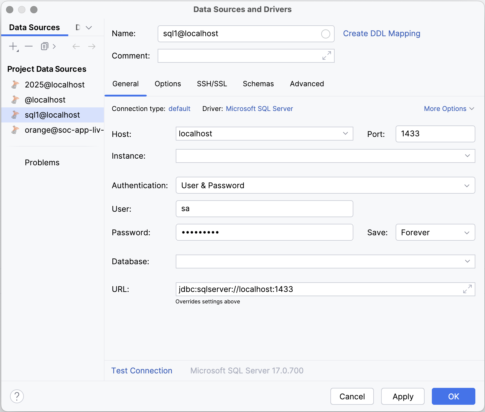{: standalone .w30 #fig1 data-title="Creating a local database connection in DataGrip" }
> 
> SQL Server is a database _server_. That is, it provides for multiple databases, each of which has its 
> own purpose and permissions. After connecting, you can see that only system databases currently exist. 
> These are used to manage the server itself and must not be modified. Note too that you are logged in 
> as the `sa` user - this is the default system administration account which should not be used for 
> routine database tasks.
> 
> In the next step, we will set up a user account and database for the Notes app.
> 
> ### Database setup
> 
> Access permissions can be enforced at both the server level and the level of an individual database. 
> For this reason, two steps are required to create a database user account with permission to log into 
> the server.
> 
> 1. **Create a new login**
> 
>    In DataGrip, right-click on the master database as shown in Fig. 2 and select _New Query_.
> 
>    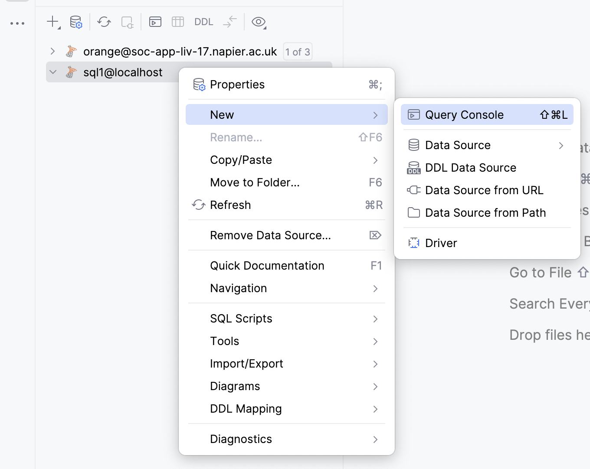{: standalone .w30 #fig2 data-title="Starting a new query in dataGrip" }
> 
>    The next page provides a field where you can type in 
>    [Transact-SQL](https://learn.microsoft.com/en-us/sql/t-sql/language-reference?view=sql-server-ver16) 
>    (T-SQL) commands. Enter the following command to create a new server-level login and then click 
>    _Run_ as shown in Fig. 3.  Replace `&lt;Login name&gt;` with the name you want to use (for the 
>    Notes tutorial, this could be `notesapp`, for example) and replace `&lt;Password&gt;` with an 
>    appropriate password (e.g `N0tesApp$`). Note that the password must meet the strength that SQL 
>    Server requires by being at least 8 characters long and containing characters from three of the 
>    following four sets: Uppercase letters, Lowercase letters, Base 10 digits, and Symbols.
> 
>    ``` sql
>    CREATE LOGIN &lt;Login name&gt; WITH PASSWORD='&lt;Password&gt;';
>    ```
> 
>    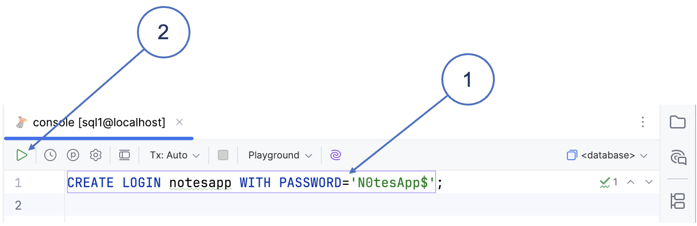{: standalone .w30 #fig3 data-title="Creating a server-level login in DataGrip" }
> 
> 2. **Create a new database**
> 
>    In the explorer sidebar, right-click on the datasource as shown in Fig. 4 and select _New > Database_.
> 
>    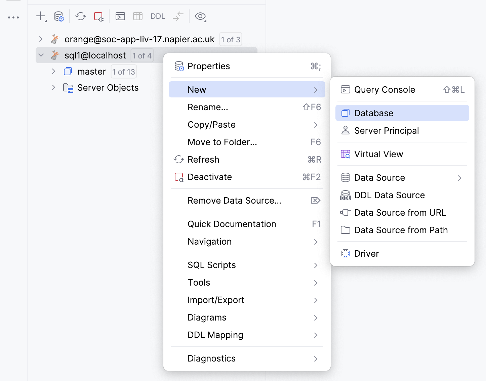{: standalone .w30 #fig4 data-title="Creating a new database in DataGrip" }
> 
>    Give the new database and appropriate name (such as _notesdb_ for the Notes tutorial), and leave all 
>    the other options with their default values.
> 
> 3. **Create a user in the new database**
> 
>    A _user_ is defined at the level of an individual database. The first step is therefore to change 
>    to your new database as shown in Fig. 5. Then execute the following command replacing 
>    `&lt;Username&gt;` and `&lt;Login name&gt;` with your values. Note that you can use the same name in 
>    both cases (e.g. `notesapp` for the Notes tutorial). 
> 
>    ```sql
>    CREATE user &lt;Username&gt; for login &lt;Login name&gt;;
>    ```
> 
>    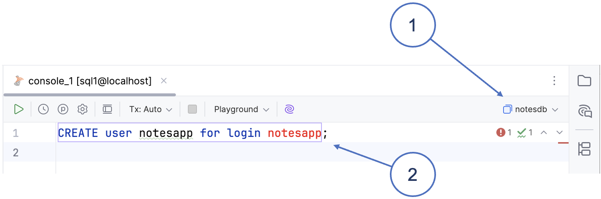{: standalone .w30 #fig5 data-title="Creating a new user for the login in DataGrip" }
> 
> 4. **Grant permissions to the new user**
> 
>    With the new database still active, execute the following T-SQL command to grant all 
>    permission to the user you created. Again, replace `&lt;Database name&gt;` and `&lt;Username&gt;`
>    with your values.
> 
>    ```sql
>    GRANT control on DATABASE::&lt;Database name&gt; to &lt;Username&gt;;
>    ```
> 
>    Next, disconnect from SQL Server using the icon in the explorer pane and edit the details of the 
>    connection. Replace `sa` and the sa password with the name and password of the user you created.
>    When you reconnect, you are using the new user account that you set up.
>
> 5. **Create a test table**
> 
>    Check that everything is working correctly by creating a table such as the NOTE table shown in 
>    Fig. 6. Use the T-SQL script below to set the table up using DataGrip. 
> 
>    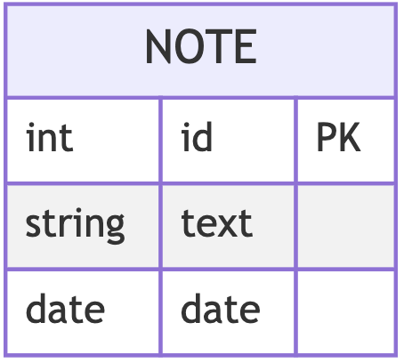{: standalone .w10 #fig6 data-title="The NOTE table" }
> 
>    ```sql
>    -- Create NOTE table
>    CREATE TABLE note (
>        id INT IDENTITY(1,1) PRIMARY KEY,
>        text NVARCHAR(MAX) NOT NULL,
>        date DATETIME2 DEFAULT SYSDATETIME()
>   );
>    ```
>   If you are following the Notes tutorial, this table will be useful and you can keep it. If you are 
>   setting up a database for another reason, either create a table that is relevant to your project, or
>   drop the test table again to leave the database in a clean state.
> 
{: .tab data-tabset="tools" data-seq="1" }

> Open Azure Data Studio (ADS) and create a new connection. You can use the parameter values shown in 
> Fig. 1. to connect to your SQL Server container. The password is the one you specified when you 
> started the container.
> 
> 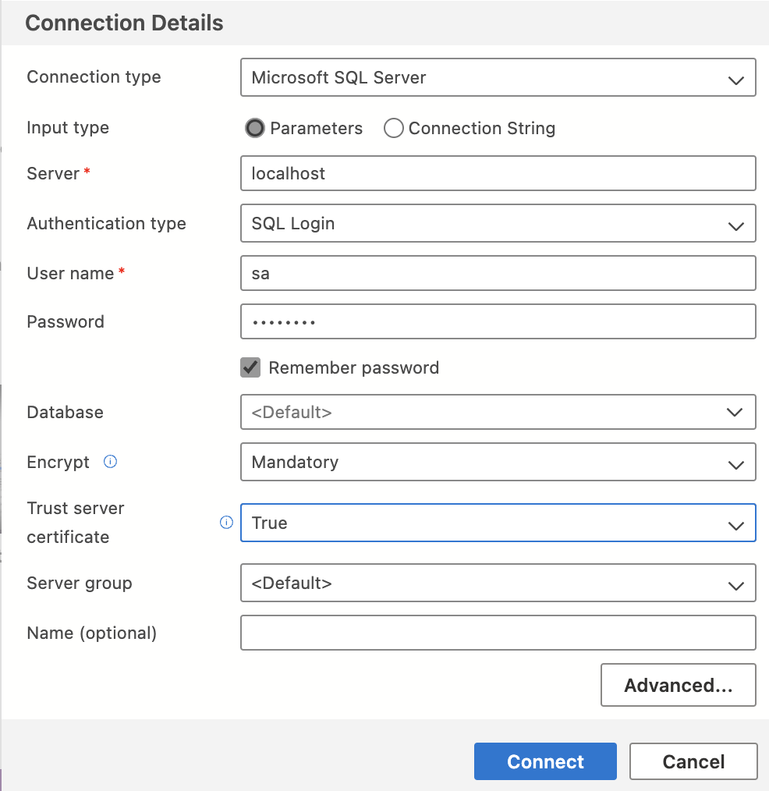{: standalone .w30 #fig1 data-title="Creating a local database connection in Azure Data Studio" }
> 
> SQL Server is a database _server_. That is, it provides for multiple databases, each of which has its 
> own purpose and permissions. After connecting, you can see that only system databases currently exist. 
> These are used to manage the server itself and must not be modified. Note too that you are logged in 
> as the `sa` user - this is the default system administration account which should not be used for 
> routine database tasks.
> 
> In the next step, we will set up a user account and database for the Notes app.
> 
> ### Database setup
> 
> Access permissions can be enforced at both the server level and the level of an individual database. 
> For this reason, two steps are required to create a database user account with permission to log into 
> the server.
> 
> 1. **Create a new login**
> 
>    In ADS, right-click on the master database as shown in Fig. 2 and select _New Query_.
> 
>    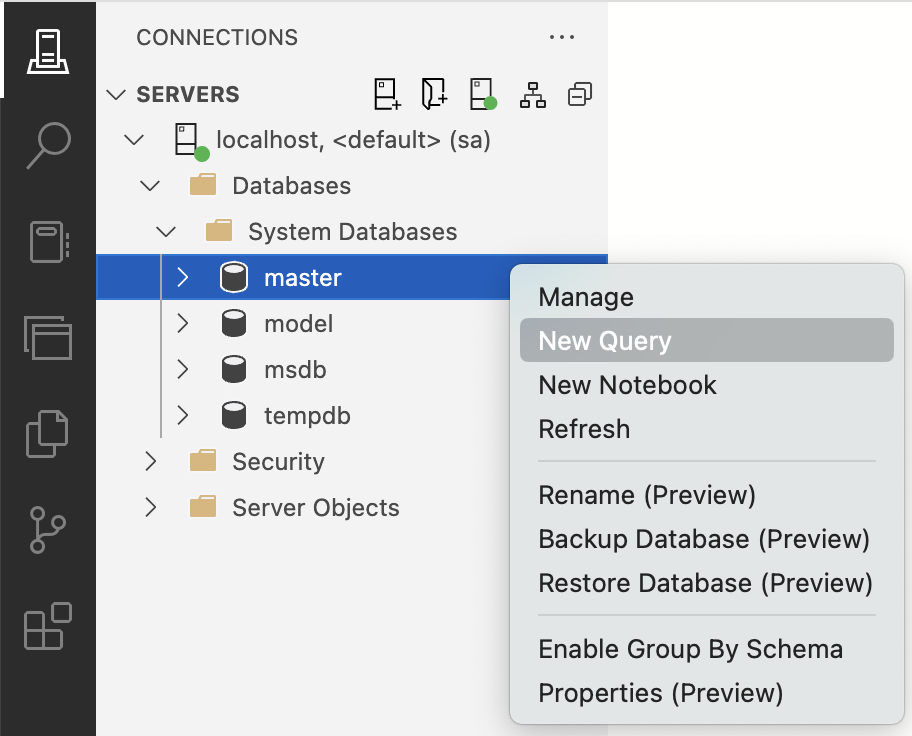{: standalone .w30 #fig2 data-title="Starting a new query in Azure Data Studio" }
> 
>    The next page provides a field where you can type in 
>    [Transact-SQL](https://learn.microsoft.com/en-us/sql/t-sql/language-reference?view=sql-server-ver16) 
>    (T-SQL) commands. Enter the following command to create a new server-level login and then click 
>    _Run_ as shown in Fig. 3.  Replace `&lt;Login name&gt;` with the name you want to use (for the 
>    Notes tutorial, this could be `notesapp`, for example) and replace `&lt;Password&gt;` with an 
>    appropriate password (e.g `N0tesApp$`). Note that the password must meet the strength that SQL 
>    Server requires by being at least 8 characters long and containing characters from three of the 
>    following four sets: Uppercase letters, Lowercase letters, Base 10 digits, and Symbols.
> 
>    ``` sql
>    CREATE LOGIN &lt;Login name&gt; WITH PASSWORD='&lt;Password&gt;';
>    ```
> 
>    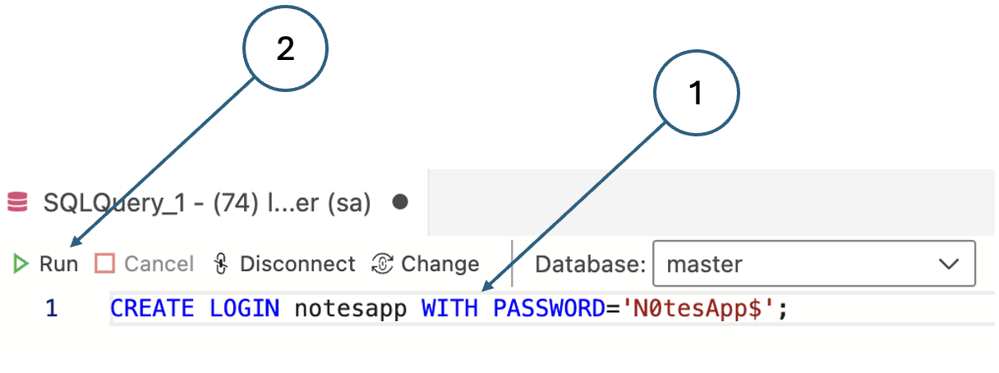{: standalone .w30 #fig3 data-title="Creating a server-level login in Azure Data Studio" }
> 
> 2. **Create a new database**
> 
>    In the explorer sidebar of ADS, click on the plus sign next to _Databases_ as shown in Fig. 4.
> 
>    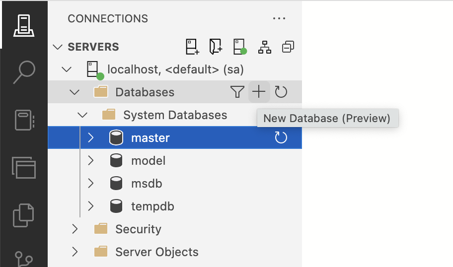{: standalone .w30 #fig4 data-title="Creating a new database in Azure Data Studio" }
> 
>    Call the new database _notesdb_, and leave all the other options with their default values.
> 
> 3. **Create a user in the new database**
> 
>    A _user_ is defined at the level of an individual database. The first step is therefore to change 
>    to your new database as shown in Fig. 5. Then execute the following command replacing 
>    `&lt;Username&gt;` and `&lt;Login name&gt;` with your values. Note that you can use the same name in 
>    both cases (e.g. `notesapp` for the Notes tutorial). 
> 
>    ```sql
>    CREATE user &lt;Username&gt; for login &lt;Login name&gt;;
>    ```
> 
>    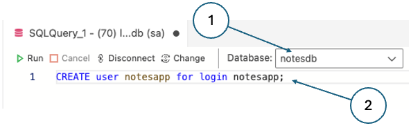{: standalone .w30 #fig5 data-title="Creating a new user for the notesapp login in Azure Data Studio" }
> 
> 4. **Grant permissions to the new user**
> 
>    With the new database still active, execute the following T-SQL command to grant all 
>    permission to the user you created. Again, replace `&lt;Database name&gt;` and `&lt;Username&gt;`
>    with your values.
> 
>    ```sql
>    GRANT control on DATABASE::&lt;Database name&gt; to &lt;Username&gt;;
>    ```
> 
>    Next, disconnect from SQL Server using the icon in the explorer pane and edit the details of the 
>    connection. Replace `sa` and the sa password with the name and password of the user you created.
>    When you reconnect, you are using the new user account that you set up.
> 
> 5. **Create a test table**
> 
>    Check that everything is working correctly by creating a table such as the NOTE table shown in 
>    Fig. 6. Use the T-SQL script below to set the table up using ADS. 
> 
>    {: standalone .w10 #fig6 data-title="The NOTE table" }
> 
>    ```sql
>    -- Create NOTE table
>    CREATE TABLE note (
>        id INT IDENTITY(1,1) PRIMARY KEY,
>        text NVARCHAR(MAX) NOT NULL,
>        date DATETIME2 DEFAULT SYSDATETIME()
>   );
>    ```
>   If you are following the Notes tutorial, this table will be useful and you can keep it. If you are 
>   setting up a database for another reason, either create a table that is relevant to your project, or
>   drop the test table again to leave the database in a clean state.
> 
{: .tab data-tabset="tools" data-seq="2" }
