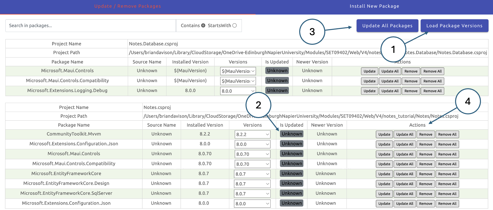
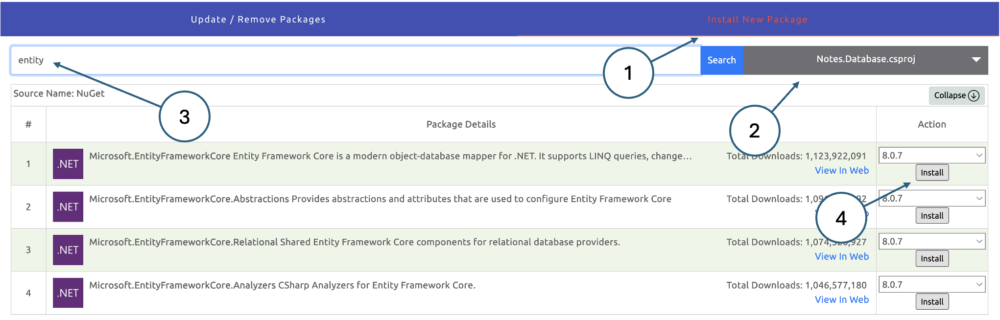
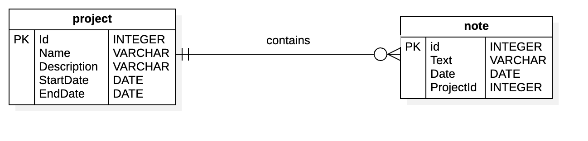

# Database migrations

Working with databases is difficult for several reasons. One of them is that the standard 
language for performing database operations is SQL which has a completely different syntax from 
all common programming languages. A simple approach is to prepare SQL statements as text strings 
and then to execute those commands against the database. This is not only cumbersome but also 
carries the security risk of SQL injection which must be prevented explicitly. In the last 
tutorial, we saw that an ORM can help by providing an object-oriented interface to the database 
which integrates much more fluently into the programming environment. Up to this point however, 
we have still been using SQL to create tables and to perform other 
[DDL](https://soc-web-liv-20.napier.ac.uk/db/Notes/DDL_DML/intro/) operations. In this tutorial, 
we will implement the _migrations_ feature of Entity Framework Core which puts DDL under 
programmatic control. Once initialised, migrations allow a developer to define changes to the 
data model in code and then implement those changes to the database using standard utility 
functions provided by EF Core.

## 1. How migrations work

During development, the main steps to implement a database change are

1.  Update the data structure in a model file
2.  Create a migration using EF Core
3.  Apply the migration to the database using EF Core
4.  Commit and push the migration to the code repo

Once the migration is part of the repo, it is available to apply to any other instance of the 
database. This includes copies used by other developers as well as server-based instances used 
either for testing or production. The process above is simple but requires some supporting 
infrastructure to make it work. To generate a migration, for example, EF Core needs to be able 
to compare the data schema as defined in the model files with the implemented schema in the 
database. That in itself is not too difficult, but the process also needs to take the sequence 
of changes into account. To illustrate the issue, consider two separate schema changes where the 
first creates a new table and the second renames one of the columns in that table. It is 
important that they are executed in sequence because the second change depends on the first. 
To ensure that changes are sequenced correctly, every migration is assigned a level identifier. 
Migration scripts specify their starting level and the target level, and a table in the database 
records the current migration level. Thus a script that migrates the schema from level 10 to 
level 11, say, cannot be run unless the database is currently at level 10.

{: standalone #fig1 data-title="Managing migrations"}

The infrastructure supporting migrations is shown in Fig. 1. Migration scripts are generated and 
stored in a standard directory. The migration process is bootstrapped from an initial migration 
which creates a migration level table in the database along with any tables defined in the model 
files. Subsequent migrations update this initial configuration. In the figure, we can see that the 
first two migrations have already been run since the migration level table records that the 
database is currently at level 1. EF Core would therefore prevent the first two migrations from 
being run again, and only the third migration would be permitted. Once it is applied, the third 
migration would update the migration level of the database to 2.

A big advantage of this infrastructure is that most migration scripts allow the database to be 
_downgraded_ from its existing level to the previous one. Some changes, such as dropping a table 
may not be completely reversible since any data the table contained would be lost.

## 2. Refactor the code

Although the concept of migrations is straightforward, there is some work to be done on the 
structure of the application before they can actually be implemented. This is mainly due to 
incompatibilities between Microsoft technologies. For example, .NET MAUI uses a new Microsoft 
feature called _Native Ahead-Of-Time_ (Native AOT) compilation. This feature minimises the size 
and startup time of the executables created for different platforms and eliminates the need for 
a .NET runtime. Unfortunately, this feature will not be fully supported by EF Core until the next 
release. A workaround is to create a 
[dummy project](https://learn.microsoft.com/en-gb/ef/core/cli/dotnet#other-target-frameworks) 
for the migrations. However, this requires the current project to be refactored so that the 
database-related elements (models and DbContext) are contained in a third project that can be 
shared by the application and the migrations. This setup is illustrated in Fig. 2 where the 
`Notes.Database` project is a shared library used by both `Notes` and `Notes.Migrations`. The 
shared library looks after all the interactions with the database.

{: standalone #fig2 data-title="Shared project structure for migrations"}

The steps below explain how to separate the database-related elements from the rest of the 
application.

### Create a new project in the same solution

This step creates a project to contain the new shared library.

1.  Right-click on the solution in the **Solution Explorer** and choose _New Project..._ 
2.  Select _Class Library_ from the available options.
3.  Name the new project _Notes.Database_.
    
    The new project should appear as shown in Fig. 3.
    
    {: standalone #fig3 .w20 data-title="New database project"}
    

### Update the project content

First, remove the default file `Class1.cs`.

Next, we will move the database-related elements from `Notes` into the new library project. 
Moving the items from one project to another is most easily done using a file manager (e.g. 
File Explorer on Windows or Finder on Mac). We will also take the opportunity to update the 
namespace in the relocated files and to correct any invalid references.

1.  Move the `Data` folder from `Notes` to `Notes.Database` 
2.  Move the `Models` folder from `Notes` to `Notes.Database` 
3.  Move `appsettings.json` from `Notes` to `Notes.Database`
4.  Edit the file `Data/NotesDbContext.cs`
    
    Update the first three lines of the file to match the snippet below
    
    ```c#
    using Microsoft.EntityFrameworkCore;
    using Notes.Database.Models;
    
    namespace Notes.Database.Data;
    ```
    
5.  Edit the file `Models/Note.cs`
    
    Update the namespace to `Notes.Database.Models`
    

### Update the NuGet packages in the Notes project

Now that we will be dealing with three related projects each with different package requirements, 
a graphical management tool will be useful. Using the extensions tool on the left-hand side menu, 
find and install the _NuGet Package Manager GUI_ by aliasadidev. Once installed, you can invoke 
the interface using the VSCode command palette (SHIFT+CTRL+P on Windows; SHIFT+CMD+P on Mac). You 
will be presented with a display like the one in Fig. 4.

{: standalone #fig4 data-title="The NuGet Package Manager GUI interface"}

The display shows the packages that are installed for each project. Clicking the 
_Load Package Versions_ button (1) will query the NuGet repositories to find out whether there are 
any updates available. If the installed packages are up to date, the _Is Updated_ flashes (2) will 
turn green. They will turn red if there is a newer version of the package available. You can 
upgrade all packages using the button at the top (3), or individually using the buttons to the 
right (4). Here, you will also find a button to delete a package.

We need to remove the references to Entity Framework Core from the `Notes` project and install 
the same packages in `Notes.Database`. Remove the following packages using the action buttons (4):

*   Microsoft.EntityFrameworkCore
*   Microsoft.EntityFrameworkCore.Design
*   Microsoft.EntityFrameworkCore.SqlServer
*   Microsoft.Extensions.Configuration.Json

Next we need to add the same packages to the `Notes.Database` project. On the _Install New Package_ 
tab as shown in Fig. 5, set the target project using the dropdown list (2), search for the package 
you want (3) and install it by clicking the button on the right (4).

{: standalone #fig5 data-title="Installing NuGet packages"}

### Modify Notes.csproj

Here, we remove the references to the relocated elements and add a directive to include the new 
shared project.

1.  Click on the `Notes` project to open the project file in the editor pane.
2.  Check that the `<ItemGroup>` that shows the installed packages matches the snippet below.
    
    ```xml
    <ItemGroup>
        <PackageReference Include="CommunityToolkit.Mvvm" Version="8.2.2" />
        <PackageReference Include="Microsoft.Maui.Controls" Version="8.0.70" />
        <PackageReference Include="Microsoft.Maui.Controls.Compatibility" Version="8.0.70" />
        <PackageReference Include="Microsoft.Extensions.Logging.Debug" Version="8.0.0" />
    </ItemGroup>
    ```
    
3.  Remove the `<ItemGroup>` that includes the `appsetting.json` file
4.  Add the new `<ItemGroup>` shown below to include the `Notes.Database` project.
    
    ```xml
    <ItemGroup>
        <ProjectReference Include="../Notes.Database/Notes.Database.csproj" />
    </ItemGroup>
    ```

### Modify Notes.Database.csproj

The next task is to update the new `Notes.Database` project file to ensure that it contains all 
the necessary elements. Follow the steps below.

1.  Click on the `Notes.Database` project to open the project file in the editor pane.
    
2.  Check that the `<ItemGroup>` that shows the installed packages matches the snippet below.
    
    ```xml
    <ItemGroup>
        <PackageReference Include="Microsoft.EntityFrameworkCore" Version="8.0.7" />
        <PackageReference Include="Microsoft.EntityFrameworkCore.Design" Version="8.0.7" />
        <PackageReference Include="Microsoft.EntityFrameworkCore.SqlServer" Version="8.0.7" />
        <PackageReference Include="Microsoft.Extensions.Configuration.Json" Version="8.0.0" />
    </ItemGroup>
    ```
    
3.  Add the new `<ItemGroup>` shown below to include the `appsettings.json` file.
    
    ```xml
    <ItemGroup>
        <EmbeddedResource Include="appsettings.json">
            <CopyToOutputDirectory>Always</CopyToOutputDirectory>
        </EmbeddedResource>
    </ItemGroup>
    ```
4. Edit the file `Data/NotesDbContext.cs` and add the `OnConfiguring()` method after the 
   constructors:

    ```c#
    protected override void OnConfiguring(DbContextOptionsBuilder optionsBuilder)
    {
        var a = Assembly.GetExecutingAssembly();
        var resources = a.GetManifestResourceNames();
        using var stream = a.GetManifestResourceStream("Notes.Database.appsettings.json");
    
        var config = new ConfigurationBuilder()
            .AddJsonStream(stream)
            .Build();
    
        optionsBuilder.UseSqlServer(
            config.GetConnectionString("DevelopmentConnection")
        );
    }
    ```

### Update other files

Now that the database-related elements have been moved, we need to remove references to them in 
the `Notes` project. Follow the steps below to make the necessary changes.

1.  Edit the `MauiProgram.cs` file.
2.  Remove the following three `using` statements from the start of the file:
    
    ```c#
    using System.Reflection;
    using Microsoft.EntityFrameworkCore;
    using Microsoft.Extensions.Configuration;
    ```
    
3.  Remove the following lines which read the `appsettings.json` file.:
    
    ```c#
    var a = Assembly.GetExecutingAssembly();
    using var stream = a.GetManifestResourceStream("Notes.appsettings.json");
    
    var config = new ConfigurationBuilder()
        .AddJsonStream(stream)
        .Build();
    
    builder.Configuration.AddConfiguration(config);
    
    var connectionString = builder.Configuration.GetConnectionString("LocalConnection");
    ```
    
4.  Update the line that creates the `DbContext` to remove the reference to the connection string. This is now handled in `Notes.Database`:
    
    ```c#
    builder.Services.AddDbContext<NotesDbContext>();
    ```
    
5.  Edit the `NoteViewModel.cs` file.
    
6.  Update the `using` statements to reflect the new namespace for `Models` and `Data`:
    
    ```c#
    using Notes.Database.Models;
    using Notes.Database.Data;
    ```
    
7.  Edit the `AllNotesViewModel.cs` file.
    
8.  Update the `using` statement to reflect the new namespace for `Data`:
    
    ```c#
    using Notes.Database.Data;
    ```    

### Update the .gitignore file

Now that we have added a new project, object and binary files will be generated which should not 
be stored in the repo. We have also moved the `appsettings.json` file and we need to prevent the 
new version from being committed. Update the contents of your `.gitignore` file to match the 
snippet below.

```shell
Notes/bin/
Notes/obj/
Notes.Database/obj/
Notes.Database/bin/
Notes.Database/appsettings.json
.vscode
```

### Test the application

At this stage, the app should still function as before. Run it in the emulator to check and fix 
any issues before continuing.

### Add the migrations project

To add the final element in the new architecture, follow the steps below.

1.  Right-click on the solution in the **Solution Explorer** and select _Console App_ from the 
    available options.
    
2.  Call the new project _Notes.Migrations_.
    
3.  Edit the project file by clicking the new project in the **Solution Explorer**.
    
4.  Add the new `<ItemGroup>` shown below to include the `Notes.Database` project.
    
    ```xml
    <ItemGroup>
        <ProjectReference Include="../Notes.Database/Notes.Database.csproj" />
    </ItemGroup>
    ```

### Update the .gitignore file

We need to prevent object and binary files from being stored in the repo as we did before. Update 
the contents of your `.gitignore` file to match the snippet below.

```shell
Notes/bin/
Notes/obj/
Notes.Database/obj/
Notes.Database/bin/
Notes.Database/appsettings.json
Notes.Migrations/obj/
Notes.Migrations/bin/
.vscode
```

## 3. Initialise migrations

### Installing the tools

To use migrations in VSCode we need to install the .NET Core 
[CLI tools](https://learn.microsoft.com/en-gb/ef/core/cli/dotnet) and the EF Design package. 
This can be done by executing the commands below at the terminal prompt in VSCode. Make sure 
that you are in the _Notes.Migrations_ project directory.

```shell
dotnet tool install --global dotnet-ef
dotnet add package Microsoft.EntityFrameworkCore.Design
```

You can check that the installation is successful with the command

```shell
dotnet ef
```

If all is well, you will see the output below along with some additional version information.

                     _/\__       
               ---==/    \\      
         ___  ___   |.    \|\    
        | __|| __|  |  )   \\\   
        | _| | _|   \_/ |  //|\\ 
        |___||_|       /   \\\/\\

    Entity Framework Core .NET Command-line Tools 9.0.6

### Create the initial migration

In the long term, we want to store database migrations in the _Notes.Migrations_ project; however, there
is a bootstrapping problem. EF Core makes the following distinction between projects used for migrations:

* The _target project_ is the one where the migration files will be generated.
* The _startup project_ is the one that will be built and run in order to perform the migrations.

You might think that since `Notes.Database` is included in `Notes.Migrations`, we could use 
`Notes.Migrations` for both the target and startup projects. However, if no migrations exist - 
as is the case with the initial migration - the command to add a new migration is unable to find 
the `DbContext`. The simplest way around the dilemma is to create the initial migration in the
_Notes.Database_ project and then move it to _Notes.Migrations_. Follow the steps below to do this.

1.  In a terminal window, make sure that you are in the solution root directory - i.e. the one 
    that contains all of the project directories.
    
2.  Create the initial migration by executing the command below:
    
    ```shell
    dotnet ef migrations add InitialCreate --project Notes.Database
    ```

The steps above create a new directory _Migrations_ in the `Notes.Database` project which contains 
two files. They are

* _NotesDbContextModelSnapshot.cs_: This file records the current state of the data model for reference. 
* _20240713135445_InitialCreate.cs_: This is the migration script - note that the number at the start of the filename is a timestamp and so your file will be named slightly differently.

{: .note-title }
> <i class="fa-solid fa-circle-info"></i> Note
> 
> The name _InitialCreate_ is commonly used, but is not mandatory. In general, you should give 
> migrations a descriptive name like commit comments so that it is clear what changes are being made.

Because this is the initial migration, EF Core assumes that the database is currently empty and 
the migration file contains the code to create the database objects defined in the model files. 
It is good practice to check migration files before applying them to make sure they are going to 
make the changes you expect. This would be a good moment to take a look at the content of the new 
example.

If we tried to apply this migration it would fail because we already have a NOTE table in the 
database. Although it is possible to work around that, the simplest approach is simply to drop 
the table from the database using your chosen database management tool (DataGrip or ADS). The steps 
below take you through the process of applying the initial migration.

1.  Use your database management tool to drop the NOTE table.
2.  In a terminal window, make sure that you are in the solution root directory.
3.  Execute the command below.
    
    ```shell
    dotnet ef database update --project Notes.Database
    ```

After the migration operation completes, check the contents of the database in your database management 
tool (you may need to refresh the view). You should see two new tables, the NOTE table and another 
called `_EFMigrationsHistory_`. You can examine the contents of the migrations history by executing the 
following query:

```sql
select * from __EFMigrationsHistory;
```

The function of the history table is to ensure that we do not try to apply migrations more than 
once. You can check out what happens by executing the `database update` command a second time. 
You should see a message that says the database is already up to date.

### Move the Migrations directory

Now that the supporting infrastructure for migrations exists, EF Core will be able to access the 
`DbContext` from the `Notes.Migrations` project. Two steps are required to make the change:

1. Use a file manager to move the _Migrations_ directory from `Notes.Database` to `Notes.Migrations`.
2. Update the `NotesDbContext.cs` file to add a reference to the `Notes.Migrations` project in the 
   `optionsBuilder`:

    ```c#
    optionsBuilder.UseSqlServer(
        config.GetConnectionString("LocalConnection"),
        m => m.MigrationsAssembly("Notes.Migrations")
        );
    ```
   
## 4. Create a new table

Let us assume that as part of the further development of the Notes application, we want to be able 
to group notes according to the project they are related to. The ER diagram for this is shown in 
Fig. 6.

{: standalone #fig6 data-title="Notes ER diagram"}

Follow the steps below to add the new model to the application, create a migration and apply it to 
the database.

1.  Create a new file `Project.cs` in the _Models_ directory and paste in the following code:
    
    ```c#
    using Microsoft.EntityFrameworkCore;
    using System.ComponentModel.DataAnnotations;
    using System.ComponentModel.DataAnnotations.Schema;
    
    namespace Notes.Database.Models;
    
    [Table("project")]
    [PrimaryKey(nameof(Id))]
    public class Project
    {
        public int Id { get; set; }
        [Required]
        public string Name { get; set; }
        [Required]
        public string Description { get; set; }
        public DateTime StartDate { get; set; }
        public DateTime EndDate { get; set; }
    
        public List Notes { get; set; } = new List();
    }
    ```
    
    Notice the use of annotations, and also the last line which defines a relationship between a 
    project and a list of notes.
    
2.  Update the `Note.cs` file with the corresponding foreign key information by adding the following two lines to the existing list of columns:
    
    ```c#
    public int ProjectId { get; set; }
    public Project Project { get; set; }
    ```
        
    {: .note-title }
    > <i class="fa-solid fa-circle-info"></i> Note
    > 
    > As currently defined, the new properties will generate non-nullable columns in the database 
    > table. That means that a note must be associated with a project. If there are existing notes 
    > in the database, an automatically generated migration will fail because it will attempt to add 
    > a non-nullable column without any data. This would be a case where manually adjusting the 
    > migration script to adjust the data would be necessary. In this case, the NOTE table is 
    > probably empty and there will be no problem. Alternatively, we could define the new properties 
    > to be nullable which would allow notes with no associated project.
    
3.  Add the following line to the `DbContext.cs` file:
    
    ```c#
    public DbSet Projects { get; set; }
    ```
    
4.  In a terminal window, make sure that you are in the `Notes.Migrations` root folder - not the 
    solution root folder.
    
5.  Execute the following command to generate the new migration:
    
    ```c#
    dotnet ef migrations add AddProjectTable
    dotnet ef database update
    ```
    
    Once both commands have completed, check the results in your database management tool.

You now have sufficient information to get started with database migrations. However, it is 
important to note that there are many options available and many problems that can arise. For 
more information, please see the 
[Microsoft documentation](https://learn.microsoft.com/en-us/ef/core/managing-schemas/migrations/?tabs=dotnet-core-cli).
