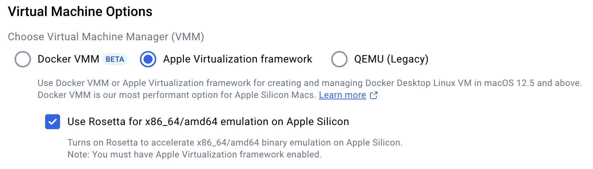
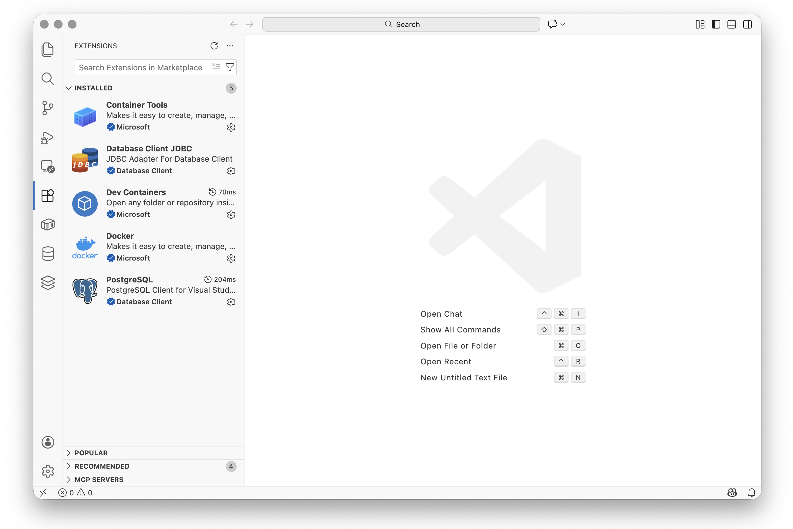
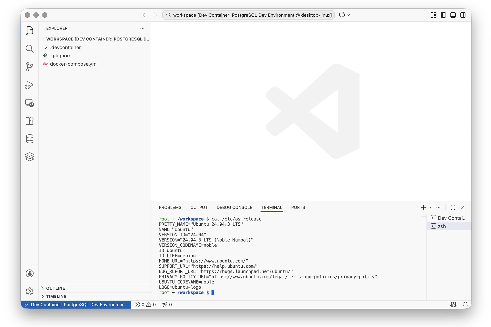
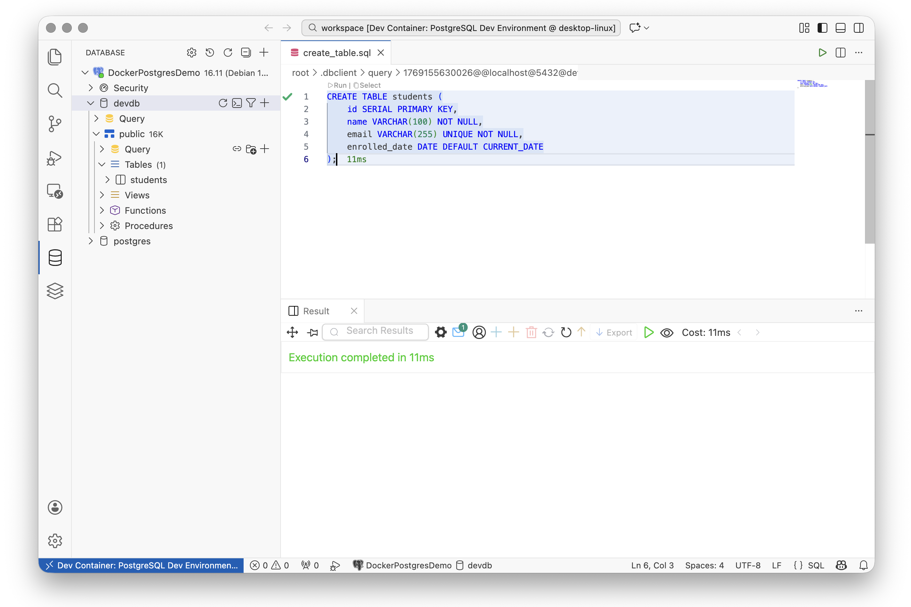
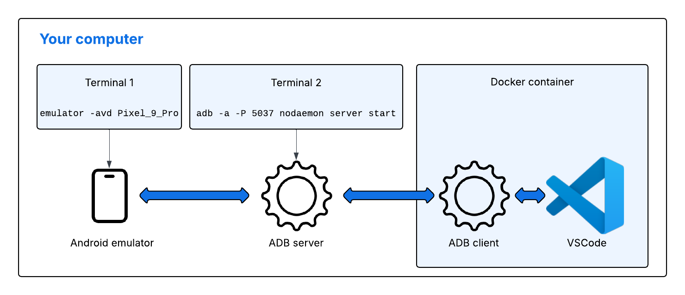

# Development Environment Setup

This tutorial guides you through setting up a containerised development environment using Docker,
Visual Studio Code, .NET MAUI, and PostgreSQL. By the end, you will have a reproducible development
environment that includes everything needed for mobile app development with database support.

## Architecture Overview

The development environment uses Docker to provide a consistent build environment across all
platforms. The Android emulator runs on your host machine (for performance and GPU access),
while the container handles building and deploying your app.

{: standalone #fig1 data-title="Architecture overview" }

## 1. Install Docker Desktop

Docker Desktop provides a graphical interface for managing containers and includes everything
needed to run containerised applications on your computer.

[Windows](){: .btn .btn-blue .tab-control data-tabset="docker" data-seq="1" }
[Mac](){: .btn .tab-control data-tabset="docker" data-seq="2" }
[Linux](){: .btn .tab-control data-tabset="docker" data-seq="3" }

> Download Docker Desktop from the [Docker website](https://www.docker.com/products/docker-desktop/){:target="_blank"}
> and run the installer.
>
> {: .warning-title }
> > <i class="fa-solid fa-triangle-exclamation"></i> Warning
> >
> > Docker Desktop on Windows requires WSL 2 (Windows Subsystem for Linux). If you don't have it
> > installed, the Docker installer will prompt you to enable it. You may need to restart your
> > computer during this process.
>
> After installation, Docker Desktop should start automatically. You can verify it's running by
> looking for the Docker whale icon in your system tray.
>
> {: standalone #fig2 data-title="Docker Desktop running on Windows" }
>
{: .tab data-tabset="docker" data-seq="1" }

> Download Docker Desktop from the [Docker website](https://www.docker.com/products/docker-desktop/){:target="_blank"}.
>
> {: .note-title }
> > <i class="fa-solid fa-circle-info"></i> Note
> >
> > Make sure you download the correct version for your Mac:
> > - **Apple Silicon** (M1, M2, M3, M4 chips): Download the "Apple Silicon" version
> > - **Intel**: Download the "Intel chip" version
> >
> > You can check your chip type by clicking the Apple menu and selecting "About This Mac".
>
> Open the downloaded `.dmg` file and drag the Docker icon to your Applications folder.
> Launch Docker from your Applications folder.
>
> {: standalone #fig3 data-title="Docker Desktop running on Mac" }
>
> If you are using an Apple Silicon Mac, make sure that Docker is configured to use 
> Rosetta for x86_64 emulation. Open the Settings and check the box as shown in Fig. 4.
> 
> {: standalone #fig4 data-title="Enabling Rosetta" }
>
>
{: .tab data-tabset="docker" data-seq="2" }

> On most Linux distributions, you can install Docker Engine using your package manager.
> For Ubuntu/Debian:
>
> ```bash
> sudo apt-get update
> sudo apt-get install docker.io docker-compose-v2
> sudo usermod -aG docker $USER
> ```
>
> Log out and back in for the group change to take effect. Alternatively, you can install
> [Docker Desktop for Linux](https://docs.docker.com/desktop/install/linux-install/){:target="_blank"}
> if you prefer a graphical interface.
>
{: .tab data-tabset="docker" data-seq="3" }

Verify Docker is installed correctly by opening a terminal and running:

```bash
docker --version
```

You should see output similar to `Docker version 24.0.0` or higher.

## 2. Install Visual Studio Code and Extensions

Follow the installation instructions for your operating system on the
[VSCode website](https://code.visualstudio.com/download){:target="_blank"}.

Once VSCode is installed, you need to add the following extensions:

| Extension | Extension ID | Purpose |
|-----------|--------------|---------|
| Dev Containers | ms-vscode-remote.remote-containers | Develop inside Docker containers |
| Docker | ms-azuretools.vscode-docker | Manage Docker containers and images |
| Database Client | cweijan.vscode-postgresql-client2 | Connect to and query PostgreSQL databases |
| .NET MAUI | dotnettools.dotnet-maui | .NET MAUI development support |
| AVD Manager | toroxx.vscode-avdmanager | Manage Android Virtual Devices |

To install an extension, open VSCode and press `Ctrl+Shift+X` (Windows/Linux) or `Cmd+Shift+X` (Mac)
to open the Extensions panel. Search for each extension by name and click Install.

{: standalone #fig5 data-title="Required VSCode extensions installed" }

## 3. Create the Project Structure

Create a new project folder with the required subdirectory for the dev container configuration.

[Windows](){: .btn .btn-blue .tab-control data-tabset="mkdir" data-seq="1" }
[Mac/Linux](){: .btn .tab-control data-tabset="mkdir" data-seq="2" }

> Open a command prompt and run:
>
> ```
> mkdir MauiDevProject
> cd MauiDevProject
> mkdir .devcontainer
> ```
>
{: .tab data-tabset="mkdir" data-seq="1" }

> Open a terminal and run:
>
> ```bash
> mkdir -p MauiDevProject/.devcontainer
> cd MauiDevProject
> ```
>
{: .tab data-tabset="mkdir" data-seq="2" }

Open the `MauiDevProject` folder in VSCode using **File > Open Folder...** or by running
`code .` from the terminal while in the project directory.

Your project structure should look like this:

```
MauiDevProject/
└── .devcontainer/
```

## 4. Create the Dockerfile

The Dockerfile defines the development container with all the tools needed for .NET MAUI
development, including the .NET SDK, MAUI workloads, Java JDK, and Android SDK.

Create a file called `Dockerfile` in the project root directory with the following content:

```dockerfile
FROM mcr.microsoft.com/devcontainers/base:ubuntu

# Install .NET SDK 9
RUN wget https://dot.net/v1/dotnet-install.sh -O dotnet-install.sh \
    && chmod +x dotnet-install.sh \
    && ./dotnet-install.sh --channel 9.0 --install-dir /usr/share/dotnet \
    && ln -s /usr/share/dotnet/dotnet /usr/bin/dotnet \
    && rm dotnet-install.sh

# Install Java JDK (required for Android SDK) and unzip
# Create a fixed symlink so JAVA_HOME works on both amd64 and arm64
RUN apt-get update && apt-get install -y openjdk-17-jdk unzip \
    && ln -sfn "$(dirname $(dirname $(readlink -f $(which javac))))" /usr/lib/jvm/java-17

# Install MAUI workloads (maui-android only — iOS/macOS targets cannot install on Linux)
RUN dotnet workload install maui-android

# Install Android SDK command-line tools
ENV ANDROID_HOME=/opt/android-sdk
ENV JAVA_HOME=/usr/lib/jvm/java-17
RUN mkdir -p ${ANDROID_HOME}/cmdline-tools \
    && wget https://dl.google.com/android/repository/commandlinetools-linux-11076708_latest.zip \
    && unzip commandlinetools-linux-*.zip -d ${ANDROID_HOME}/cmdline-tools \
    && mv ${ANDROID_HOME}/cmdline-tools/cmdline-tools ${ANDROID_HOME}/cmdline-tools/latest \
    && rm commandlinetools-linux-*.zip

# Accept licenses and install platform tools
RUN yes | ${ANDROID_HOME}/cmdline-tools/latest/bin/sdkmanager --licenses && \
    ${ANDROID_HOME}/cmdline-tools/latest/bin/sdkmanager \
      "platform-tools" \
      "platforms;android-35" \
      "build-tools;35.0.0"

ENV PATH="${PATH}:${ANDROID_HOME}/cmdline-tools/latest/bin:${ANDROID_HOME}/platform-tools"
```

{: .note-title }
> <i class="fa-solid fa-circle-info"></i> Note
>
> **Understanding the Dockerfile:**
>
> - **.NET SDK 9** - The latest .NET SDK for building MAUI applications
> - **MAUI Android workload** - Only the `maui-android` workload is installed. The full `maui`
>   workload includes iOS, macOS, and Windows targets that cannot be installed on a Linux
>   container, so installing it would fail.
> - **Java JDK 17** - Required by the Android SDK tools. A symlink is created at a fixed path
>   so that `JAVA_HOME` resolves correctly on both x86_64 (Windows/Intel) and ARM64
>   (Apple Silicon) architectures.
> - **Android SDK** - Command-line tools for building and deploying Android apps
> - **Platform tools** - ADB and other utilities for communicating with Android devices

## 5. Configure Docker Compose

Docker Compose allows you to define and run multi-container applications. We will create a
configuration with two services: an application container for development and a PostgreSQL
database container.

Create a file called `docker-compose.yml` in the project root directory with the following content:

```yaml
services:
  app:
    build:
      context: .
      dockerfile: Dockerfile
      platform: linux/amd64 
    volumes:
      - .:/workspace:cached
    network_mode: service:db
    environment:
      - ADB_SERVER_SOCKET=tcp:host.docker.internal:5037
    command: sleep infinity
    depends_on:
      db:
        condition: service_healthy

  db:
    image: postgres:16
    restart: always
    environment:
      POSTGRES_USER: dev_user
      POSTGRES_PASSWORD: dev_password
      POSTGRES_DB: devdb
    ports:
      - "5432:5432"
    volumes:
      - postgres_data:/var/lib/postgresql/data
    healthcheck:
      test: ["CMD-SHELL", "pg_isready -U dev_user -d devdb"]
      interval: 5s
      timeout: 5s
      retries: 5

volumes:
  postgres_data:
```

{: .note-title }
> <i class="fa-solid fa-circle-info"></i> Note
>
> **Understanding the configuration:**
>
> - `build` - Builds the container using our custom Dockerfile instead of a base image
> - `network_mode: service:db` - The app container shares the database container's network
>   namespace entirely. This means you can connect to PostgreSQL using `localhost:5432` from
>   within the app container. It also means `extra_hosts` cannot be used on the app service,
>   as these two options conflict.
> - `depends_on: condition: service_healthy` - Ensures the app container does not start until
>   PostgreSQL is genuinely ready to accept connections, not merely running.
> - `healthcheck` - Runs `pg_isready` every 5 seconds so Docker Compose knows when the
>   database is ready. This is what `service_healthy` above waits for.
> - `ports: "5432:5432"` - Exposes the database on the host machine. The Android emulator
>   (which runs on the host, not inside the container) connects to PostgreSQL using
>   `10.0.2.2:5432`, where `10.0.2.2` is the special address that the Android emulator uses
>   to reach the host machine.
> - `volumes: postgres_data` - A named volume that persists your database data even when
>   containers are stopped or removed.
> - `command: sleep infinity` - Keeps the app container running so VSCode can connect to it.

{: standalone #fig6 data-title="Docker Compose architecture diagram" }

## 6. Configure the Dev Container

The dev container configuration tells VSCode how to use the Docker Compose setup for development.

Create a file called `devcontainer.json` inside the `.devcontainer` directory with the following content:

```json
{
    "name": "MAUI Dev Environment",
    "dockerComposeFile": ["../docker-compose.yml"],
    "service": "app",
    "workspaceFolder": "/workspace",
    "customizations": {
        "vscode": {
            "extensions": [
                "cweijan.vscode-postgresql-client2",
                "ms-dotnettools.dotnet-maui",
                "toroxx.vscode-avdmanager"
            ]
        }
    },
    "remoteUser": "root",
    "portsAttributes": {
        "5037": { "onAutoForward": "ignore" },
        "5554": { "onAutoForward": "silent" },
        "5555": { "onAutoForward": "silent" }
    }
}
```

{: .note-title }
> <i class="fa-solid fa-circle-info"></i> Note
>
> **Understanding the configuration:**
>
> - `dockerComposeFile` - Points to your Docker Compose configuration
> - `service` - Specifies which container VSCode should connect to
> - `workspaceFolder` - The folder inside the container where your project files appear
> - `customizations.vscode.extensions` - Extensions to install automatically inside the container,
>   including the PostgreSQL client, .NET MAUI tools, and AVD Manager
> - `portsAttributes` - Controls how VSCode handles port forwarding for specific ports detected
>   inside the container. Port `5037` (the ADB server) is set to `ignore` so VSCode does not
>   attempt to forward it — the container already reaches the host ADB server via the
>   `ADB_SERVER_SOCKET` environment variable rather than a forwarded port. Ports `5554` and
>   `5555` (the Android emulator's console and ADB ports) are set to `silent` so that if VSCode
>   detects them it forwards them without showing a notification pop-up.

Your project structure should now look like this:

```
MauiDevProject/
├── .devcontainer/
│   └── devcontainer.json
├── docker-compose.yml
└── Dockerfile
```

## 7. Create a .gitignore File

Before initialising a git repository, create a `.gitignore` file to exclude sensitive and
unnecessary files from version control.

Create a file called `.gitignore` in the project root directory:

```
# Environment files
.env
.env.local
.env.*.local

# IDE settings
.idea/
*.swp
*.swo
*~

# OS files
.DS_Store
Thumbs.db

# Docker volumes (if using bind mounts for data)
postgres_data/

# .NET build outputs
[Bb]in/
[Oo]bj/
[Ll]og/
[Ll]ogs/

# User-specific files
*.rsuser
*.suo
*.user
*.userosscache
*.sln.docstates
```

{: .warning-title }
> <i class="fa-solid fa-triangle-exclamation"></i> Warning
>
> Never commit database credentials or `.env` files containing passwords to version control.
> The credentials in this tutorial are for local development only.

### Create a .gitattributes File

Create a file called `.gitattributes` in the project root directory:

```
* text=auto eol=lf
*.sh text eol=lf
Dockerfile text eol=lf
docker-compose.yml text eol=lf
```

{: .note-title }
> <i class="fa-solid fa-circle-info"></i> Note
>
> Windows uses `CRLF` line endings by default, while Linux and macOS use `LF`. If a Windows
> user edits the `Dockerfile` or shell scripts and saves them with `CRLF` endings, the Docker
> build will fail with confusing errors because the extra `\r` character corrupts the shell
> commands inside `RUN` instructions.
>
> The `.gitattributes` file instructs Git to normalise line endings to `LF` on checkout
> regardless of the operating system or editor settings. This ensures the project builds
> correctly for all students.

## 8. Open the Project in the Container

Now you can open the project inside the development container.

1. Press `Ctrl+Shift+P` (Windows/Linux) or `Cmd+Shift+P` (Mac) to open the command palette.
2. Type "Reopen in Container" and select **Dev Containers: Reopen in Container**.

{: standalone #fig7 data-title="Building the container in VSCode" }

{: .warning-title }
> <i class="fa-solid fa-triangle-exclamation"></i> Warning
>
> The first time you do this, Docker will build the custom image and download the required
> components (.NET SDK, MAUI workloads, Java JDK, Android SDK). This may take 10-15 minutes
> depending on your internet connection. Subsequent starts will be much faster as the image
> is cached locally.

Once the container is ready, you will see the project files in the Explorer panel, and the
bottom-left corner of VSCode will show "Dev Container: MAUI Dev Environment".

{: standalone #fig8 data-title="VSCode running inside the container" }

### Verify the Development Tools

Open a terminal (`Ctrl+ `` ` or `Cmd+ `` `) and verify the development tools are installed:

```bash
# Check .NET version
dotnet --version

# Check MAUI workloads
dotnet workload list

# Check Android SDK
sdkmanager --version
```

You should see .NET 9.x, the MAUI workloads listed, and the Android SDK manager version.

{: standalone #fig9 data-title="Terminal inside container showing configuration details" }

## 9. Connect to PostgreSQL from VSCode

The Database Client extension allows you to browse and query your database directly from VSCode.

1. Click on the Database icon in the Activity Bar on the left side of VSCode.
2. Click the **+** button to create a new connection and select **PostgreSQL**.
3. Enter the following connection details:

| Parameter | Value |
|-----------|-------|
| Connection Name | MauiDevProject |
| Group | (leave blank) |
| Hostname | localhost |
| Port | 5432 |
| Username | dev_user |
| Password | dev_password |
| Database | devdb |
| Use SSL | No |

{: standalone #fig10 data-title="PostgreSQL connection configuration" }

{: .note-title }
> <i class="fa-solid fa-circle-info"></i> Note
>
> Because the app container uses `network_mode: service:db`, it shares the network namespace
> with the database container. This means PostgreSQL is accessible at `localhost:5432` from
> within the app container.

Once connected, you can expand the connection in the sidebar to see databases, schemas, and tables.

## 10. Verify the Database Setup

Let's verify the database connection is working by creating a simple table and querying it.

### Create a test table

Expand the `devdb` database in the sidebar until you can see the `public > Query` element. Click on
the`+` icon to create a new query called `create_table`. Enter the following SQL and execute it by
clicking the Run button:

```sql
CREATE TABLE students (
    id SERIAL PRIMARY KEY,
    name VARCHAR(100) NOT NULL,
    email VARCHAR(255) UNIQUE NOT NULL,
    enrolled_date DATE DEFAULT CURRENT_DATE
);
```

{: standalone #fig11 data-title="Creating a test table in PostgreSQL" }

### Insert sample data

Run the following SQL to add some test records:

```sql
INSERT INTO students (name, email) VALUES
    ('Alice Smith', 'alice@example.com'),
    ('Bob Jones', 'bob@example.com'),
    ('Charlie Brown', 'charlie@example.com');
```

### Query the data

Run a SELECT query to verify the data was inserted:

```sql
SELECT * FROM students;
```

{: standalone #fig12 data-title="Query results showing test data" }

You should see three rows returned with the student data you inserted.

### Clean up (optional)

If you want to remove the test table:

```sql
DROP TABLE students;
```

## 11. Android Emulator Setup (Host Machine)

The Android emulator runs on your host machine rather than inside the container. This provides
better performance and access to hardware acceleration.

{: .warning-title }
> <i class="fa-solid fa-triangle-exclamation"></i> Windows: Enable Hardware Acceleration
>
> The Android emulator requires hardware virtualisation to run at acceptable speed. On Windows,
> this must be enabled in your BIOS/UEFI settings before the emulator will work.
>
> 1. Restart your computer and enter the BIOS/UEFI setup (typically by pressing `F2`, `F10`,
>    `Del`, or `Esc` during startup — the key is usually shown briefly on screen)
> 2. Look for a setting named **Intel VT-x**, **Intel Virtualization Technology**, **AMD-V**,
>    or **SVM Mode** (the exact name depends on your motherboard manufacturer)
> 3. Enable it, save, and restart
>
> If you are unsure whether it is already enabled, you can check in Windows:
> open **Task Manager**, go to the **Performance** tab, select **CPU**, and look for
> **Virtualization: Enabled**.

{: .note-title }
> <i class="fa-solid fa-circle-info"></i> Alternative: Android Studio
>
> If you prefer a graphical interface for managing virtual devices, you can install
> [Android Studio](../android-studio/) instead of following the command-line approach below.
> Android Studio includes the SDK Manager and AVD Manager with a GUI.

### Install Android SDK Command-Line Tools

Download the "Command line tools only" package from the
[Android developer website](https://developer.android.com/studio#command-tools){:target="_blank"}
and extract it.

[Windows](){: .btn .btn-blue .tab-control data-tabset="cmdtools" data-seq="1" }
[Mac/Linux](){: .btn .tab-control data-tabset="cmdtools" data-seq="2" }

> 1. Create the directory structure: `C:\Android\cmdline-tools\latest`
> 2. Extract the downloaded zip and move the `bin` and `lib` folders into `latest`
>
> {: .warning-title }
> > <i class="fa-solid fa-triangle-exclamation"></i> Warning
> >
> > You must create the folder named `latest` and put the `bin` and `lib` folders inside it,
> > or the tools will error out.
>
> Set environment variables (search for "Environment Variables" in the Start menu):
>
> | Variable | Value |
> |----------|-------|
> | ANDROID_HOME | `C:\Android` |
>
> Add to your PATH:
> - `C:\Android\cmdline-tools\latest\bin`
> - `C:\Android\emulator`
> - `C:\Android\platform-tools`
>
> Close and reopen any terminal windows for changes to take effect.
>
{: .tab data-tabset="cmdtools" data-seq="1" }

> 1. Create the directory structure: `~/Android/cmdline-tools/latest`
> 2. Extract the downloaded zip and move the `bin` and `lib` folders into `latest`
>
> ```bash
> mkdir -p ~/Android/cmdline-tools/latest
> cd ~/Downloads
> unzip commandlinetools-*_latest.zip
> mv cmdline-tools/* ~/Android/cmdline-tools/latest/
> ```
>
> {: .warning-title }
> > <i class="fa-solid fa-triangle-exclamation"></i> Warning
> >
> > You must create the folder named `latest` and put the `bin` and `lib` folders inside it,
> > or the tools will error out.
>
> Add these lines to your shell profile (`~/.zshrc` for Mac, `~/.bashrc` for Linux):
>
> ```bash
> export ANDROID_HOME=$HOME/Android
> export PATH=$PATH:$ANDROID_HOME/cmdline-tools/latest/bin:$ANDROID_HOME/emulator:$ANDROID_HOME/platform-tools
> ```
>
> Apply the changes:
>
> ```bash
> source ~/.zshrc  # or source ~/.bashrc on Linux
> ```
>
{: .tab data-tabset="cmdtools" data-seq="2" }

Verify the installation:

```bash
sdkmanager --version
```

### Install Emulator and System Image

Accept the Android SDK licenses:

```bash
sdkmanager --licenses
```

Type `y` to accept each license when prompted.

Install the emulator, platform tools, and a system image. Choose the appropriate image
for your machine's architecture:

[Windows / Intel Mac / Linux](){: .btn .btn-blue .tab-control data-tabset="install" data-seq="1" }
[Apple Silicon Mac](){: .btn .tab-control data-tabset="install" data-seq="2" }

> ```bash
> sdkmanager "emulator" "platform-tools" "platforms;android-34" "system-images;android-34;google_apis;x86_64"
> ```
>
{: .tab data-tabset="install" data-seq="1" }

> ```bash
> sdkmanager "emulator" "platform-tools" "platforms;android-34" "system-images;android-34;google_apis;arm64-v8a"
> ```
>
> {: .note-title }
> > <i class="fa-solid fa-circle-info"></i> Note
> >
> > On Apple Silicon Macs, the ARM64 image runs natively without emulation,
> > providing significantly better performance.
>
{: .tab data-tabset="install" data-seq="2" }

### Create an Android Virtual Device (AVD)

Create an AVD using the Pixel 9 Pro device profile:

[Windows / Intel Mac / Linux](){: .btn .btn-blue .tab-control data-tabset="createavd" data-seq="1" }
[Apple Silicon Mac](){: .btn .tab-control data-tabset="createavd" data-seq="2" }

> ```bash
> avdmanager create avd -n Pixel_9_Pro -k "system-images;android-34;google_apis;x86_64" -d 47
> ```
>
{: .tab data-tabset="createavd" data-seq="1" }

> ```bash
> avdmanager create avd -n Pixel_9_Pro -k "system-images;android-34;google_apis;arm64-v8a" -d 47
> ```
>
{: .tab data-tabset="createavd" data-seq="2" }

{: .note-title }
> <i class="fa-solid fa-circle-info"></i> Device IDs
>
> The `-d 47` flag specifies the Pixel 9 Pro device profile. To see all available
> device profiles, run: `avdmanager list device`

Verify the AVD was created:

```bash
avdmanager list avd
```

### Start the Emulator

Launch the emulator with your AVD:

```bash
emulator -avd Pixel_9_Pro
```

{: .warning-title }
> <i class="fa-solid fa-triangle-exclamation"></i> Warning
>
> The first boot may take several minutes as Android performs initial setup. Subsequent
> starts will be faster.

Leave the emulator running while you work with the development container.

### Connect the Container to the Emulator

To deploy apps from the container to the emulator, you need to configure ADB networking.

**On your host machine** (in a separate terminal), start the ADB server in network mode:

```bash
adb kill-server
adb -a -P 5037 nodaemon server start
```

Leave this terminal open while developing.

There are several elements to the setup. Fig. 13 provides a visualisation.

{: standalone #fig13 data-title="Android Emulator Setup Visualisation" }

Verify the connection:

```bash
adb devices
```

You should see output similar to:

```
List of devices attached
emulator-5554	device
```

If the emulator appears in the list, you're ready to deploy apps from the container.

## 12. Create and Run a MAUI Application

With the development container running and the emulator connected, you can create and deploy
a .NET MAUI application.

### Create a new MAUI project

Inside the container terminal, create a new MAUI project:

```bash
cd /workspace
dotnet new maui -n HelloMaui
```

This creates a new directory called `HelloMaui` containing a default MAUI application with
a simple counter interface.

### Update the default HelloMaui.csproj file

When we are working inside a Docker container, VSCode needs to communicate with the
ADB server process on the host rather than starting a new one inside the container.
This is partially handled by the `devcontainer.json` file, but we need to add a
line to the `HelloMaui.csproj` file to prevent the build from killing/restarting the
host ADB server. Place the following line immediately before the final `</Project>` tag:`

```xml
<Target Name="_StartAdbServer" />
```

{: .note-title }
> <i class="fa-solid fa-circle-info"></i> dotnet restore
>
> If you see an error message that suggests some libraries may be missing and that
> `dotnet restore` can fix it, ignore it for the time being. We will change the
> target platform in the next step.

### Update the Target Platform

Locate the file `HelloMaui.csproj` in the `HelloMaui` directory and update the target platform
to `net9.0-android`:

    <TargetFrameworks>net9.0-android</TargetFrameworks> 

### Build for Android

Navigate to the project directory and build for Android:

```bash
cd HelloMaui
dotnet build -f net9.0-android
```

{: .note-title }
> <i class="fa-solid fa-circle-info"></i> Target Framework
>
> The `-f net9.0-android` flag specifies the Android target framework. MAUI projects can
> target multiple platforms (Android, iOS, Windows, Mac), and this flag ensures you build
> specifically for Android.

The first build downloads additional dependencies and may take a few minutes. Subsequent
builds will be faster.

### Deploy to the Emulator

Ensure your emulator is running and the ADB connection is established (check with `adb devices`),
then deploy and run the application:

```bash
adb install -r HelloMaui/bin/Debug/net9.0-android/com.companyname.hellomaui-Signed.apk
```

{: .warning-title }
> <i class="fa-solid fa-triangle-exclamation"></i> Warning
>
> If the deployment fails with "no devices/emulators found", verify that:
> - The emulator is running on your host machine
> - The ADB server is started with `adb -a -P 5037 nodaemon server start` on the host
> - The container has `ADB_SERVER_SOCKET` set correctly
> - `adb devices` shows the emulator in the container

### Verify the Application

You should now see a .NET app icon on the home screen of the emulator. You can
tap it to launch the app.

The default MAUI app displays a "Hello, World!" message and a button that counts clicks.
Tap the button to verify the app is running correctly.

{: standalone #fig14 data-title="Default MAUI application running on the Android emulator" }

{: .note-title }
> <i class="fa-solid fa-circle-info"></i> Note
>
> Hot Reload works best for XAML and minor code changes. Structural changes to your app
> may still require a full rebuild.

## 13. Managing Your Development Environment

### Starting and stopping

**To stop the containers:** Close VSCode or use the command palette (`Ctrl+Shift+P` / `Cmd+Shift+P`)
and select **Dev Containers: Reopen Folder Locally**.

You can also stop containers from the terminal:

```bash
docker compose down
```

**To start the containers again:** Open the project in VSCode and select
**Dev Containers: Reopen in Container** from the command palette.

### Returning to local development

To switch back to developing outside the container, use the command palette and select
**Dev Containers: Reopen Folder Locally**. Your files remain on your local machine and are
always accessible.

### Persistent data

The PostgreSQL data is stored in a Docker volume called `postgres_data`. This means your
database contents persist across container restarts. To completely reset the database, you
would need to remove this volume:

```bash
docker volume rm mauidevproject_postgres_data
```

{: .warning-title }
> <i class="fa-solid fa-triangle-exclamation"></i> Warning
>
> Removing the volume deletes all data in the database. Only do this if you want to start fresh.

### Rebuilding the container

If you need to update the development tools or modify the Dockerfile, rebuild the container:

1. Open the command palette (`Ctrl+Shift+P` / `Cmd+Shift+P`)
2. Select **Dev Containers: Rebuild Container**

This will rebuild the Docker image with any changes you've made to the Dockerfile.

### Troubleshooting

| Problem | Solution |
|---------|----------|
| Docker not running | Start Docker Desktop and wait for it to fully initialise |
| Port 5432 already in use | Stop any local PostgreSQL instance or change the port in docker-compose.yml |
| Container fails to start | Check Docker Desktop logs or run `docker compose logs` from the project directory |
| Cannot connect to database | Verify the containers are running with `docker compose ps` |
| Extensions not loading | Rebuild the container: Command Palette > Dev Containers: Rebuild Container |
| .NET SDK not found | Rebuild the container to ensure the Dockerfile completed successfully |
| ADB cannot connect to emulator | See the ADB troubleshooting section in the MAUI tutorial |

### Useful Docker commands

| Command | Description |
|---------|-------------|
| `docker compose ps` | List running containers for this project |
| `docker compose logs` | View container logs |
| `docker compose logs db` | View only database container logs |
| `docker compose logs app` | View only app container logs |
| `docker compose down` | Stop and remove containers |
| `docker compose down -v` | Stop containers and remove volumes (deletes data) |
| `docker compose build --no-cache` | Rebuild the image from scratch |
| `docker volume ls` | List all Docker volumes |
