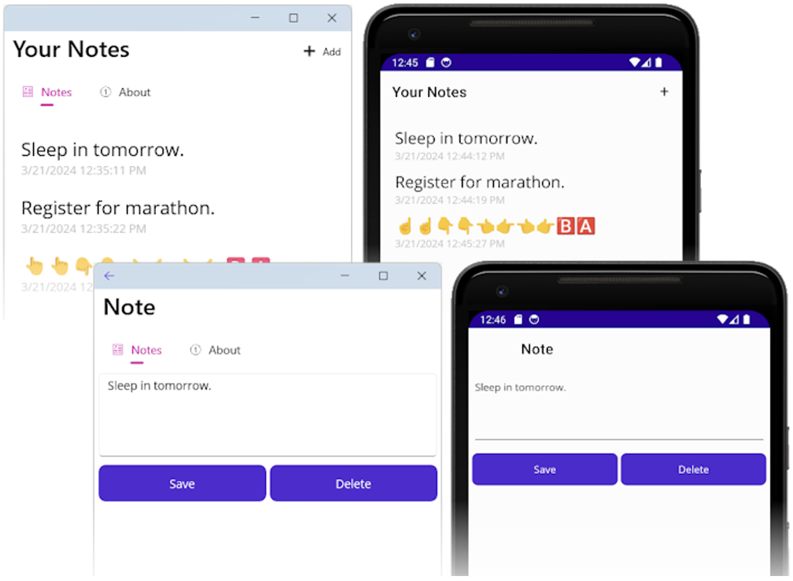
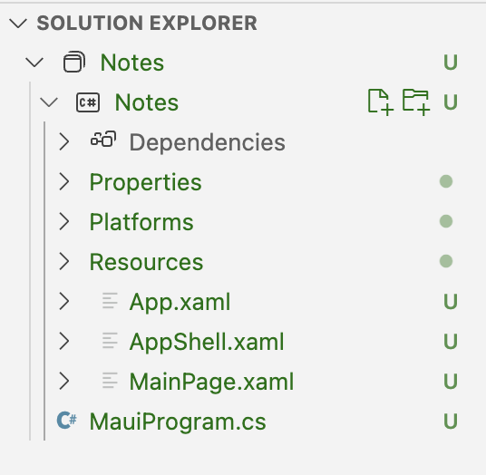
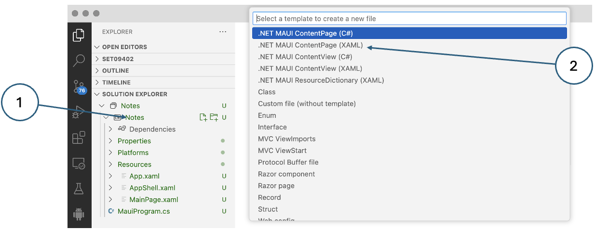
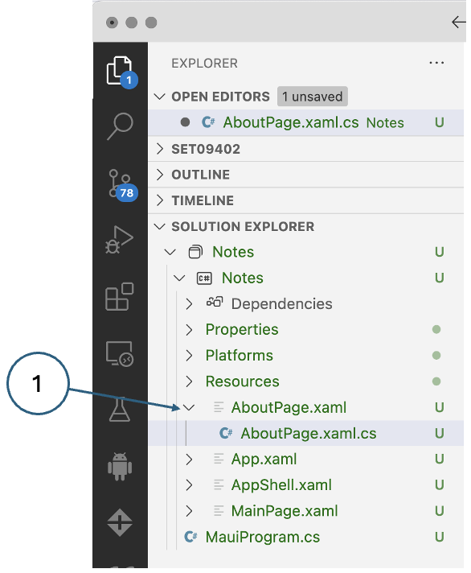
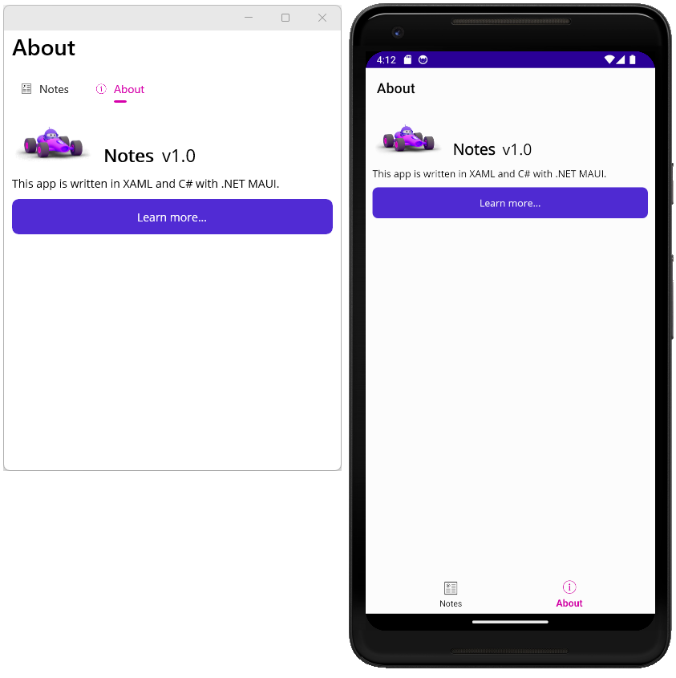
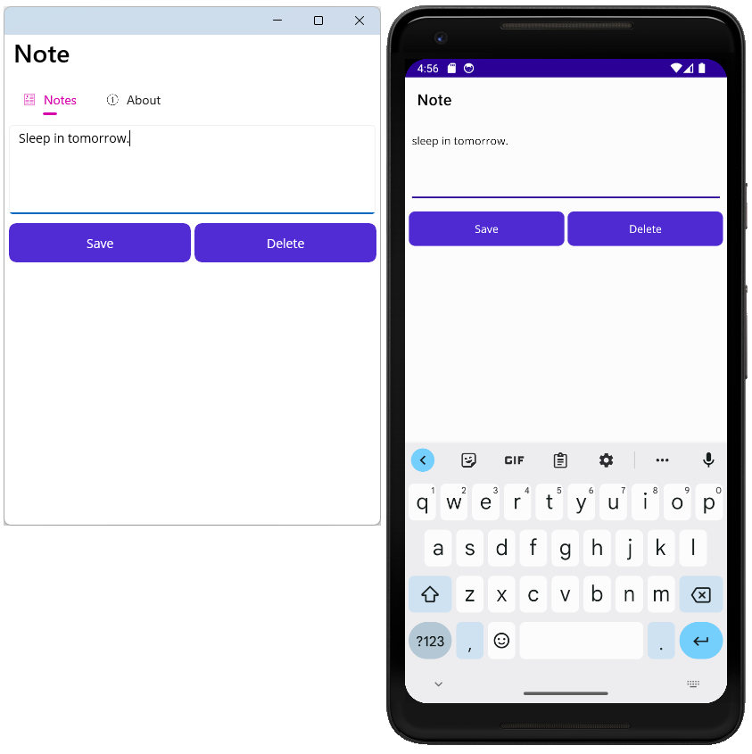
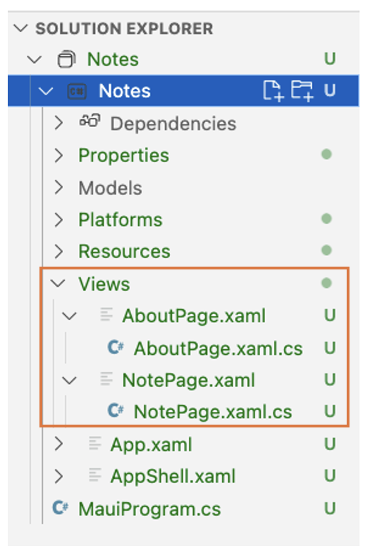
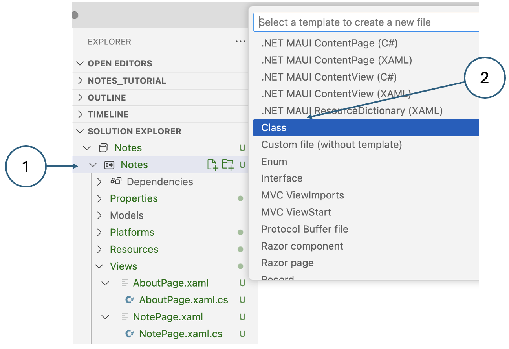
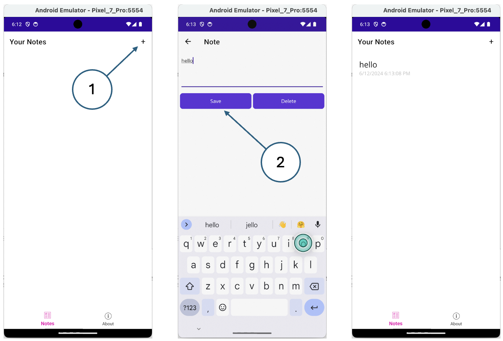

# Getting started with MAUI

This tutorial series is designed to demonstrate how to create a .NET
Multi-platform App UI (.NET MAUI) app that only uses cross-platform code.
That is, the code you write won't be specific to Windows, Android, iOS,
or macOS. The app you'll create will be a note-taking app, where the user
can create, save, and load multiple notes.

In this tutorial, you learn how to:

*   Create a .NET MAUI Shell app.
*   Run your app on your chosen platform.
*   Define the user interface with eXtensible Application Markup Language
    (XAML), and interact with XAML elements through code.
*   Create views and bind them to data.
*   Use navigation to move to and from pages.

The content of the tutorial is heavily based on the standard
[Microsoft tutorial](https://learn.microsoft.com/en-us/dotnet/maui/tutorials/notes-app/?view=net-maui-8.0){:target="_blank"}
which uses Visual Studio IDE as the development tool. This version has been
modified to use Visual Studio Code (VSCode) but the result should be the same.
In the first stage, your app will allow users to enter a note and save it to
device storage.  

{: standalone #fig1}

## 1. Create a project

Copy and clone the [stub repo](https://github.com/edinburgh-napier/SET09402){:target="_blank"} into your project workspaces folder.

Open the new project in VSCode and delete the existing _Haulage_ project folder
and the solution file _Haulage.sln_.

Commit the changes and provide a suitable commit comment when prompted.

Create a new project with the **_.NET: New project..._** option on the VSCode
command palette. When prompted for a template, select **_.NET MAUI App_** and
call it _Notes_.

Edit the file _.gitignore_ replacing all references to _Haulage_ with _Notes_.

Commit these changes as well.

This essentially re-creates the original dummy project with a different name.

## 2. Customise the app shell

When VSCode creates a .NET MAUI project four important code files are generated.
These can be seen in the **Solution Explorer** pane:

{: standalone #fig2}

These files help get the .NET MAUI app configured and running. Each file serves
a different purpose as described below:

_MauiProgram.cs_

This is a code file that bootstraps your app. The code in this file serves as
the cross-platform entry point of the app, which configures and starts the app.
The template startup code points to the `App` class defined by the _App.xaml_ file.

_App.xaml_ and _App.xaml.cs

Just to keep things simple, both of these files are referred to as a single file.
There are generally two files with any XAML file, the _.xaml_ file itself, and a
corresponding code file that is a child item of it in the **Solution Explorer**.
The _.xaml_ file contains XAML markup and the code file contains code created by
the user to interact with the XAML markup.

The _App.xaml_ file contains app-wide XAML resources, such as colours, styles,
or templates. The _App.xaml.cs_ file generally contains code that instantiates
the Shell application. In this project, it points to the `AppShell` class.

_AppShell.xaml_ and _AppShell.xaml.cs

This file defines the `AppShell` class, which is used to define visual hierarchy
of the app.

_MainPage.xaml_ and _MainPage.xaml.cs

This is the startup page displayed by the app. The _MainPage.xaml_ file defines
the UI (user interface) of the page. _MainPage.xaml.cs_ contains the
[code-behind](https://learn.microsoft.com/en-us/dotnet/android/features/layout-code-behind/?toc=%2Fdotnet%2Fmaui%2Ftoc.json&bc=%2Fdotnet%2Fmaui%2Fbreadcrumb%2Ftoc.json&view=net-maui-8.0#code-behind){:target="_blank"} for the XAML, like code for a button click event.

### Add an "About" page

The first customization you'll do is add another page to the project. This page
is an "about" page, which represents information about this app, such as the
author, version, and perhaps a link for more information.

1. In the **Solution Explorer** pane of VSCode, right-click the _Notes_
project and select _Add New File..._

{: standalone #fig3}

Select _.NET MAUI ContentPage (XAML)_ and call the new page _AboutPage.xaml._
You do not have to type the extension - it will be added automatically.

2. The _AboutPage.xaml_ file will open a new document tab, displaying all of
the XAML markup that represents the UI of the page. Replace the XAML markup
with the following markup:

```xml
<?xml version="1.0" encoding="utf-8" ?>
<ContentPage xmlns="http://schemas.microsoft.com/dotnet/2021/maui"
             xmlns:x="http://schemas.microsoft.com/winfx/2009/xaml"
             x:Class="Notes.AboutPage">
    <VerticalStackLayout Spacing="10" Margin="10">
        <HorizontalStackLayout Spacing="10">
            <Image Source="dotnet_bot.png"
                   SemanticProperties.Description="The dot net bot waving hello!"
                   HeightRequest="64" />
            <Label FontSize="22" FontAttributes="Bold" Text="Notes" VerticalOptions="End" />
            <Label FontSize="22" Text="v1.0" VerticalOptions="End" />
        </HorizontalStackLayout>

        <Label Text="This app is written in XAML and C# with .NET MAUI." />
        <Button Text="Learn more..." Clicked="LearnMore_Clicked" />
    </VerticalStackLayout>
</ContentPage>
```

Let's break down the key parts of the XAML controls placed on the page:

* `<ContentPage>` is the root object for the `AboutPage` class.
* `<VerticalStackLayout>` is the only child object of the [ContentPage](https://learn.microsoft.com/en-us/dotnet/api/microsoft.maui.controls.contentpage){:target="_blank"}.
[ContentPage](https://learn.microsoft.com/en-us/dotnet/api/microsoft.maui.controls.contentpage){:target="_blank"} can only have one child object. The [VerticalStackLayout](https://learn.microsoft.com/en-us/dotnet/api/microsoft.maui.controls.verticalstacklayout){:target="_blank"}
type can have multiple children. This layout control arranges its children
vertically, one after the other.
* `<HorizontalStackLayout>` operates the same as a `<VerticalStackLayout>`,
except its children are arranged horizontally.
* `<Image>` displays an image, in this case it's using the `dotnet_bot.png`
image that comes with every .NET MAUI project.

{: .note-title }
> <i class="fa-solid fa-triangle-exclamation"></i> Note
> 
> The file added to the project is actually `dotnet_bot.svg`. .NET MAUI converts
> Scalable Vector Graphics (SVG) files to Portable Network Graphic (PNG) files
> based on the target device. Therefore, when adding an SVG file to your .NET MAUI
> app project, it should be referenced from XAML or C# with a `.png` extension.
> The only reference to the SVG file should be in your project file.

* `<Label>` controls display text.
* `<Button>` controls can be pressed by the user, which raise the `Clicked` event.
  You can run code in response to the `Clicked` event.
* `Clicked="LearnMore_Clicked"`

The `Clicked` event of the button is assigned to the `LearnMore_Clicked` event
handler, which will be defined in the code-behind file. You'll create this code
in the next step.

### Handle the Clicked event

The next step is to add the code for the button's `Clicked` event.

In the **Solution Explorer** pane of VSCode, expand the _AboutPage.xaml_ file
to reveal its code-behind file _AboutPage.xaml.cs_. Then click on the
_AboutPage.xaml.cs_ file to open it in the code editor.

{: standalone #fig4}

Change the `namespace` to _Notes_ instead of the default _MauiApp1_.

Add the following `LearnMore_Clicked` event handler code, which opens the
system browser to a specific URL:

```c#
private async void LearnMore_Clicked(object sender, EventArgs e)
{
    // Navigate to the specified URL in the system browser.
    await Launcher.Default.OpenAsync("https://aka.ms/maui");
}
```

Notice that the `async` keyword has been added to the method declaration,
which allows the use of the `await` keyword when opening the system browser.

Now that the XAML and code-behind of the `AboutPage` is complete, you'll need
to get it displayed in the app.

### Add image resources

Some controls can use images, which enhances how users interact with your app.
In this section you'll download two images, an _About_ icon and a _Notes_ icon
in two formats, one for iOS and one for other platforms. The _About_ icon will
be used as a link to the page you created earlier, and the _Notes_ icon will be
used to navigate to a notes page that you will create in the next part of the
tutorial.

iOS images:

[](https://raw.githubusercontent.com/dotnet/docs-maui/main/docs/tutorials/notes-app/snippets/shell/Resources/Images/icon_about_ios.png){:target="_blank"}

[](https://raw.githubusercontent.com/dotnet/docs-maui/main/docs/tutorials/notes-app/snippets/shell/Resources/Images/icon_notes_ios.png){:target="_blank"}

Images for other plaforms:

[](https://raw.githubusercontent.com/dotnet/docs-maui/main/docs/tutorials/notes-app/snippets/shell/Resources/Images/icon_about.png){:target="_blank"}

[](https://raw.githubusercontent.com/dotnet/docs-maui/main/docs/tutorials/notes-app/snippets/shell/Resources/Images/icon_notes.png){:target="_blank"}

After you've downloaded the images, you can move them with File Explorer or
Finder to the _Resources\Images_ folder of the project. Any file in this
folder is automatically included in the project as a
**[MauiImage](https://learn.microsoft.com/en-us/dotnet/maui/user-interface/images/images?view=net-maui-8.0){:target="_blank"}** resource.

### Modify the app shell

As noted at the start of this article, the `AppShell` class defines an app's
visual hierarchy, the XAML markup used in creating the UI of the app. Update
the XAML to add a [TabBar](https://learn.microsoft.com/en-us/dotnet/api/microsoft.maui.controls.tabbar){:target="_blank"} control:

Click the _AppShell.xaml_ file in the **Solution Explorer** pane to open the
XAML editor. Replace the XAML markup with the following code:

```xml
<?xml version="1.0" encoding="UTF-8" ?>
<Shell
    x:Class="Notes.AppShell"
    xmlns="http://schemas.microsoft.com/dotnet/2021/maui"
    xmlns:x="http://schemas.microsoft.com/winfx/2009/xaml"
    xmlns:local="clr-namespace:Notes"
    Shell.FlyoutBehavior="Disabled">

    <TabBar>
        <ShellContent
            Title="Notes"
            ContentTemplate="{DataTemplate local:MainPage}"
            Icon="{OnPlatform 'icon_notes.png', iOS='icon_notes_ios.png', MacCatalyst='icon_notes_ios.png'}" />

        <ShellContent
            Title="About"
            ContentTemplate="{DataTemplate local:AboutPage}"
            Icon="{OnPlatform 'icon_about.png', iOS='icon_about_ios.png', MacCatalyst='icon_about_ios.png'}" />
    </TabBar>

</Shell>
```

Let's break down the key parts of the XAML:

* `<Shell>` is the root object of the XAML markup.
* `<TabBar>` is the content of the [Shell](https://learn.microsoft.com/en-us/dotnet/api/microsoft.maui.controls.shell){:target="_blank"}.
* Two `<ShellContent>` objects inside of the `<TabBar>`. Before you replaced
  the template code, there was a single `<ShellContent>` object, pointing to
  the `MainPage` page.

The `TabBar` and its children don't represent any user interface elements,
but rather the organization of the app's visual hierarchy. Shell takes these
objects and produces the user interface for the content, with a bar at the
top representing each page. The `ShellContent.Icon` property for each page
uses special syntax: `{OnPlatform ...}`. This syntax is processed when the
XAML pages are compiled for each platform, and with it you can specify a
property value for each platform. In this case, every platform uses the
`icon_about.png` icon by default, but iOS and MacCatalyst will use
`icon_about_ios.png`.

Each `<ShellContent>` object is pointing to a page to display. This is set
by the `ContentTemplate` property.

### Run the app

With the emulator running, click the _Run and Debug_ icon in the VSCode
controls panel.

You'll see that there are two tabs: **Notes** and **About**. Press the
**About** tab and the app navigates to the `AboutPage` you created. Press
on the **Learn More...** button to open the web browser.

{: standalone #fig5}

## 3. Create a page for a note

Now that the app contains the `MainPage` and `AboutPage`, you can start
creating the rest of the app. First, you'll create a page that allows a
user to create and display a note, and then you'll write the code to load
and save the note.

The note page will display the note and allow you to either save or delete
it. First, add the new page to the project using the same procedure as you
did in step 3. Name the new item _NotePage.xaml_.

The _NotePage.xaml_ file will open in a new tab, displaying all of the
XAML markup that represents the UI of the page. Replace the XAML code
markup the following markup:

```xml
<!--?xml version="1.0" encoding="utf-8" ?-->
<ContentPage xmlns="http://schemas.microsoft.com/dotnet/2021/maui"
             xmlns:x="http://schemas.microsoft.com/winfx/2009/xaml"
             x:Class="Notes.NotePage"
             Title="Note">
    <VerticalStackLayout Spacing="10" Margin="5">
        <Editor x:Name="TextEditor"
                Placeholder="Enter your note"
                HeightRequest="100" />

        <Grid ColumnDefinitions="\*,\*" ColumnSpacing="4">
            <Button Text="Save"
                    Clicked="SaveButton_Clicked" />

            <Button Grid.Column="1"
                    Text="Delete"
                    Clicked="DeleteButton_Clicked" />
        </Grid>
    </VerticalStackLayout>
</ContentPage>
```

Let's break down the key parts of the XAML controls placed on the page:

* `<VerticalStackLayout>` arranges its children controls vertically, one
below the other.
* `<Editor>` is a multi-line text editor control, and is the first control
inside [VerticalStackLayout](https://learn.microsoft.com/en-us/dotnet/api/microsoft.maui.controls.verticalstacklayout){:target="_blank"}
* `<Grid>` is a layout control, and is the second control inside of
[VerticalStackLayout](https://learn.microsoft.com/en-us/dotnet/api/microsoft.maui.controls.verticalstacklayout){:target="_blank"}

The [Grid](https://learn.microsoft.com/en-us/dotnet/api/microsoft.maui.controls.grid){:target="_blank"} control defines columns and rows to create cells.
Child controls are placed within those cells.

By default, the [Grid](https://learn.microsoft.com/en-us/dotnet/api/microsoft.maui.controls.grid){:target="_blank"} control contains a single row and column,
creating a single cell. Columns are defined with a width, and the `*` value
for width tells the column to fill up as much space as possible. The previous
snippet defined two columns, both using as much space as possible, which
evenly distributes the columns in the allotted space: `ColumnDefinitions="*,*"`.
The column sizes are separated by a `,` character.

Columns and rows defined by a [Grid](https://learn.microsoft.com/en-us/dotnet/api/microsoft.maui.controls.grid){:target="_blank"} are indexed starting at 0. So
the first column would be index 0, the second column is index 1, and so on.

Two `<Button>` controls are inside the `<Grid>` and assigned a column. If
a child control doesn't define a column assignment, it's automatically
assigned to the first column. In this markup, the first button is the "Save"
button and automatically assigned to the first column, column 0. The second
button is the "Delete" button and assigned to the second column, column 1.

Notice the two buttons have the `Clicked` event handled. You'll add the
code for those handlers in the next section.

### Load and save a note

Open the _NotePage.xaml.cs_ code-behind file using the **Solution Explorer**
to expand the _NotePage.xaml_ entry, revealing the _NotePage.xaml.cs_ file.
Click the file to open it.

When you add a new XAML file, the code-behind contains a single line in the
constructor, a call to the `InitializeComponent` method:

```c#
namespace Notes;

public partial class NotePage : ContentPage
{
    public NotePage()
    {
        InitializeComponent();
    }
}
```

The `InitializeComponent` method reads the XAML markup and initializes all
of the objects defined by the markup. The objects are connected in their
parent-child relationships, and the event handlers defined in code are
attached to events set in the XAML.

Now that you understand a little more about code-behind files, you're going
to add code to the _NotePage.xaml.cs_ code-behind file to handle loading
and saving notes.

1.  When a note is created, it's saved to the device as a text file. The name of the
    file is represented by the `_fileName` variable. Add the following `string`
    variable declaration to the `NotePage` class:

    public partial class NotePage : ContentPage
    {
        string _fileName = Path.Combine(FileSystem.AppDataDirectory, "notes.txt");

    The code above constructs a path to the file, storing it in the app's local data directory. The file name is notes.txt.

2.  In the constructor of the class, after the `InitializeComponent` method is called,
    read the file from the device and store its contents in the `TextEditor` control's
    `Text` property:

    ```c#
    public NotePage()
    {
        InitializeComponent();

        if (File.Exists(_fileName))
            TextEditor.Text = File.ReadAllText(_fileName);
    }
    ```

3.  Next, add the code to handle the `Clicked` events defined in the XAML:

    ```c#
    private void SaveButton_Clicked(object sender, EventArgs e)
    {
        // Save the file.
        File.WriteAllText(_fileName, TextEditor.Text);
    }

    private void DeleteButton_Clicked(object sender, EventArgs e)
    {
        // Delete the file.
        if (File.Exists(_fileName))
            File.Delete(_fileName);

        TextEditor.Text = string.Empty;
    }
    ```

    The `SaveButton_Clicked` method writes the text in the [Editor](https://learn.microsoft.com/en-us/dotnet/api/microsoft.maui.controls.editor?view=net-maui-8.0){:target="_blank"}
    control, to the file represented by the `_fileName` variable.

    The `DeleteButton_Clicked` method first checks if the file represented by the
    `_fileName` variable, and if it exists, deletes it. Next, the Editor control's text is cleared.


The final code for the code-behind file should look like the following:

```c#
namespace Notes;

public partial class NotePage : ContentPage
{
    string _fileName = Path.Combine(FileSystem.AppDataDirectory, "notes.txt");

    public NotePage()
    {
        InitializeComponent();

        if (File.Exists(_fileName))
            TextEditor.Text = File.ReadAllText(_fileName);
    }

    private void SaveButton_Clicked(object sender, EventArgs e)
    {
        // Save the file.
        File.WriteAllText(_fileName, TextEditor.Text);
    }

    private void DeleteButton_Clicked(object sender, EventArgs e)
    {
        // Delete the file.
        if (File.Exists(_fileName))
            File.Delete(_fileName);

        TextEditor.Text = string.Empty;
    }
}
```

### Test the note

Now that note page is finished, you need a way to present it to the user.
Open the _AppShell.xaml_ file, and change the first [ShellContent](https://learn.microsoft.com/en-us/dotnet/api/microsoft.maui.controls.shellcontent){:target="_blank"}
entry to point to the `NotePage` instead of `MainPage`:

```xml
<?xml version="1.0" encoding="UTF-8" ?>
<Shell
    x:Class="Notes.AppShell"
    xmlns="http://schemas.microsoft.com/dotnet/2021/maui"
    xmlns:x="http://schemas.microsoft.com/winfx/2009/xaml"
    xmlns:local="clr-namespace:Notes"
    Shell.FlyoutBehavior="Disabled">

    <TabBar>
        <ShellContent
            Title="Notes"
            ContentTemplate="{DataTemplate local:NotePage}"
            Icon="{OnPlatform 'icon_notes.png', iOS='icon_notes_ios.png', MacCatalyst='icon_notes_ios.png'}" />

        <ShellContent
            Title="About"
            ContentTemplate="{DataTemplate local:AboutPage}"
            Icon="{OnPlatform 'icon_about.png', iOS='icon_about_ios.png', MacCatalyst='icon_about_ios.png'}" />
    </TabBar>

</Shell>
```

Save the file and run the app. Try typing into the entry box and press the
Save button. Close the app, and reopen it. The note you entered should be
loaded from the device's storage.

{: standalone #fig6}

## 4. Bind data to the UI and navigate pages

This portion of the tutorial introduces the concepts of views, models, and
in-app navigation.

In the previous steps of the tutorial, you added two pages to the project:
`NotePage` and `AboutPage`. The pages represent a view of data. The `NotePage`
is a "view" that displays "note data" and the `AboutPage` is a "view" that
displays "app information data." Both of these views have a model of that
data hardcoded, or embedded in them, and you'll need to separate the data
model from the view.

What is the benefit of separating the model from the view? It allows you to
design the view to represent and interact with any portion of the model
without worrying about the actual code that implements the model. This is
accomplished using data binding, something that will be presented later in
this tutorial. For now, though, let's restructure the project.

### Separate the view and model

Refactor the existing code to separate the model from the view. The next
few steps will organize the code so that views and models are defined
separately from each other.

1.  Delete _MainPage.xaml_ and _MainPage.xaml.cs_ from your project, they're no longer
    needed.

{: .tip-title }
> <i class="fa-regular fa-lightbulb"></i> Tip
>
> Deleting the _MainPage.xaml_ item should also delete the _MainPage.xaml.cs_ item
> too. If _MainPage.xaml.cs_ wasn't deleted, right-click on it and select **Delete**.

2.  Right-click on the **Notes** project and select **Add > New Folder**. Name the folder
    _Models_.
3.  Right-click on the **Notes** project and select **Add > New Folder**. Name the folder
    _Views_.
4.  Find the _NotePage.xaml_ item and drag it to the **Views** folder. The
    _NotePage.xaml.cs_ should move with it.

{: .tip-title }
> <i class="fa-regular fa-lightbulb"></i> Tip
>
> VSCode may not allow you to move items in the **Solution Explorer** by dragging
> and dropping. Instead, use the file browser pane at the top of the explorer panel.
> Here, you will have to move both the _.xaml_ file and the _.xaml.cs_ files
> separately.

5.  Find the _AboutPage.xaml_ item and drag it to the **Views** folder. The
    _AboutPage.xaml.cs_ should move with it.  


### Update the view namespace

Now that the views have been moved to the Views folder, you'll need to update the
namespaces to match. The namespace for the XAML and code-behind files of the pages
is set to `Notes`. This needs to be updated to `Notes.Views`.

1.  In the Solution Explorer pane, expand both _NotePage.xaml_ and _AboutPage.xaml_ to
    reveal the code-behind files:

    {: standalone #fig7}

4.  Double-click on the _NotePage.xaml.cs_ item to open the code editor. Change the
    namespace to `Notes.Views`:

    namespace Notes.Views;

5.  Repeat the previous steps for the _AboutPage.xaml.cs_ item.
6.  Double-click on the _NotePage.xaml_ item to open the XAML editor. The old namespace
    is referenced through the `x:Class` attribute, which defines which class type is the
    code-behind for the XAML. This entry isn't just the namespace, but the namespace
    with the type. Change the `x:Class` value to `Notes.Views.NotePage`:

    ```xml
    x:Class="Notes.Views.NotePage"
    ```

7.  Repeat the previous step for the _AboutPage.xaml_ item, but set the `x:Class` value
    to `Notes.Views.AboutPage`.

### Fix the namespace reference in Shell

The _AppShell.xaml_ defines two tabs, one for the NotesPage and another for AboutPage.
Now that those two pages were moved to a new namespace, the type mapping in the XAML
is now invalid. In the **Solution Explorer** pane, double-click on the _AppShell.xaml_
entry to open it in the XAML editor. It should look like the following snippet:

```xml
<?xml version="1.0" encoding="UTF-8" ?>
<Shell
    x:Class="Notes.AppShell"
    xmlns="http://schemas.microsoft.com/dotnet/2021/maui"
    xmlns:x="http://schemas.microsoft.com/winfx/2009/xaml"
    xmlns:local="clr-namespace:Notes"
    Shell.FlyoutBehavior="Disabled">

    <TabBar>
        <ShellContent
            Title="Notes"
            ContentTemplate="{DataTemplate local:NotePage}"
            Icon="{OnPlatform 'icon_notes.png', iOS='icon_notes_ios.png', MacCatalyst='icon_notes_ios.png'}" />

        <ShellContent
            Title="About"
            ContentTemplate="{DataTemplate local:AboutPage}"
            Icon="{OnPlatform 'icon_about.png', iOS='icon_about_ios.png', MacCatalyst='icon_about_ios.png'}" />
    </TabBar>

</Shell>
```

A .NET namespace is imported into the XAML through an XML namespace declaration. In the
previous XAML markup, it's the `xmlns:local="clr-namespace:Notes"` attribute in the root
element: `<Shell>`. The format of declaring an XML namespace to import a .NET namespace
in the same assembly is:

xmlns:{XML namespace name}="clr-namespace:{.NET namespace}"

So the previous declaration maps the XML namespace of `local` to the .NET namespace of
`Notes`. It's common practice to map the name local to the root namespace of your project.

Remove the `local` XML namespace and add a new one. This new XML namespace will map
to the .NET namespace of `Notes.Views`, so name it `views`. The declaration should
look like the following attribute: `xmlns:views="clr-namespace:Notes.Views"`.

The `local` XML namespace was used by the `ShellContent.ContentTemplate` properties,
change them to `views`. Your XAML should now look like the following snippet:

```xml
<?xml version="1.0" encoding="UTF-8" ?>
<Shell
    x:Class="Notes.AppShell"
    xmlns="http://schemas.microsoft.com/dotnet/2021/maui"
    xmlns:x="http://schemas.microsoft.com/winfx/2009/xaml"
    xmlns:views="clr-namespace:Notes.Views"
    Shell.FlyoutBehavior="Disabled">

    <TabBar>
        <ShellContent
            Title="Notes"
            ContentTemplate="{DataTemplate views:NotePage}"
            Icon="{OnPlatform 'icon_notes.png', iOS='icon_notes_ios.png', MacCatalyst='icon_notes_ios.png'}" />

        <ShellContent
            Title="About"
            ContentTemplate="{DataTemplate views:AboutPage}"
            Icon="{OnPlatform 'icon_about.png', iOS='icon_about_ios.png', MacCatalyst='icon_about_ios.png'}" />
    </TabBar>

</Shell>
```

You should now be able to run the app without any compiler errors, and everything should
still work as before.

### Define the model

Currently, the model is the data that is embedded in the note and about views. We'll
create new classes to represent that data. First, the model to represent a note page's
data:

1.  In the **Solution Explorer** pane, right-click on the **Models** folder and select
    **Add New File....**  

    {: standalone #fig8}

2.  Name the class `Note` and press RETURN. Notice that VSCode will automatically add
    the _.cs_ extension to the filename.
3.  _Note.cs_ is opened automatically after creation. Replace the default content with
    the following snippet:

    ```c#
    namespace Notes.Models;

    internal class Note
    {
        public string? Filename { get; set; }
        public string? Text { get; set; }
        public DateTime? Date { get; set; }
    }
    ```

{: .information-title }
> <i class="fa-light fa-circle-info"></i> Information
>
> The question marks after the datatypes in the code above indicate that these properties are 
> all nullable. This is not necessarily what we want in the long run, but for now, this will 
> allow us to run the app with no errors.


Next, create the about page's model:

1.  In the **Solution Explorer** pane, right-click on the **Models** folder and select
    **Add New File...**.
2.  Create a new class called `About`.
3.  Replace the default content of the new file with the following snippet:

    ```c#
    namespace Notes.Models;

    internal class About
    {
        public string Title => AppInfo.Name;
        public string Version => AppInfo.VersionString;
        public string MoreInfoUrl => "https://aka.ms/maui";
        public string Message => "This app is written in XAML and C# with .NET MAUI.";
    }
    ```    

### Update About page

The about page will be the quickest page to update and you'll be able to run the app
and see how it loads data from the model.

1.  In the **Solution Explorer** pane, open the _Views/AboutPage.xaml_ file.
2.  Replace the content with the following snippet:

    ```xml
    <?xml version="1.0" encoding="utf-8" ?>
    <ContentPage xmlns="http://schemas.microsoft.com/dotnet/2021/maui"
                 xmlns:x="http://schemas.microsoft.com/winfx/2009/xaml"
                 xmlns:models="clr-namespace:Notes.Models"
                 x:Class="Notes.Views.AboutPage">
        <ContentPage.BindingContext>
            <models:About />
        </ContentPage.BindingContext>
        <VerticalStackLayout Spacing="10" Margin="10">
            <HorizontalStackLayout Spacing="10">
                <Image Source="dotnet_bot.png"
                       SemanticProperties.Description="The dot net bot waving hello!"
                       HeightRequest="64" />
                <Label FontSize="22" FontAttributes="Bold" Text="{Binding Title}" VerticalOptions="End" />
                <Label FontSize="22" Text="{Binding Version}" VerticalOptions="End" />
            </HorizontalStackLayout>

            <Label Text="{Binding Message}" />
            <Button Text="Learn more..." Clicked="LearnMore_Clicked" />
        </VerticalStackLayout>

    </ContentPage>
    ```    

Let's look at the changes in the new snippet:

*   `xmlns:models="clr-namespace:Notes.Models"`

    This line maps the `Notes.Models` .NET namespace to the `models` XML namespace.

*   The `BindingContext` property of the [ContentPage](https://learn.microsoft.com/en-us/dotnet/api/microsoft.maui.controls.contentpage){:target="_blank"} is set to
    an instance of the `Note.Models.About` class, using the XML namespace and object of
    `models:About`. This was set using property element syntax instead of an XML attribute.

{: .note-title }
> <i class="fa-solid fa-triangle-exclamation"></i> Important!
> 
> Until now, properties have been set using an XML attribute. This works great for
> simple values, such as a `Label.FontSize` property. But if the property value is more
> complex, you must use property element syntax to create the object. Consider the
> following example of a creating a label with its `FontSize` property set:
>
> ```xml
> <Label FontSize="22" />
> ```
>     
> The same FontSize property can be set using property element syntax:
>
> ```xml
> <Label>
>     <Label.FontSize>
>         22
>     </Label.FontSize>
> </Label>
> ```

*   Three `<Label>` controls had their `Text` property value changed from a hardcoded
    string to binding syntax: `{Binding PATH}`.

    `{Binding}` syntax is processed at run-time, allowing the value returned from the
    binding to be dynamic. The `PATH` portion of `{Binding PATH}` is the property path
    to bind to. The property comes from the current control's `BindingContext`. With the
    `<Label>` control, `BindingContext` is unset. Context is inherited from the parent
    when it's unset by the control, which in this case, the parent object setting context
    is the root object: [ContentPage](https://learn.microsoft.com/en-us/dotnet/api/microsoft.maui.controls.contentpage).

    The object in the `BindingContext` is an instance of the `About` model. The binding
    path of one of the labels binds the `Label.Text` property to the `About.Title`
    property.


The final change to the about page is updating the button click that opens a web page. The URL was hardcoded in the code-behind, but the URL should come from the model that is in the `BindingContext` property.

1.  In the **Solution Explorer** pane, open the _Views/AboutPage.xaml.cs_ file.
2.  Replace the `LearnMore_Clicked` method with the following code:

    ```c#
    private async void LearnMore_Clicked(object sender, EventArgs e)
    {
        if (BindingContext is Models.About about)
        {
            // Navigate to the specified URL in the system browser.
            await Launcher.Default.OpenAsync(about.MoreInfoUrl);
        }
    }
    ```    

The condition checks if the `BindingContext` is a `Models.About` type, and if it is,
assigns it to the `about` variable. The line inside the if statement opens the browser
to the URL provided by the `about.MoreInfoUrl` property.

Run the app and you should see that it runs exactly the same as before. Try changing
the about model's values and see how the UI and URL opened by the browser also change.

### Update Note page

The previous section bound the **about** page view to the **about** model, and now
you'll do the same, binding the **note** view to the **note** model. However, in this
case, the model won't be created in XAML but will be provided in the code-behind in
the next few steps.

1.  In the **Solution Explorer** pane, open the _Views/NotePage.xaml_ file.
2.  Change the `<Editor>` control adding the `Text` property. Bind the property to the
    `Text` property: `<Editor ... Text="{Binding Text}"`:

    ```xml
    <?xml version="1.0" encoding="utf-8" ?>
    <ContentPage xmlns="http://schemas.microsoft.com/dotnet/2021/maui"
                 xmlns:x="http://schemas.microsoft.com/winfx/2009/xaml"
                 x:Class="Notes.Views.NotePage"
                 Title="Note">
        <VerticalStackLayout Spacing="10" Margin="5">
            <Editor x:Name="TextEditor"
                    Placeholder="Enter your note"
                    Text="{Binding Text}"
                    HeightRequest="100" />

            <Grid ColumnDefinitions="\*,\*" ColumnSpacing="4">
                <Button Text="Save"
                        Clicked="SaveButton_Clicked" />

                <Button Grid.Column="1"
                        Text="Delete"
                        Clicked="DeleteButton_Clicked" />
            </Grid>
        </VerticalStackLayout>
    </ContentPage>
    ```

The modifications for the code-behind are more complicated than the XAML. The current
code is loading the file content in the constructor, and then setting it directly to
the `TextEditor.Text` property. Here is what the current code looks like:

```c#
public NotePage()
{
    InitializeComponent();

    if (File.Exists(_fileName))
        TextEditor.Text = File.ReadAllText(_fileName);
}
```

Instead of loading the note in the constructor, create a new `LoadNote` method. This
method will do the following:

*   Accept a file name parameter.
*   Create a new note model and set the file name.
*   If the file exists, load its content into the model.
*   If the file exists, update the model with the date the file was created.
*   Set the `BindingContext` of the page to the model.

1.  In the **Solution Explorer** pane, open the _Views/NotePage.xaml.cs_ file.
2.  Add the following method to the class:

    ```c#
    private void LoadNote(string fileName)
    {
        Models.Note noteModel = new Models.Note();
        noteModel.Filename = fileName;

        if (File.Exists(fileName))
        {
            noteModel.Date = File.GetCreationTime(fileName);
            noteModel.Text = File.ReadAllText(fileName);
        }

        BindingContext = noteModel;
    }
    ```

3.  Update the class constructor to call `LoadNote`. The file name for the note should
    be a randomly generated name to be created in the app's local data directory.

    ```c#
    public NotePage()
    {
        InitializeComponent();

        string appDataPath = FileSystem.AppDataDirectory;
        string randomFileName = $"{Path.GetRandomFileName()}.notes.txt";

        LoadNote(Path.Combine(appDataPath, randomFileName));
    }
    ```

## 5. Add a view and model that lists all notes

This portion of the tutorial adds the final piece of the app, a view that displays
all of the notes previously created.

### Multiple notes and navigation

Currently the note view displays a single note. To display multiple notes, create a
new view and model: `AllNotes`.

1.  In the **Solution Explorer** pane, right-click on the **Views** folder and select
    **Add New File...**.
2.  Select the **.NET MAUI ContentPage (XAML)** template. Name the file
    _AllNotesPage.xaml_, and press RETURN.
3.  In the **Solution Explorer** pane, right-click on the **Models** folder and
    select **Add New File...**
4.  Create a new class called _AllNotes.cs_.

### Code the AllNotes model

The new model will represent the data required to display multiple notes. This data
will be a property that represents a collection of notes. The collection will be an
`ObservableCollection` which is a specialized collection. When a control which lists
multiple items, such as a [ListView](https://learn.microsoft.com/en-us/dotnet/api/microsoft.maui.controls.listview), is bound to an `ObservableCollection`,
the two work together to automatically keep the list of items in sync with the
collection. If the list adds an item, the collection is updated. If the collection
adds an item, the control is automatically updated with a new item.

1.  In the **Solution Explorer** pane, open the _Models/AllNotes.cs_ file.
2.  Replace the code with the following snippet:

    ```c#
    using System.Collections.ObjectModel;

    namespace Notes.Models;

    internal class AllNotes
    {
        public ObservableCollection<Note> Notes { get; set; } = new ObservableCollection<Note>();

        public AllNotes() =>
            LoadNotes();

        public void LoadNotes()
        {
            Notes.Clear();

            // Get the folder where the notes are stored.
            string appDataPath = FileSystem.AppDataDirectory;

            // Use Linq extensions to load the \*.notes.txt files.
            IEnumerable<Note> notes = Directory

                                        // Select the file names from the directory
                                        .EnumerateFiles(appDataPath, "\*.notes.txt")

                                        // Each file name is used to create a new Note
                                        .Select(filename => new Note()
                                        {
                                            Filename = filename,
                                            Text = File.ReadAllText(filename),
                                            Date = File.GetLastWriteTime(filename)
                                        })

                                        // With the final collection of notes, order them by date
                                        .OrderBy(note => note.Date);

            // Add each note into the ObservableCollection
            foreach (Note note in notes)
                Notes.Add(note);
        }
    }
    ```

The previous code declares a collection, named `Notes`, and uses the `LoadNotes`
method to load notes from the device. This method uses [LINQ extensions](https://dotnettutorials.net/lesson/linq-extension-methods/) to
load, transform, and sort the data into the `Notes` collection.

### Design the AllNotes page

Next, the view needs to be designed to support the `AllNotes` model.

1.  In the **Solution Explorer** pane, open the _Views/AllNotesPage.xaml>_ file.
2.  Replace the code with the following markup:

    ```xml
    <?xml version="1.0" encoding="utf-8" ?>
    <ContentPage xmlns="http://schemas.microsoft.com/dotnet/2021/maui"
                 xmlns:x="http://schemas.microsoft.com/winfx/2009/xaml"
                 x:Class="Notes.Views.AllNotesPage"
                 Title="Your Notes">
        <!-- Add an item to the toolbar -->
        <ContentPage.ToolbarItems>
            <ToolbarItem Text="Add" Clicked="Add_Clicked" IconImageSource="{FontImage Glyph='+', Color=Black, Size=22}" />
        </ContentPage.ToolbarItems>

        <!-- Display notes in a list -->
        <CollectionView x:Name="notesCollection"
                            ItemsSource="{Binding Notes}"
                            Margin="20"
                            SelectionMode="Single"
                            SelectionChanged="notesCollection_SelectionChanged">

            <!-- Designate how the collection of items are laid out -->
            <CollectionView.ItemsLayout>
                <LinearItemsLayout Orientation="Vertical" ItemSpacing="10" />
            </CollectionView.ItemsLayout>

            <!-- Define the appearance of each item in the list -->
            <CollectionView.ItemTemplate>
                <DataTemplate>
                    <StackLayout>
                        <Label Text="{Binding Text}" FontSize="22"/>
                        <Label Text="{Binding Date}" FontSize="14" TextColor="Silver"/>
                    </StackLayout>
                </DataTemplate>
            </CollectionView.ItemTemplate>
        </CollectionView>
    </ContentPage>
    ```

The previous XAML introduces a few new concepts:

*   The `ContentPage.ToolbarItems` property contains a `ToolbarItem`. The buttons
    defined here are usually displayed at the top of the app, along the page title.
    Depending on the platform, though, it may be in a different position. When one of
    these buttons is pressed, the `Clicked` event is raised, just like a normal button.

    The `ToolbarItem.IconImageSource` property sets the icon to display on the button.
    The icon can be any image resource defined by the project, however, in this example,
    a `FontImage` is used. A `FontImage` can use a single glyph from a font as an image.

*   The `CollectionView` control displays a collection of items, and in this case, is
    bound to the model's `Notes` property. The way each item is presented by the
    collection view is set through the `CollectionView.ItemsLayout` and
    `CollectionView.ItemTemplate` properties.

    For each item in the collection, the `CollectionView.ItemTemplate` generates the
    declared XAML. The `BindingContext` of that XAML becomes the collection item itself,
    in this case, each individual note. The template for the note uses two labels,
    which are bound to the note's `Text` and `Date` properties.

*   The `CollectionView` handles the `SelectionChanged` event, which is raised when an
    item in the collection view is selected.

The code-behind for the view needs to be written to load the notes and handle the events.

1.  In the **Solution Explorer** pane, open the _Views/AllNotesPage.xaml.cs_ file.
2.  Replace the code with the following snippet:

    ```c#
    namespace Notes.Views;

    public partial class AllNotesPage : ContentPage
    {
        public AllNotesPage()
        {
            InitializeComponent();

            BindingContext = new Models.AllNotes();
        }

        protected override void OnAppearing()
        {
            ((Models.AllNotes)BindingContext).LoadNotes();
        }

        private async void Add_Clicked(object sender, EventArgs e)
        {
            await Shell.Current.GoToAsync(nameof(NotePage));
        }

        private async void notesCollection_SelectionChanged(object sender, SelectionChangedEventArgs e)
        {
            if (e.CurrentSelection.Count != 0)
            {
                // Get the note model
                var note = (Models.Note)e.CurrentSelection\[0\];

                // Should navigate to "NotePage?ItemId=path\\on\\device\\XYZ.notes.txt"
                await Shell.Current.GoToAsync($"{nameof(NotePage)}?{nameof(NotePage.ItemId)}={note.Filename}");

                // Unselect the UI
                notesCollection.SelectedItem = null;
            }
        }
    }
    ```

This code uses the constructor to set the BindingContext of the page to the model.

The `OnAppearing` method is overridden from the base class. This method is automatically
called whenever the page is shown, such as when the page is navigated to. The code here
tells the model to load the notes. Because the [CollectionView](https://learn.microsoft.com/en-us/dotnet/api/microsoft.maui.controls.collectionview){:target="_blank"} in
the `AllNotes` view is bound to the `AllNotes` model's `Notes` property, which is an
`ObservableCollection`, whenever the notes are loaded, the
[CollectionView](https://learn.microsoft.com/en-us/dotnet/api/microsoft.maui.controls.collectionview){:target="_blank"} is automatically updated.

The `Add_Clicked` handler introduces another new concept, navigation. Because the app
is using .NET MAUI Shell, you can navigate to pages by calling the
`Shell.Current.GoToAsync` method. Notice that the handler is declared with the async
keyword, which allows the use of the await keyword when navigating. This handler
navigates to the `NotePage`.

The last piece of code in the previous snippet is the `notesCollection_SelectionChanged`
handler. This method takes the currently selected item, a `Note` model, and uses its
information to navigate to the `NotePage`. [GoToAsync](https://learn.microsoft.com/en-us/dotnet/api/microsoft.maui.controls.shell.gotoasync){:target="_blank"} uses a URI
string for navigation. In this case, a string is constructed that uses a query string
parameter to set a property on the destination page. The interpolated string
representing the URI ends up looking similar to the following string:

NotePage?ItemId=path\\on\\device\\XYZ.notes.txt

The `ItemId=` parameter is set to the file name on the device where the note is stored.

Note

VSCode may be indicating that the NotePage.ItemId property doesn't exist, which it
doesn't. The next step is modifying the `Note` view to load the model based on the
`ItemId` parameter that you'll create.

### Query string parameters

The `Note` view needs to support the query string parameter, `ItemId`. Create it now:

1.  In the **Solution Explorer** pane, open the _Views/NotePage.xaml.cs_ file.
2.  Add a new string property named `ItemId`. This property calls the `LoadNote` method,
    passing the value of the property, which in turn, should be the file name of the note:

    ```c#
    public string ItemId
    {
        set { LoadNote(value); }
    }
    ```

3.  Add the `QueryProperty` attribute to the `class` keyword, providing the name of the
    query string property, and the class property it maps to, `ItemId` and `ItemId`
    respectively:

    ```c#
    \[QueryProperty(nameof(ItemId), nameof(ItemId))\]
    public partial class NotePage : ContentPage
    ```

4.  Replace the `SaveButton_Clicked` and `DeleteButton_Clicked` handlers with the
    following code:

    ```c#
    private async void SaveButton_Clicked(object sender, EventArgs e)
    {
        if (BindingContext is Models.Note note)
            File.WriteAllText(note.Filename, TextEditor.Text);

        await Shell.Current.GoToAsync("..");
    }

    private async void DeleteButton_Clicked(object sender, EventArgs e)
    {
        if (BindingContext is Models.Note note)
        {
            // Delete the file.
            if (File.Exists(note.Filename))
                File.Delete(note.Filename);
        }

        await Shell.Current.GoToAsync("..");
    }
    ```

    The buttons are now `async`. After they're pressed, the page navigates back to the
    previous page by using a URI of `..`

5.  Delete the `_fileName` variable from the top of the code, as it's no longer used by
    the class.

### Modify the app's visual tree

The `AppShell` is still loading the single note page, instead, it needs to load the
`AllPages` view. Open the _AppShell.xaml_ file and change the first `ShellContent`
entry to point to the `AllNotesPage` instead of `NotePage`:

```xml
<?xml version="1.0" encoding="UTF-8" ?>
<Shell
    x:Class="Notes.AppShell"
    xmlns="http://schemas.microsoft.com/dotnet/2021/maui"
    xmlns:x="http://schemas.microsoft.com/winfx/2009/xaml"
    xmlns:views="clr-namespace:Notes.Views"
    Shell.FlyoutBehavior="Disabled">

    <TabBar>
        <ShellContent
            Title="Notes"
            ContentTemplate="{DataTemplate views:AllNotesPage}"
            Icon="{OnPlatform 'icon_notes.png', iOS='icon_notes_ios.png', MacCatalyst='icon_notes_ios.png'}" />

        <ShellContent
            Title="About"
            ContentTemplate="{DataTemplate views:AboutPage}"
            Icon="{OnPlatform 'icon_about.png', iOS='icon_about_ios.png', MacCatalyst='icon_about_ios.png'}" />
    </TabBar>

</Shell>
```

If you run the app now, you'll notice it crashes if you press the **Add** button,
complaining that it can't navigate to `NotesPage`. Every page that can be navigated
to from another page, needs to be registered with the navigation system. The
`AllNotesPage` and `AboutPage` pages are automatically registered with the navigation
system by being declared in the [TabBar](https://learn.microsoft.com/en-us/dotnet/api/microsoft.maui.controls.tabbar){:target="_blank"}.

Register the `NotesPage` with the navigation system:

1.  In the **Solution Explorer** pane, open the _App.xaml.cs_ file.
2.  Add a line to the constructor that registers the navigation route:

    ```c#
    namespace Notes;

    public partial class AppShell : Shell
    {
        public AppShell()
        {
            InitializeComponent();

            Routing.RegisterRoute(nameof(Views.NotePage), typeof(Views.NotePage));

            MainPage = new AppShell();
        }
    }
    ```

The Routing.RegisterRoute method takes two parameters:

* The first parameter is the string name of the URI you want to register, in this case
  the resolved name is `"NotePage"`.
* The second parameter is the type of page to load when `"NotePage"` is navigated to.

Now you can run your app. Try adding new notes, navigating back and forth between notes,
and deleting notes.

{: standalone #fig9}
