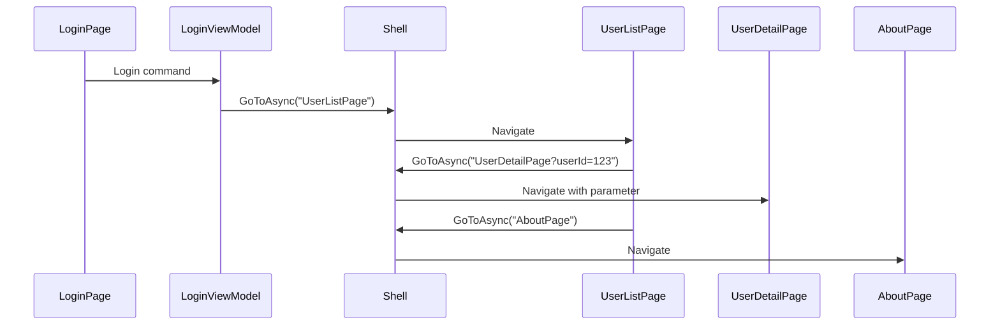
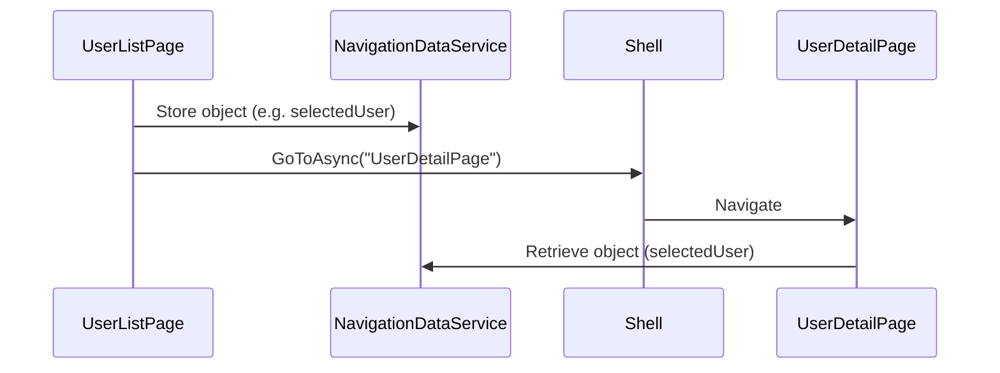

# 📄 Navigation in StarterApp (.NET MAUI)

This document explains how navigation works in the `StarterApp` project and provides 
step-by-step guidance for making common modifications like adding a new page.

---

## 🔍 1. Overview: How Navigation Works

StarterApp uses **.NET MAUI Shell navigation**, which simplifies routing between pages in an app.

- The main navigation container is defined in `AppShell.xaml`.
- Pages are displayed using `ShellContent`, and more complex routes can be registered dynamically.
- Navigation is typically triggered from view models using `Shell.Current.GoToAsync(...)`.

```csharp
await Shell.Current.GoToAsync(nameof(RegisterPage));
```

---

## 🧭 2. AppShell.xaml

This file defines the app's navigation structure:

```xml
<Shell
    x:Class="StarterApp.AppShell"
    xmlns="http://schemas.microsoft.com/dotnet/2021/maui"
    xmlns:x="http://schemas.microsoft.com/winfx/2009/xaml"
    xmlns:views="clr-namespace:StarterApp.Views"
    Shell.FlyoutBehavior="Disabled">

    <ShellContent ContentTemplate="{DataTemplate views:LoginPage}" />
</Shell>
```

---

## 📈 3. Navigation Flow Diagram



This diagram illustrates how users navigate between pages in StarterApp.

---

## 🛠️ 4. How to Add a New Page

### ✅ Step 1: Create the Page

1. Right-click on the `Views` folder → Add → New Item → ContentPage (XAML).
2. Name it `MyNewPage.xaml`.

### ✅ Step 2: Add the ViewModel

```csharp
public partial class MyNewPage : ContentPage
{
    public MyNewPage()
    {
        InitializeComponent();
        BindingContext = new MyNewPageViewModel();
    }
}
```

### ✅ Step 3: Register the Route

In `AppShell.xaml.cs`:

```csharp
Routing.RegisterRoute(nameof(MyNewPage), typeof(MyNewPage));
```

### ✅ Step 4: Navigate to the Page

```csharp
await Shell.Current.GoToAsync(nameof(MyNewPage));
```

---

## 🔄 5. Navigate Back

```csharp
await Shell.Current.GoToAsync("..");
```

---

## 🧠 Tips for Beginners

- Always register routes for pages you want to navigate to using `GoToAsync`.
- Use `nameof(PageName)` instead of hardcoding strings.
- You can pass parameters to pages via query strings or navigation context.


---

## 📦 6. Passing Parameters Between Pages

You can pass data between pages using **query parameters** with `.GoToAsync(...)`.

### ✅ Step 1: Add `[QueryProperty]` to the Target Page

In the ViewModel of the target page, add a property and decorate it with `[QueryProperty]`.

**Example:**

```csharp
[QueryProperty(nameof(UserId), "userId")]
public partial class UserDetailPage : ContentPage
{
    public string UserId { get; set; }

    public UserDetailPage()
    {
        InitializeComponent();
    }
}
```

### ✅ Step 2: Navigate with Parameters

From another ViewModel, navigate like this:

```csharp
await Shell.Current.GoToAsync($"{nameof(UserDetailPage)}?userId=123");
```

This passes the value `123` to the `UserId` property on `UserDetailPage`.

### 🔁 Notes

- The parameter name in the query string must match the alias given in `[QueryProperty]`.
- The type must be convertible from string (for example: `int`, `Guid`, `string`).

---

## 🧩 7. Passing Complex Objects Between Pages

Passing complex objects directly via Shell navigation is not supported by default. However, you can 
work around this by using a **shared service** or a **singleton** to temporarily store the object.

### ✅ Option 1: Use a Shared Service

1. Create a service class to hold navigation state:

```csharp
public class NavigationDataService
{
    public object NavigationParameter { get; set; }
}
```

2. Register it as a singleton in `MauiProgram.cs`:

```csharp
builder.Services.AddSingleton<NavigationDataService>();
```

3. Before navigating, store the object:

```csharp
_navigationDataService.NavigationParameter = user;
await Shell.Current.GoToAsync(nameof(UserDetailPage));
```

4. In the target page (or ViewModel), retrieve it:

```csharp
var user = _navigationDataService.NavigationParameter as User;
```

> 🧠 This method is ideal for passing view models, user objects, or more structured data types.

### ✅ Option 2: Serialise to JSON (for simple objects)

You can serialise objects to JSON and pass them as strings, but be mindful of size and encoding:

```csharp
string json = JsonSerializer.Serialize(user);
await Shell.Current.GoToAsync($"{nameof(UserDetailPage)}?userJson={Uri.EscapeDataString(json)}");
```

Then decode and deserialise on the receiving page:

```csharp
[QueryProperty(nameof(UserJson), "userJson")]
public partial class UserDetailPage : ContentPage
{
    public string UserJson { get; set; }

    public UserDetailPage()
    {
        InitializeComponent();
    }

    protected override void OnNavigatedTo(NavigatedToEventArgs args)
    {
        var user = JsonSerializer.Deserialize<User>(Uri.UnescapeDataString(UserJson));
    }
}
```

> ⚠️ This approach is more complex and should be used with caution due to potential encoding issues.


---

### 📊 Diagram: Passing Complex Objects

The diagram below illustrates how a complex object (e.g., a user model) is passed using a shared service.


