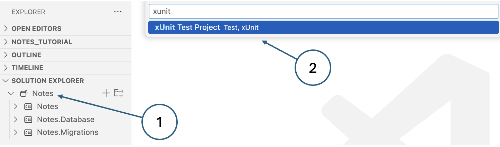

# Unit tests

Testing a method is essentially a simple concept. You work out what output or behaviour you 
expect for a given input, feed that input into the method and see what comes out. If it matches 
your expectations, the test succeeds; if the output does not match expectations, the test fails. 
Creating unit tests manually can be a laborious and error-prone process, however, requiring 
developers to write extensive code to cover various scenarios and edge cases. This often leads 
to inconsistent testing practices, missed cases, and difficulties in maintaining the test suite 
as the codebase evolves. Using a testing framework, on the other hand, offers significant benefits 
by providing a structured and systematic approach to testing. Frameworks such as MSTest, NUnit 
or xUnit offer built-in functionalities like assertions, test runners, and mocking, which 
streamline the creation, execution, and reporting of tests. They also promote best practices, 
enhance test readability and reusability, and simplify the detection and debugging of issues, 
leading to more robust and reliable software development. 
This [discussion](https://stackify.com/unit-test-frameworks-csharp/) comparing the above three 
frameworks for unit testing C# code shows that not much separates them in their current versions. 
Here, we will be using [xUnit](https://xunit.net/) as the most popular option.

{: .note-title }
> <i class="fa-solid fa-triangle-exclamation"></i> Important
> 
> This tutorial makes use of concepts from the previous one on database migrations and is built 
> on top of the version of the Notes application from that tutorial. If you have not completed 
> the migrations tutorial, some parts of this one will not work.


## 1. Theory

### Test coverage

In an ideal world, every line of code should be tested to ensure that it behaves as expected. 
_Test coverage_ is a software quality metric that measures the extent to which the source code of 
a program is tested by a particular set of tests (the _test suite_). It is typically expressed as 
a percentage, indicating how many lines of code, branches, or functions have been executed during 
testing. High test coverage suggests that a significant portion of the code has been exercised, 
potentially uncovering more defects and reducing the likelihood of undiscovered bugs. However, 
while high coverage can indicate thorough testing, it does not guarantee the detection of all 
issues or the quality of the tests themselves. As a metric, test coverage is used to identify 
untested parts of the codebase, guide the creation of additional tests, and ensure that 
modifications or new features do not introduce regressions. These are defects or bugs that arise 
when a previously functioning feature stops working correctly after changes have been made to the 
codebase. Detecting and fixing regressions is a critical part of maintaining software quality, 
often addressed through _regression testing_ which involves re-running existing test cases to 
ensure that recent changes have not adversely affected previously working functionality.

### Cyclomatic complexity

It is reasonable to expect that the more complex a piece of code, the more unit tests are 
required to ensure it works correctly. 
[Cyclomatic complexity](https://www.sonarsource.com/learn/cyclomatic-complexity/) measures the 
number of linearly independent paths through the code, indicating the minimum number of test cases 
needed to cover all possible paths. While it is a useful metric for understanding the potential 
complexity of a codebase, relying on it solely to specify the number of unit tests required has 
its limitations. For example, this metric does not account for the quality or effectiveness of 
the tests, only their quantity. High cyclomatic complexity may necessitate more tests, but it 
does not ensure those tests cover edge cases, validate correct behaviour under various conditions, 
or catch subtle bugs.

A further limitation of cyclomatic complexity is that it does not consider the interactions 
between different modules or components which can also affect the testing requirements. It 
focuses on individual functions or methods, potentially overlooking integration issues that may 
arise. Additionally, it does not address other important aspects of code quality, such as 
readability, maintainability, or adherence to design principles.

While cyclomatic complexity can guide the initial estimation of unit tests, it should be used in 
conjunction with other metrics and testing strategies to ensure comprehensive and effective test 
coverage. Effective unit testing should also focus on testing different input combinations, 
boundary conditions, and error-handling scenarios, which may not be fully captured by cyclomatic 
complexity alone.

### Private methods

Does 100% test coverage mean that every method in every class requires its own unit tests? This is 
a question that has no accepted answer once you get into the details and testing private methods 
is a classic case which causes 
[considerable debate](https://jesseduffield.com/Testing-Private-Methods/).

Some people argue that private methods should always be unit tested because they often contain the 
core logic and algorithms that drive the functionality of a class. They say that ignoring private 
methods in unit testing can lead to overlooked bugs and insufficient coverage of the code's 
functionality. Unit testing private methods ensures that these internal workings are robust, 
reliable, and behave as expected under various conditions. By testing private methods, developers 
can also refactor code with greater confidence, knowing that the underlying logic remains intact 
and functional.

At the other extreme is the argument that private methods should never be unit tested because they 
are implementation details of a class, intended to be encapsulated and hidden from external access. 
The primary focus of unit testing should be on the public interface and behaviour of a class, 
ensuring that it meets its specified requirements and interacts correctly with other components. 
Testing private methods can lead to brittle tests that break easily with refactoring, even when 
the public behaviour remains correct. This undermines the agility and maintainability of the code.

Some test frameworks including xUnit make it difficult if not impossible to test methods that are 
declared with [private access](https://learn.microsoft.com/en-us/dotnet/csharp/programming-guide/classes-and-structs/access-modifiers). 
This suggests a bias towards the second position presented above. There is another position, 
however, that resolves the issue and potentially enhances the quality of the code in other ways 
by abstracting private methods into a separate class. By doing so, these methods become publicly 
accessible in their new context which facilitates thorough unit testing without violating 
encapsulation principles. It also safeguards the 
[Single Responsibility Principle](../../../notes/unit1_code_quality/principles.md#single-responsibility-principle), 
ensuring each class has a clear, focused purpose. Additionally, this approach enhances code 
reusability, as the new class can be used by other parts of the application, promoting 
[DRY](../../../notes/unit1_code_quality/principles.md#dry) (Don't Repeat Yourself) principles.

Although the approach suggested above has a lot of benefits, it may not work in absolutely every 
situation. However, it is a good rule of thumb which should be adhered to where possible.

### Best practices

There is a lot of advice available on the internet on how to do unit testing - the advice from 
[Microsoft](https://learn.microsoft.com/en-us/dotnet/core/testing/unit-testing-best-practices) on 
unit testing in .NET is particularly worth a look. Here are a few fairly uncontroversial points 
to bear in mind.

*   **Make sure you are testing all of the relevant scenarios for your method.**
    
    For example, calculating the income tax that someone must pay in the UK requires many inputs 
    including
    
    *   Gross income
    *   Country of domicile (Scotland is different to England)
    *   Age
    *   Whether the person is in receipt of pension income
    *   Whether the person is blind or partially sighted
    
    To accurately test a method for calculating the amount owed, the tests would need to cover 
    all combinations of significant parameter values. This would include boundary cases such as 
    age values below, above and equal to a defined threshold.
    
*   **Arrange, Act, Assert**
    
    The AAA protocol is widely used for structuring unit tests to give them a consistent 
    appearance and to make them easier to understand and maintain. The three elements are
    
    *   **Arrange**: Perform any setup or initialisation actions to prepare for the test
    *   **Act**: Perform the test itself - i.e instantiate the class, provide a known input to the 
        method under test and record the result
    *   **Assert**: Verify that the result matches expectations. This is typically dome using an 
        `assert` statement
    
    A common practice is to use comments in the unit test code to indicate where each block starts:
    
    ```c#
    using Xunit;
    using...
    
    // Arrange
            // Setup actions here
    
    // Act
            // Test here
    
    // Assert
            // Verification checks here
    ```
    
*   **Do not embed logic in unit tests**
    
    If you find that you want to include loops or conditions in your test, you should consider 
    splitting the test up and performing each element separately. This will make the test more 
    readable and it will avoid the temptation to duplicate login in the application code. This is 
    clearly bad since any issues with the application logic would be invisible if the test uses 
    the same logic.
    
    Think about tests as a form of documentation for the development team. The more complex they 
    are, the more difficult they are to understand. A good rule of thumb is to make sure that each 
    test targets only one use case.
    
*   **Unit tests should be deterministic**

    _Deterministic_ means that tests consistently produce the same result when run multiple times, 
    provided the test code remains unchanged. This consistency ensures that if a function passes 
    a test, it should continue to pass as long as the function is not altered, and vice versa. 
    Deterministic tests build trust among developers by avoiding arbitrary or random results.

    To ensure tests are deterministic they must be isolated from

    *   other test cases
    *   environmental values (like time or system settings)
    *   external dependencies (such as file systems or networks)

    Essentially, a test should only change its outcome due to changes in the production code it 
    targets, or modifications to the test itself.

## 2. Configure your solution for unit testing

In this section, we will perform all the preparatory steps to allow you to write and run unit 
tests for the Notes app.

### Add an xUnit project to your solution

1.  Right-click on the solution in the **Solution Explorer** and select `New Project...`
2.  Select _xUnit Test Project_ from the available options as shown in Fig. 1.
3.  Call the new project `Notes.Test`.
    
    {: standalone #fig1 data-title="Adding a test project"}
    
4.  View the project file
    
    Click on the new project in the **Solution Explorer**. You will see that four packages have 
    been included automatically:
    
    *   **xunit**: Brings in child packages that include the testing framework itself, and 
        Roslyn analyzers that detect common issues with unit tests.
    *   **Microsoft.NET.Test.Sdk**: Provides the MSbuild targets and properties for building 
        .NET test projects.
    *   **xunit.runner.visualstudio**: Contains the Visual Studio runner for xUnit.net which is 
        also used in VSCode.
    *   **coverlet.collector**: Enables the test project to collect code coverage data.

### Update the application project file

1.  Click on the `Notes` project in the **Solution Explorer** to open the project file in the 
    editor pane.
    
2.  Add `net8.0` to the `TargetFrameworks` element as shown below.
    
    ```xml
    <TargetFrameworks>net8.0;net8.0-android;net8.0-maccatalyst</TargetFrameworks>
    ```
    
3.  Prevent the build process from attempting to output an executable for the test project.
    
    Update the `OutputType` item to add the condition shown below.
    
    ```xml
    <OutputType Condition="'$(TargetFramework)' != 'net8.0'">Exe</OutputType>
    ```

### Update the test project file

1.  Click on the `Notes.Test` project in the **Solution Explorer** to open the project file in 
    the editor pane.
    
2.  Add the following reference to the `Notes` project before the closing `</Project>` tag.
    
    ```xml
    <ItemGroup>
        <ProjectReference Include="../Notes/Notes.csproj" />
    </ItemGroup> 
    ```    

### Exclude generated files from the repository

1.  Edit the `.gitignore` file.
    
2.  Add the following two lines:
    
    ```sh
    Notes.Test/obj
    Notes.Test/bin
    ```

## 3. Run some dummy tests

The purpose of this step is just to test that the framework is properly configured.

{: .note-title }
> <i class="fa-solid fa-circle-info"></i> Note
> 
> xUnit supports two different types of unit test:
>
> *   **Facts**: Tests that are always true, which test invariant conditions
> *   **Theories**: Tests that are only true for a particular set of data
>
> Here, we will only be considering facts.

### Run a successful test

1.  The `Notes.Test` project already contains a default file called _UnitTest1.cs_. Edit the file 
    and you will see that it contains no executable test code. Update the contents to add an 
    `Assert` statement that will always succeed as shown below.
    
    ```c#
    namespace Notes.Test;
    
    public class UnitTest1
    {
        [Fact]
        public void Test1()
        {
            Assert.True(true);
        }
    }
    ```
    
2.  Clean and rebuild the entire solution by right-clicking the solution in the 
    **Solution Explorer**
    
    Once the solution has been built, the _.NET MAUI_ extension (which extends the _C# Dev Kit_) 
    will identify any tests and generate shortcut controls like the one labelled (1) in Fig. 2.
    
    {: standalone #fig2 data-title="Test controls in VSCode"}
    
3.  Enable the **Test Explorer** view by clicking the beaker icon in the left-hand toolbar. This 
    view shows the tests arranged in a tree structure which provides an alternative way to run 
    individual tests - (3) in Fig. 2.
    
4.  Click either of the _Run_ icons to run the dummy test. The results are presented in the 
    **Test Explorer** and in the editor pane where green ticks are displayed showing that the test 
    was successful. A new pane is also generated in the lower part of the application wind 
    labelled _TEST RESULTS_. Here you can see the same success or failure information along with 
    any output generated during the test.

### Run a failing test

To see what happens when a test fails, change the Assert.True(false) and run the test again.

{: .note-title }
> <i class="fa-solid fa-circle-info"></i> Note
> 
> The `Assert` class provides many options for testing the results of a test. Please refer to the 
> [xUnit documentation](https://csharp-tokyo.github.io/xUnit-Hands-on/class_xunit_1_1_assert.html) 
> for details.

## 4. Prepare a new test

In the example that foillows, we will create a unit test for the method in the `NoteViewModel 
which saves a new note in the database. The code is shown below.

```c#
private async Task Save()
{
    _note.Date = DateTime.Now;
    if (_note.Id == 0)
    {
        _context.Notes.Add(_note);
    }
    _context.SaveChanges();
    await Shell.Current.GoToAsync($"..?saved={_note.Id}");
}
```

The test should check that a new note is indeed created as expected; however, there are a few 
complications:

*   The method is defined with the `private` access modifier and xUnit cannot test private methods.
*   We need some note data to save.
*   To verify correct execution, the test needs access to the database.

### Set up the test outline

1.  Under the `Notes.Test` project, create a new unit test class called `NoteViewModelTests`.
    
    {: .tip-title }
    > <i class="fa-regular fa-lightbulb"></i> Tip
    > 
    > This name suggests that all unit tests related to the methods in `NoteViewModel` can be 
    > found in this class. This is not the only way to divide tests up, and you should adopt a 
    > consistent convention for both the arrangement of tests and the naming of tests and test 
    > classes.
    
2.  Add a method, `Save_NewNote_ShouldCreateDatabaseRecord` to the new class using the AAA 
    structure as shown in the snippet below.
    
    ```c#
    using Xunit;
    
    namespace Notes.Test;
    
    public class NoteViewModelTests
    {
        [Fact]
        public void Save_NewNote_ShouldCreateDatabaseRecord() {
    
            // Arrange
    
            // Act
    
            // Assert
        }
    }
    ```
    
    We will go on to develop the content of the test over the next few steps.
    
    {: .tip-title }
    > <i class="fa-regular fa-lightbulb"></i> Tip
    > 
    > Note that the name of the test is verbose and descriptive. It includes
    >
    > *   The name of the method being tested
    > *   The scenario under which it's being tested
    > *   The expected behaviour when the scenario is invoked
    
    This is [good practice](https://learn.microsoft.com/en-us/dotnet/core/testing/unit-testing-best-practices#naming-your-tests) 
    since it helps with readability and maintainability.
    

### Testing private methods

This is one of the situations where extracting the method into a separate class would be difficult. 
It would not be impossible to solve the problem using .NET 
[generics](https://learn.microsoft.com/en-us/dotnet/csharp/fundamentals/types/generics) 
which would make the code even more streamlined; however, that is an advanced C# topic that is 
beyond the scope of the module.

As a workaround to the access issue, we can take advantage of the `internal` access modifier:

1.  Change the access modifier on the method from `private` to `internal`.
2.  Add the following `ItemGroup` element to the `Notes` project file:
    
    ```xml
    <ItemGroup>
        <AssemblyAttribute Include="InternalsVisibleToAttribute">
            <_Parameter1>Notes.Test</_Parameter1>
        </AssemblyAttribute>
    </ItemGroup>
    ```
    
    This directive makes methods declared as `internal` visible to the assembly named in 
   `_Parameter1`.
    

### Creating a test note

Before we can save a note, we need to instantiate it and populate its properties. This is a good 
example of something that is done in the _Arrange_ section of the unit test. Add the following 
lines into the new test method under the `// Arrange` comment:

```c#
var note = new Note();
note.Date = DateTime.Now;
note.Text = "I am a test note";
```

### Run the test

Although the test does not actually do anything yet, we can still run it. If there are any 
issues related to setting up the test note, they will show up here.

1.  Right-click on the `Notes.Test` project and select _Rebuild_.
2.  Click one of the options for running the test

## 5. Managing database access

We already have a database set up for the application. However, using it for testing would be a 
bad idea. What happens for example if we are testing record deletion and something goes wrong? We 
risk losing any real data that we already have. The solution is to use a parallel database purely 
for testing. We can set up the test database at the start of a test run and this has the added 
advantage that it will always have predictable structure and content. At this stage, we need to 
introduce three new concepts:

> A **fixture** is a fixed state of the test environment used to ensure that tests run with the 
> same conditions every time, providing consistency and reliability in the results.
> 
> **Setup** is the process of creating the required objects, data, or configurations before 
> running tests.
> 
> **Teardown** is the process of cleaning up afterwards to remove the test context thus keeping 
> all tests isolated.

In xUnit, the test database can be set up before each individual test or at higher levels that 
allow several tests to share the same context. We will be using the 
[class fixture](https://xunit.net/docs/shared-context#class-fixture) 
approach which allows us to set up the context once for all the tests in a single class. The 
Notes application already has code for creating a database connection and database objects. The 
steps below will take advantage of known concepts and existing code wherever possible. In summary, 
we need to

*   Add a new database connection string
*   Add a second database context
*   Alter the user's SQL Server permissions to allow them to create and drop databases
*   Create a fixture class
*   Make the fixture class accessible from our tests
*   Make the `Notes.Migrations` project accessible from the `Notes.Test` project
*   Finish writing the test

### Add a new connection string

The connection string contains all the parameters needed for the database connection including the 
name of the database. We can recycle a lot of the information from the existing connection string 
by following these steps:

1.  Edit the file `appsettings.json`
2.  Duplicate the existing connection string named `DevelopmentConnection`
3.  Change the name of the new string to `TestConnection`
4.  Change the database in the new connections string to `testdb`
5.  Add a comma between the two connection string items

The file should look similar to the following snippet:

```c#
{
    "ConnectionStrings": {
        "DevelopmentConnection": "Server=YOUR-IP-ADDRESS;Database=notesdb;User Id=notesapp;Password=N0tesApp$;TrustServerCertificate=True;",
        "TestConnection": "Server=YOUR-IP-ADDRESS;Database=testdb;User Id=notesapp;Password=N0tesApp$;TrustServerCertificate=True;"
    }
}
```

### Add a second database context

The simplest way to create a second `DbContext` would be to copy the existing one and update the 
relevant names. However, that would be a violation of the DRY principle. Instead, we will convert 
the existing code into an abstract class that we can subclass for the two contexts that we need.

1.  Edit the file `NotesDbContext.cs` in the `Notes.Database` project.
2.  Add the `abstract` modifier to the class definition.
3.  Change the class name to `GenericDbContext` and update the constructors to match.
4.  Add an abstract property `connectionString` to hold the name of the connection string.
5.  In the call to `optionsBuilder.UseSqlServer()`, change the hard-coded connection string name 
    to `connectionString`

At this stage, the code should look like this:

```c#
public abstract class GenericDbContext : DbContext
{
    internal abstract String connectionName {get; set;}
    public GenericDbContext()
    { }
    public GenericDbContext(DbContextOptions options) : base(options)
    { }

    protected override void OnConfiguring(DbContextOptionsBuilder optionsBuilder)
    {
        var a = Assembly.GetExecutingAssembly();
        var resources = a.GetManifestResourceNames();
        using var stream = a.GetManifestResourceStream("Notes.Database.appsettings.json");

        var config = new ConfigurationBuilder()
            .AddJsonStream(stream)
            .Build();

        optionsBuilder.UseSqlServer(
            config.GetConnectionString(connectionName),
            m => m.MigrationsAssembly("Notes.Migrations")
            );
    }

    public DbSet Notes { get; set; }
    public DbSet Projects { get; set; }
}
```

We can now create two subclasses that inherit from `GenericDbContext`, overriding the 
`connectinString` property in each case:

```c#
public class NotesDbContext : GenericDbContext
{
    internal override String connectionName {get; set;} = "DevelopmentConnection";
}

public class TestDbContext : GenericDbContext
{
    internal override String connectionName {get; set;} = "TestConnection";
}
```

At this point, you can check that the original connection is still working by rebuilding the 
`Notes.Database` project and attempting a migration. In a terminal window, make sure that you 
are in the `Notes.Migrations` project directory and execute the following commands:

```shell
dotnet ef dbcontext info
dotnet ef database update
```

You should see the connection details and a message to say that the database is already up to date.

#### Alter the user's SQL Server permissions

Our strategy is to create the `tempdb` database when needed. We therefore need to ensure that 
the _notesapp_ user has the necessary privilege.

1.  Open Azure Data Studio.
2.  Connect to your local database as the _sa_ user. Remember that you set the password for the 
    _sa_ user in the [SQL Server tutorial](https://moodle.napier.ac.uk/mod/page/view.php?id=2450161).
3.  Open a _New Query_ view and select the `master` database. 
4.  Create the _notesapp_user with the command below.
    
    ```shell
     user notesapp;
    ```
    
    {: .note-title }
    > <i class="fa-solid fa-circle-question"></i> Why?
    > 
    > Currently, the _notesapp_ user only exists in the `notesdb` database, but only users of the 
    > `master` database are allowed to create new databases.
    
5.  Grant the required permission to the new user using the command below.
    
    ```sql
    grant create any database to notesapp;
    ```

To check that the new permission works, you can connect to your local server as the user and try 
to create a new database. In a _New Query_ view, make sure that the `master` database is active 
and use the command

```sql
create database testdb;
```

Check that the database has been created with reference to Fig. 3.

{: standalone #fig3 data-title="Checking that the notesapp user can create a database"}

*   Note of the user that is connected
*   Right-click the connection and select _Manage_ from the context menu
*   Select the _Databases_ view
*   The new `testdb` should appear in the list

Remove the database again with the following SQL statement:

```sql
drop database testdb;
```

#### Create a fixture class

Add a new class called `DatabaseFixture` to the `Notes.Test` project and paste in the code below.

```c#
using Microsoft.EntityFrameworkCore;
using Notes.Database.Data;

namespace Notes.Test;

public class DatabaseFixture 
{
    internal TestDbContext? _testDbContext { get; private set; }

    public DatabaseFixture()
    {
        _testDbContext = new TestDbContext();

        _testDbContext.Database.EnsureDeleted();
        _testDbContext.Database.EnsureCreated();
        _testDbContext.Database.OpenConnection();
        _testDbContext.Database.Migrate();
    }
}
```

The code is fairly self-explanatory. The main features are:

*   `EnsureDeleted()`: If the database already exists, drop it. This ensures a clean start every time.
*   `EnsureCreated()`: Creates the database.
*   `OpenConnection()`: Opens the connection.
*   `Migrate()`: Runs all database migrations - i.e. creates all database objects.

As well as creating the database tables, we need some data in them. Add the `Seed()` method shown 
below to the `DatabaseFixture` class and call it after the migrations. You will need to add the 
line `using Notes.Database.Models` at the top of the file.

```c#
internal void Seed() {
    var project = new Database.Models.Project();
    project.Name = "Seed project";
    project.Description = "Just testing";
    project.StartDate = new DateTime(2025, 1, 10, 9, 00, 00);
    project.EndDate = new DateTime(2025, 10, 31, 17, 00, 00);

    _testDbContext.Add(project);
    _testDbContext.SaveChanges();

    var note = new Note();
    note.Date = DateTime.Now;
    note.Text = "Seed note";
    note.Project = project;

    _testDbContext.Add(note);
    _testDbContext.SaveChanges();

}
```

The method creates a single project with one associated note.

### Make the Notes.Migrations project accessible from the Notes.Test project

To ensure that the test project has access to the migration files, we need to add a reference in 
the `Notes.Test` project file.

1.  Click on the `Notes.Test` project to open the project file in the editor pane.
    
2.  Find the `<ItemGroup>` element that contains a reference to the `Notes` project.
    
3.  Add a similar reference to the `Notes.Migrations` project as shown below.
    
    ```xml
    <ItemGroup>
        <ProjectReference Include="../Notes/Notes.csproj" />
        <ProjectReference Include="../Notes.migrations/Notes.Migrations.csproj" />
    </ItemGroup>
    ```

### Make the fixture class accessible from our tests

Although the fixture is defined, we need to add a reference to the 
[IClassFixture](https://xunit.net/docs/shared-context#class-fixture) interface into the test 
class to trigger the fixture as intended.

1.  Edit the file `NoteViewModelTests.cs`
    
2.  Update the class declaration and constructor as shown below.
    
    ```c#
    public class NoteViewModelTests : IClassFixture<DatabaseFixture>
    {
        DatabaseFixture _fixture;
        public NoteViewModelTests(DatabaseFixture fixture) {
            _fixture = fixture;
        }
    ```
    
    Note that the fixture is injected into the class where it is used to instantiate an internal 
    property.
    

### Run the test

Although there is still no content to the test itself, running the test will trigger the fixture 
so that we can see that it works correctly. Assuming the test completes successfully, use Azure 
Data Studio to check that the database, the tables and the data have been created correctly. 
Resolve any issues before continuing.

{: .note-title }
> <i class="fa-solid fa-circle-info"></i> Information
>
> The [xUnit documentation](https://xunit.net/docs/shared-context#class-fixture) recommends 
> that the test class implements the `IDisposable` interface so that the database can be dropped 
> once the tests are complete. That would be a good way to implement the _teardown_ process. As 
> our test is currently written however, the database is dropped at the start if it already exists. 
> This has the advantage that the test data is available for manual checking after the tests have 
> been run which can often be useful when debugging.

## 6. Finish writing the test

We now have all the supporting infrastructure in place to complete the 
`Save_NewNote_ShouldCreateDatabaseRecord` test. We have already set up the test note in the 
_Arrange_ section, so the steps below target the _Act_ and sections.

### Update the test

1.  Edit the `NoteViewModelTests.cs` file.
    
2.  Add the following two lines to the _Act_ section.
    
    ```c#
    _fixture._testDbContext.Add(note);
    _fixture._testDbContext.SaveChanges();
    ```
    
3.  Add the following line into the _Assert_ section.
    
    ```c#
    Assert.NotEqual(note.Id, 0);
    ```
    
    If the note is successfully inserted into the database, the engine will create a new value 
    for the `Id` property since it is defined as an identity column. Entity Framework will ensure 
    that the local `note` object is updated with the new value. We therefore do not need to make an 
    explicit call to the database; we just need to check whether the `Id` value has been populated.
    

### Run the test

We have finally reached the point where we can actually test whether a note is correctly inserted 
into the table by the `Save()` method.

Run the test in the usual way.

If you have been following the instructions exactly as written, you should see the message in Fig. 4:

{: standalone #fig4 data-title="Error message when trying to insert a new note"}

What has gone wrong?

If you anticipated this error and corrected it as you went along - well done. The error of course 
arises because we changed the database structure so that a note must now be associated with a 
project. The error message is telling us that we have tried to perform a database insert that 
violates a foreign key constraint which is exactly what it should do.

The immediate solution is simply to ensure that the `ProjectId` property of the test note is 
populated, and we can do that by hard-coding the value 1 which is the id of the seed project 
created by the fixture. Add the following line to the _Arrange_ section of the test and run it 
again. This time it should succeed and you can check it manually through ADS.

```c#
note.ProjectId = 1;
```

We should not start to think about how to ensure that the `ProjectId` property is set correctly by 
the application. Remember that we have not made any allowance yet for listing or maintaining 
projects; we have only changed the database structure. This might lead us to start thinking that 
the simple fix we just made to the test might have to change to something more sophisticated. 
That would be a mistake, however, because the purpose of the test is to make sure that the 
`Save()` method works and nothing else. The way in which the properties of the new note are 
populated in the application is out of scope. We might test the setup with other tests, but this 
one is fine as it is.

## 7. Summary

In this tutorial, we have barely scratched the surface of what is possible with unit tests in 
the .NET environment. We have, however, done several important things:

*   Covered the basic structure of a unit test.
*   Added the elements required to run unit tests to our .NET MAUI solution.
*   Enabled database access to our tests.
*   Defined and used a fixture that creates a repeatable environment for our tests.

As you can see from section 6 above, writing a single test is relatively simple. Now that the 
supporting machinery is in place, you should have no trouble adding more of them as required.
