# Getting started with Visual Studio Code

The purpose of this exercise is to install and configure the software tools required for the
rest of the module.

Follow the instructions below carefully.

Where you are asked to execute a command, you should do this in a command window. On a Mac,
that means in a [terminal](https://support.apple.com/en-gb/guide/terminal/welcome/mac){:target="_blank"},
and on Windows it means using a command prompt. Please avoid using the Windows PowerShell
unless you are confident with it.

Where the format of a command is operating system specific, it will be labelled with either
<i class="fa-brands fa-windows icon"></i> or <i class="fa-brands fa-apple icon"></i>

You can click the relevant icon for more information. For links relevant to either operating
system, you can click <i class="fa-solid fa-circle-info icon"></i>
for more information.

When you see **USERNAME** in a variable value, replace it with your username on your computer.

## 1. Install the .NET SDK

Follow the instructions for your operating system on the [Microsoft website](https://learn.microsoft.com/en-us/dotnet/core/install/){:target="_blank"}
You should install .NET 8 for the purposes of this module. Although .NET 9 is available, there may be 
some incompatibilities with other software tools.

Check that .NET is installed correctly by executing the command:

dotnet --version 

You should see that your .NET version is 8.0.300

## 2. Install MAUI workloads

A workload is a set of software files that provide support functionality for a .NET feature.
For example, the MAUI workloads add options to the VSCode command palette for creating a new
MAUI project, configuring the development environment and choosing a target device for mobile
development.

Install the MAUI workloads by executing the command:

 
dotnet workload install maui


The command is the same for both Mac and Windows

## 3. Set environment variables

Environment variables are values that are set centrally at the operating system level and
are used by software applications and command windows. They hold values such as the path
to executable or configuration files.

You can see the environment variables you currently have set with the command:

[<i class="fa-brands fa-windows icon"></i>](https://learn.microsoft.com/en-us/windows-server/administration/windows-commands/set_1){:target="_blank"}
<hr class="icon-prefix">

set 


[<i class="fa-brands fa-apple icon"></i>](https://support.apple.com/en-gb/guide/terminal/apd382cc5fa-4f58-4449-b20a-41c53c006f8f/mac){:target="_blank"}
<hr class="icon-prefix">

env 

The following variables are required for building and testing Android versions of your app.


| Variable           | Description                                                            | Windows value                              | Mac value                            |
|--------------------|------------------------------------------------------------------------|--------------------------------------------|--------------------------------------|
| JAVA\_HOME         | Stores the root directory of a Java SDK                                | C:\\Users\\\*\*USERNAME\*\*\\MAUI\\java    | /Users/\*\*USERNAME\*\*/MAUI/java    |
| ANDROID\_HOME      | Stores the root of an Android SDK                                      | C:\\Users\\\*\*USERNAME\*\*\\MAUI\\android | /Users/\*\*USERNAME\*\*/MAUI/android |
| ANDROID\_SDK\_HOME | Stores the directory that contains user-specific settings such as ADVs | C:\\Users\\\*\*USERNAME\*\*\\.android      | /Users/\*\*USERNAME\*\*/.android     |

The best approach is to create a folder in your home directory and let .NET install the appropriate versions there specifically for use with .NET. Instructions for this are given later. For now, it is enough to create the relevant directories and set the environment variables.

{: .warning-title }
> <i class="fa-solid fa-triangle-exclamation"></i> Warning
> 
> Please check whether you already have these environment variables defined. If so, changing them may affect other applications that you use.

### Create the new directory

[<i class="fa-brands fa-windows icon"></i>](https://learn.microsoft.com/en-us/windows-server/administration/windows-commands/mkdir){:target="_blank"} 
<hr class="icon-prefix">

mkdir C:\Users\USERNAME\MAUI 

[<i class="fa-brands fa-apple icon"></i>](https://ss64.com/mac/mkdir.html){:target="_blank"}
<hr class="icon-prefix">

mkdir ~/MAUI 

### Create the variables on Windows

In the Start menu panel, start typing *Environment variables* and choose the option to edit them when it
appears. You will be taken to the system control panel as shown below where you should click the
*Environment Variables* button.

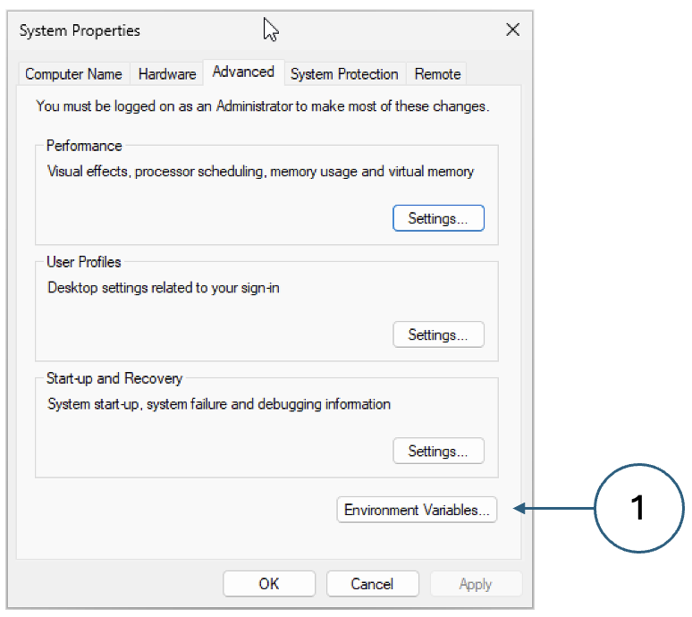{: standalone #fig1 .h20 data-title="Creating environment variables on Windows"}

In the next dialog, there are two panels. Click *New...* in the top panel for a new user variable and
fill in the details.

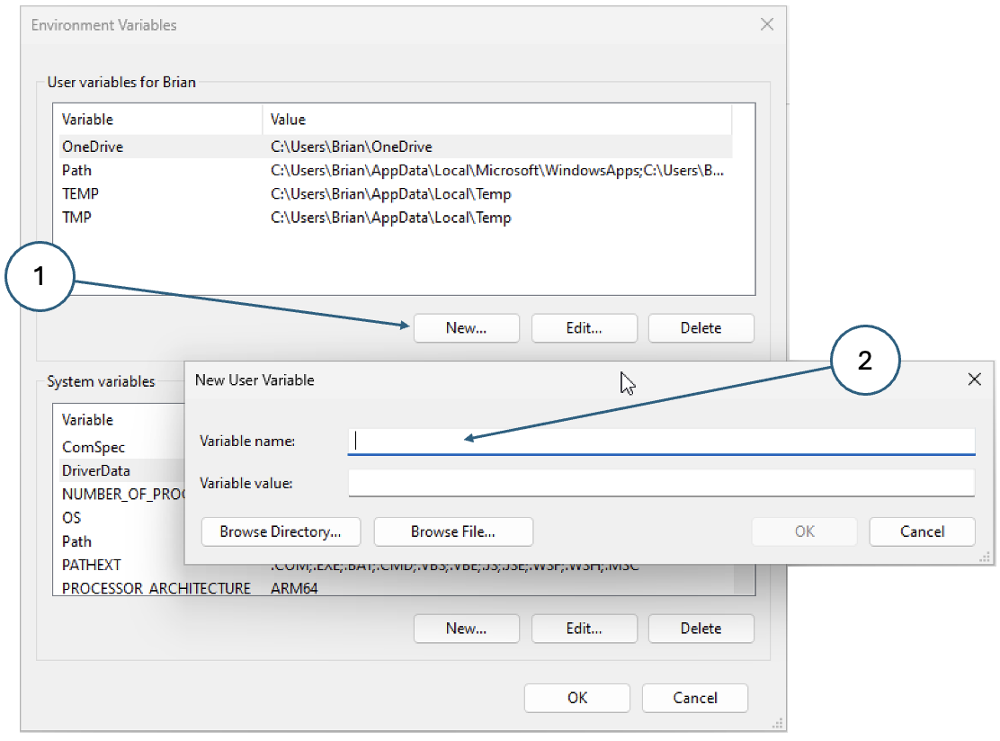{: standalone #fig2 data-title="New variable"}

To make the Android SDK command-line tools available from any directory, you also need to update the
*PATH* environment variable. Specifically, you need to add the directory
*%ANDROID_HOME%\cmdline-tools\11.0\bin* to the PATH - follow the steps indicated in the image below.

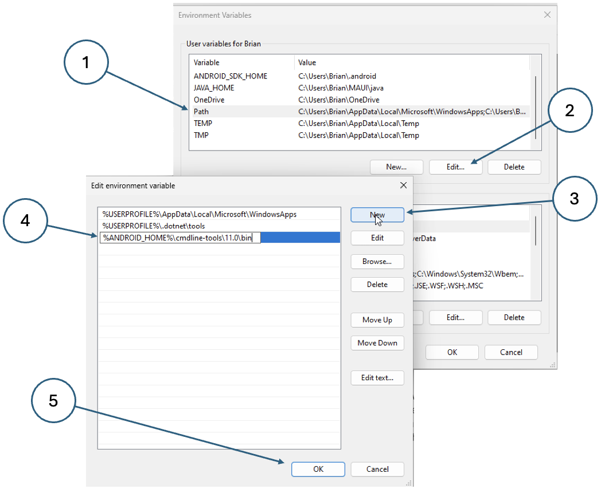{: standalone #fig4 data-title="Updating the PATH on Windows"}

The changes will not be visible in any CMD or PowerShell windows that are currently open. 
You will need to close and re-open them to pick up the new variables.

### Create the variables on Mac

The simplest way to define environment variables is in the .zshrc file in your home 
directory. This file is run automatically whenever a new terminal is opened and when an 
application starts. Edit the file and add the following lines at the end.

```sh
    # Environment variables for .NET MAUI development <br>
    export JAVA_HOME=${HOME}/MAUI/java <br>
    export ANDROID_HOME=${HOME}/MAUI/android <br>
    export ANDROID_SDK_HOME=${HOME}/MAUI <br>
    export PATH=${PATH}:${ANDROID_HOME}/cmdline-tools/11.0/bin <br>
```

The new settings will not affect any currently running terminal windows. You will need to restart them or alternatively type the same commands at the prompt.

## 4. Install VSCode

Follow the installation instructions for your operating system on the [VSCode website](https://code.visualstudio.com/download){:target="_blank"}

Once the installation is finished, open the application and install the following extensions:

* .NET MAUI (dotnettools.dotnet-maui)
* AVD Manager (toroxx.vscode-avdmanager)

The first one requires some other extensions as dependencies and these will be added automatically.

Note that you will need to sign in with your University username and password to use the .NET extension. Some error messages may appear but they can be ignored once you have signed in.

When you are done, you should have at least the extensions shown below.

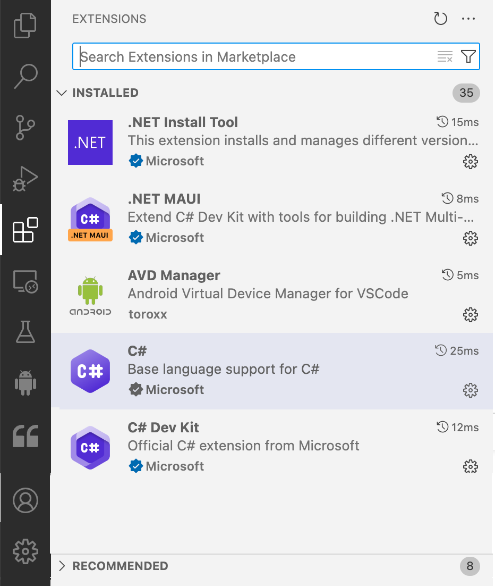{: standalone #fig4 .h30 data-title="VSCode extensions"}

## 5. Install Android dependencies

.NET 8 has a build target that installs the Android dependencies using the environment variables that you defined earlier. However, the command must be run from the root directory of a .NET project. Change into the root directory of your cloned repo (created in step 3 above) - that is the one containing the *.sln* file.

Run the following command to configure your machine:

<i class="fa-brands fa-windows icon"></i>
<hr class="icon-prefix">

dotnet build -t:InstallAndroidDependencies -f:net8.0-android -p:AndroidSdkDirectory="%ANDROID_HOME%" -p:JavaSdkDirectory="%JAVA_HOME%" -p:AcceptAndroidSDKLicenses=True 

<i class="fa-brands fa-apple icon"></i>
<hr class="icon-prefix">

dotnet build -t:InstallAndroidDependencies -f:net8.0-android -p:AndroidSdkDirectory="${ANDROID_HOME}" -p:JavaSdkDirectory="${JAVA_HOME}" -p:AcceptAndroidSDKLicenses=True 

## 6. Update Android SDK

The Android SDK installed in the previous step may not be completely up to date. Update the contents with

[<i class="fa-solid fa-circle-info icon"></i> ](https://developer.android.com/tools/sdkmanager){:target="_blank"}
<hr class="icon-prefix">

sdkmanager --update 

## 7. Build project

The purpose of this step is to check that everything is working so far. If all of the steps up to this point have been successful, it should be possible to build the app.

First, restart VSCode to pick up any environment changes since it was last opened.

Next, open the project root folder using the *File -&gt; Open Folder... *option on the menu.

To build the project, right-click the project name in the *Solution Explorer *section of the files panel as shown.

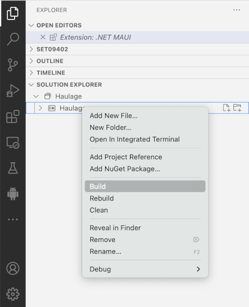{: standalone #fig5 .h30 data-title="Building the project"}

{: .warning-title }
> <i class="fa-solid fa-triangle-exclamation"></i> Warning
> 
> If you see the error message **error XA5300: The Android SDK directory could not be found** with a recommendation to set the **AndroidSdkDirectory** MSBuild property, add the following line to the *Haulage.cproj* file replacing ANDROID_HOME with the value of the environment variable you set earlier.
> 
> ``` shell
> <AndroidSdkDirectory>ANDROID_HOME</AndroidSdkDirectory>
> ```

If there are any other error messages in the output, they will need to be investigated and resolved before moving on.

## 8. Install Android emulator

To build and test your apps for the Android platform, you need either an Android phone or a software emulator. For consistency, we are planning to use an emulator by default, but if you want to use your Adroid device that is fine. You will just need to follow the appropriate instructions.

The emulator can be installed using one of the following commands:

[<i class="fa-solid fa-circle-info icon"></i>](https://developer.android.com/tools/sdkmanager){:target="_blank"}
<hr class="icon-prefix">

sdkmanager --install emulator 

{: .warning-title }
> <i class="fa-solid fa-triangle-exclamation"></i> Warning
> 
> If the command above fails with the message *Failed to find package 'emulator'*, you can
> install an emulator manually. [Download the latest version](https://developer.android.com/studio/emulator_archive),
> unzip it and copy the *emulator* directory into the *ANDROID_HOME* directory.
>
> Copy the file *package.xml* from the *setup* directory in your cloned repo into the
> *emulator* directory. Edit the last line of the file so that the revision number
> corresponds to the version of the emulator that you downloaded


## 9. Install AVD image

The emulator is an application for playing virtual machines that represent different types of 
phone with different software configurations. On its own, it does nothing, so we need to create a 
virtual device for it to host. The first step is to choose which image to use. You can get a list 
of all available system images by using the command

sdkmanager --list 

By default, we will be using Android 34; however, Apple Silicon Macs require a different image 
because of their architecture.

For Windows machines and Intel Macs, use the command

sdkmanager --install "system-images;android-34;google_apis;x86_64" 

For Apple Silicon Macs, use

sdkmanager --install "system-images;android-34;google_apis;arm64-v8a" 

## 10. Configure AVD manager

The AVD Manager extension in VSCode allows you to create Android Virtual Devices (AVDs) based on the images that you have installed.

Activate the AVD Manager panel by clicking the Android icon in the left-hand menu.

You may see some prompts appear in the bottom right-hand corner of the window asking you to configure the required paths. If so, click the button to update the value and navigate to the appropriate executable if needed.

{: .warning-title }
> <i class="fa-solid fa-triangle-exclamation"></i> Warning
> 
>  If the prompts do not appear, you may need to update the values manually. Call up the VSCode command palette by pressing Shift+Ctrl+P on Windows or Shift+Cmd+P on Mac. Then type *AVD* into the search box. There are four settings that need to be updated as shown below. When prompted, make each setting global.

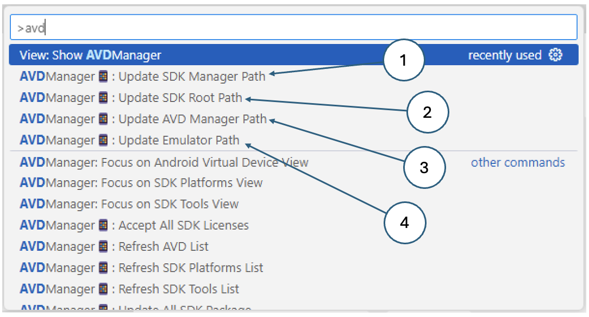{: standalone #fig6 data-title="Updating AVD Manager paths"}

The values you need are shown below

| Variable | Description | Windows value | Mac value |
| --- | --- | --- | --- |
| SDK Manager path | Path to the sdkmanager executable | C:\\Users\\USERNAME\\MAUI\\android\\cmdline-tools\\11.0\\bin\\sdkmanager | /Users/USERNAME/MAUI/android/cmdline-tools/11.0/bin/sdkmanager |
| SDK root path | Same as the ANDROID\_HOME environment variable | C:\\Users\\USERNAME\\MAUI\\android | /Users/USERNAME/MAUI/android |
| AVD Manager path | Path to the avdmanager executable | C:\\Users\\USERNAME\\MAUI\\android\\cmdline-tools\\11.0\\bin\\avdmanager | /Users/USERNAME/MAUI\\android\\cmdline-tools\\11.0\\bin\\avdmanager |
| Emulator path | Path to the emulator executable | C:\\Users\\USERNAME\\MAUI\\android\\emulator\\emulator.exe | /Users/USERNAME/MAUI/android/emulator/emulator |

Once the AVD Manager is correctly configured, information about the installed and available SDK components will be displayed as shown below. The image shows the Android SDK Platform 34 installed, but no AVDs yet.

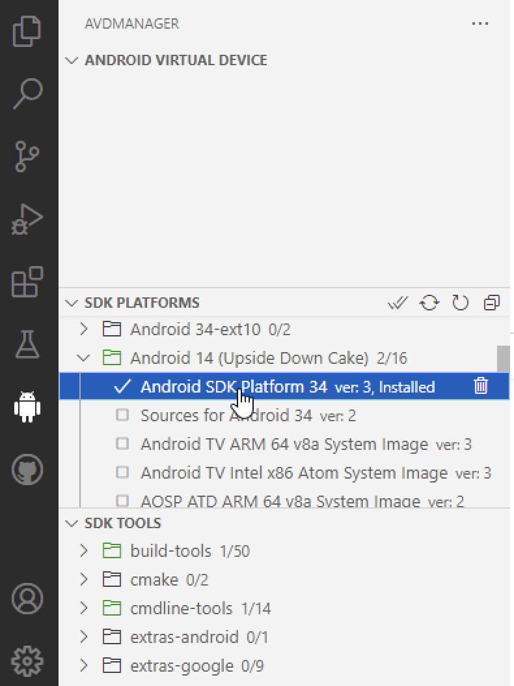{: standalone #fig7 data-title="SDK details"}

## 11. Create AVD

Creating an API is simply a question of pairing an Android platform with a device file. We will 
be using the Google Pixel Pro 7 which can be installed using one of the commands below.

For Windows and Intel Macs use
<br/>

avdmanager create avd -d 30 --name Pixel_7_Pro -k "system-images;android-34;google_apis;x86_64" 

For Apple silicon Macs use
<br/>

avdmanager create avd -d 30 --name Pixel_7_Pro -k "system-images;android-34;google_apis;arm64-v8a" 

Clicking the refresh icon in the *Android Virtual Device* panel will reveal the newly-created AVD. 
Start it by clicking the *Run* icon next to its name. If everything is set up correctly, you should 
see a virtual Android device appear on your screen.

## 12 Create a new project

Open the command palette in VSCode (`CTRL+SHIFT+P` in Windows or `CMD+SHIFT+P` on Mac)
and select the `.NET: New Project...` option. VSCode will then prompt you for several
pieces of information. Enter or select the values shown below.

| Prompt                 | Response                                                                |
|------------------------|-------------------------------------------------------------------------|
| Project type           | `.NET MAUI App Android, iOS, Mac Catalyst, macOS, MAUI, Tizen, Windows` |
| Project root directory | Create a folder on your computer called `Notes`                         |
| Project name           | `Notes`                                                                 |
| Options confirmation   | Press ENTER to confirm your choices in this final step                  |

VSCode will generate a complete default application for you.

## 13. Run the default app

While the Android emulator is running, it can be used as a debug target so that the application is 
loaded and run on the emulator.

To select the debug target for a project, click the curly brackets in the lower tray of the VSCode 
window as shown below. Click *Debug Target* and some options will appear at the top of the window. 
Choose the emulator from the ist.

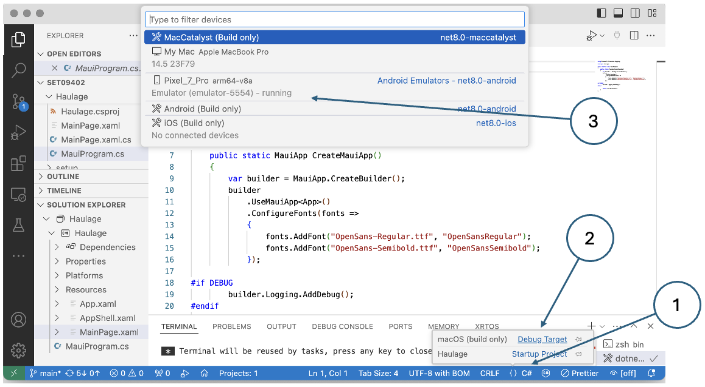{: standalone #fig8 data-title="Selecting a debug target in VSCode"}

With the target selected, click the *Run* icon in the control panel on the left. Then, follow 
through the prompts to select the debugger and the run configuration.

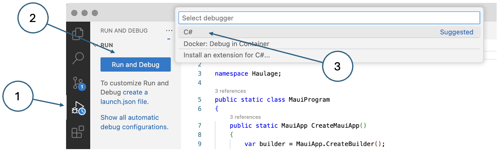{: standalone #fig9 data-title="Debugging in VSCode"}

After a few moments, a .NET icon should appear on the screen of the virtual phone.

Clicking it should launch the default app:

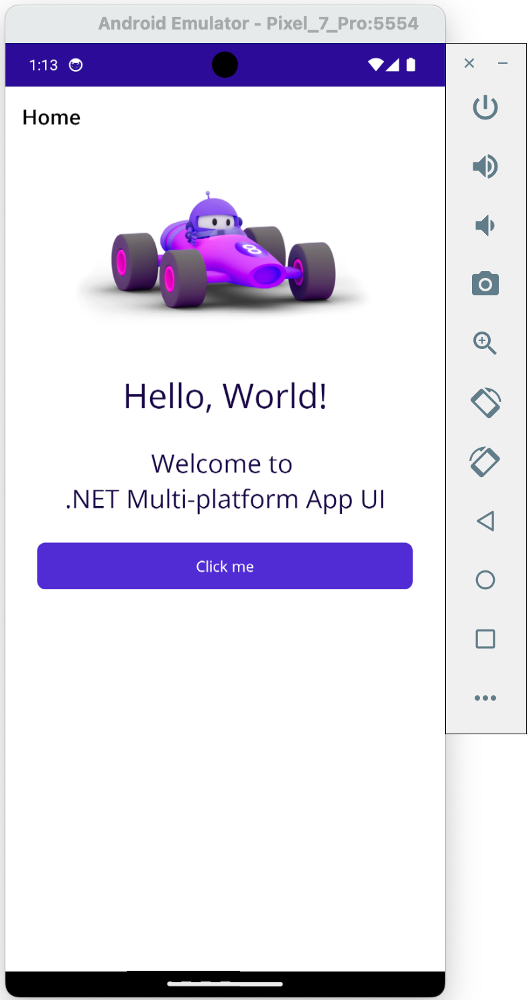{: standalone #fig10 data-title="Default MAUI app running on the Android emulator"}

## 15. Install git

Good practice dictates that you should always use a version control system to manage your code.
We will be using [git](https://git-scm.com/) in this module. 

{: .note-title }
> <i class="fa-solid fa-triangle-exclamation"></i> Note
> 
> _Git_ is a distributed command-line version control tool. When you install it on your computer,
> it creates a local repository. GitHub, on the other hand, is a cloud platform where you can set
> up and share remote repositories. Make sure that you clearly understand the difference.

Use the appropriate command below to install git on your computer if it is not installed already.

<i class="fa-brands fa-windows icon"></i> [Windows git installer](https://gitforwindows.org/){:target="_blank"}

<i class="fa-brands fa-apple icon"></i> git is already installed on Macs <i class="fa-regular fa-face-smile icon"></i>

## 16. Create a repository

VSCode provides git and GitHub integration so that you do not have to use git at the command line.
Click the version control icon in the vertical menu bar as shown in Fig. 11 to reveal the 
initialisation options.

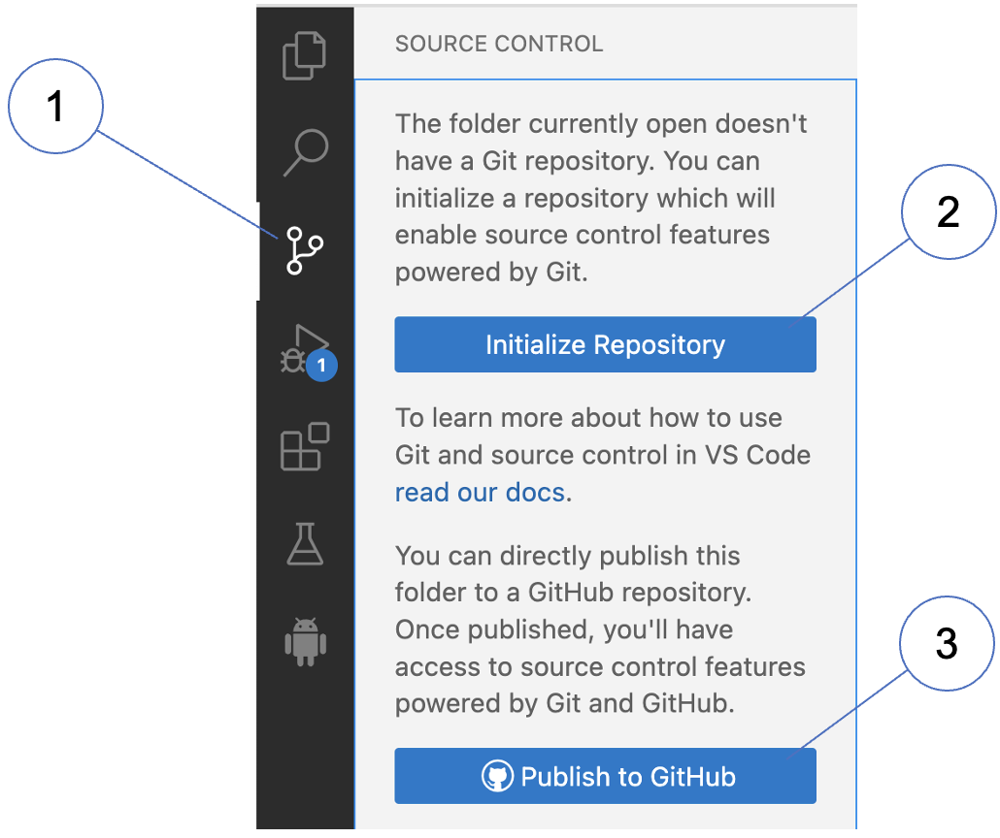{: standalone #fig11 .h30 data-title="Initialising git for your project"}

Click the repository initialisation button (2) but **do not click the commit button in the next 
dialog!** The number next to the version control icon shows that you are about to commit more than 
2000 files! Take a look at the file list and you will see that most of them are configuration or
cache file, or just part of the standard .NET framework. Before committing the small number of 
files that actually constitute your app, we need to add a `.gitignore` file that will filter out
all the ones we are not interested in. There are several ways you could do this. The simplest
is to create the file manually. You could copy the content below and paste it into a file called 
`.gitignore`in the project root directory. Make sure that you do not omit the leading dot in the 
filename.

A more interesting way to create the `.gitignore` file is to use Copilot. Make sure you have
Copilot enabled, open the secondary sidebar to the right of the main editor panel. You will be
prompted to authenticate with GitHub to use Copilot. Once connected, enter the prompt:

> Generate a gitignore file for this .NET MAUI project

Because this is such a common action, Copilot can do this quite easily without help. Once the file
is ready, you are prompted to create it by clicking a button labelled _Create File..._. A file
dialog appears which already has the correct filename and is offering to save it into the project 
root directory. This dialog simply acts as a confirmation step: all you need to do is click the
`Save` button.

```shell
# User-specific files
*.rsuser
*.suo
*.user
*.userosscache
*.sln.docstates

# User-specific files (Mono)
mono_crash.*

# Mono auto generated files
mono_crash.*

# Build results
[Dd]ebug/
[Dd]ebugPublic/
[Rr]elease/
[Rr]eleases/
x64/
x86/
[Aa][Rr][Mm]/
[Aa][Rr][Mm]64/
bld/
[Bb]in/
[Oo]bj/
[Ll]og/
[Ll]ogs/

# Visual Studio 2019
.vscode/
.vs/
.vscode/

# Windows image file caches
Thumbs.db
ehthumbs.db

# Folder config file
Desktop.ini

# Recycle Bin used on file shares
$RECYCLE.BIN/

# VS Code directories
.vscode/

# Windows Installer files
*.cab
*.msi
*.msm
*.msp

# Windows shortcuts
*.lnk

# JetBrains Rider
.idea/
*.sln.iml
```

With your `.gitignore` file in place you can go ahead and make your initial commit. Be sure to
add a descriptive commit comment.

## Publish your repository

Creating a remote copy of your repository on GitHub is very simple. Just click the _Publish Branch_
button labelled (1) in Fig. 12. Then, select whether you want the repository to be private or
public (2). 

Congratulations! You can now create a default .NET MAUI project and publish it to GitHub.
