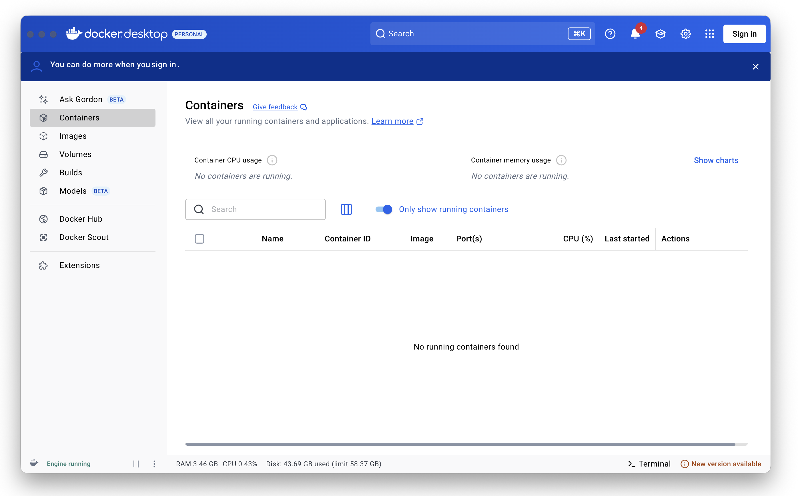
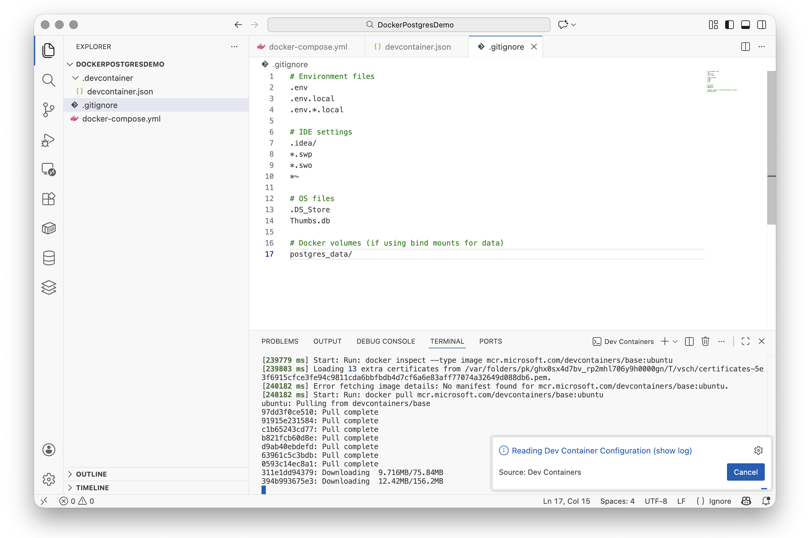
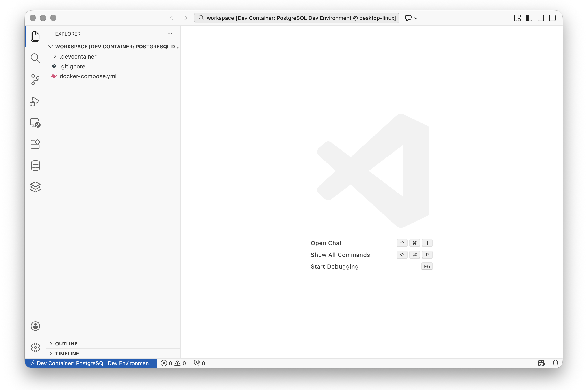
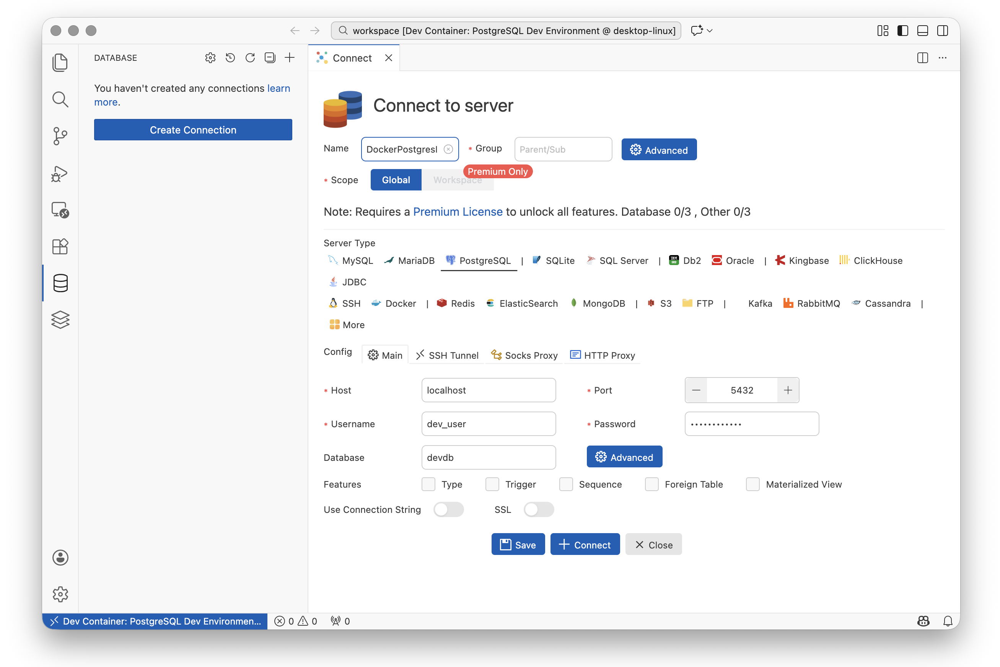
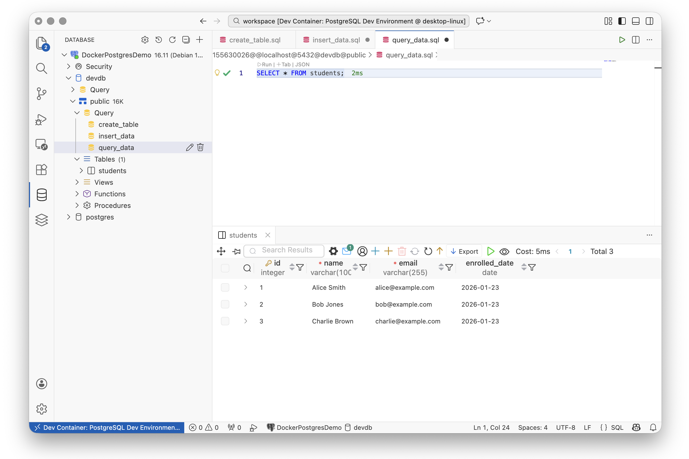

# Docker and PostgreSQL

This tutorial guides you through setting up a containerised development environment using Docker,
PostgreSQL, and Visual Studio Code. By the end, you will have a reproducible development
environment that can be shared with team members and used as a foundation for database-backed
applications.

## 1. Install Docker Desktop

Docker Desktop provides a graphical interface for managing containers and includes everything
needed to run containerised applications on your computer.

[Windows](){: .btn .btn-blue .tab-control data-tabset="docker" data-seq="1" }
[Mac](){: .btn .tab-control data-tabset="docker" data-seq="2" }
[Linux](){: .btn .tab-control data-tabset="docker" data-seq="3" }

> Download Docker Desktop from the [Docker website](https://www.docker.com/products/docker-desktop/){:target="_blank"}
> and run the installer.
>
> {: .warning-title }
> > <i class="fa-solid fa-triangle-exclamation"></i> Warning
> >
> > Docker Desktop on Windows requires WSL 2 (Windows Subsystem for Linux). If you don't have it
> > installed, the Docker installer will prompt you to enable it. You may need to restart your
> > computer during this process.
>
> After installation, Docker Desktop should start automatically. You can verify it's running by
> looking for the Docker whale icon in your system tray.
>
> {: standalone #fig1 data-title="Docker Desktop running on Windows" }
>
{: .tab data-tabset="docker" data-seq="1" }

> Download Docker Desktop from the [Docker website](https://www.docker.com/products/docker-desktop/){:target="_blank"}.
>
> {: .note-title }
> > <i class="fa-solid fa-circle-info"></i> Note
> >
> > Make sure you download the correct version for your Mac:
> > - **Apple Silicon** (M1, M2, M3, M4 chips): Download the "Apple Silicon" version
> > - **Intel**: Download the "Intel chip" version
> >
> > You can check your chip type by clicking the Apple menu and selecting "About This Mac".
>
> Open the downloaded `.dmg` file and drag the Docker icon to your Applications folder.
> Launch Docker from your Applications folder.
>
> {: standalone #fig2 data-title="Docker Desktop running on Mac" }
>
{: .tab data-tabset="docker" data-seq="2" }

> On most Linux distributions, you can install Docker Engine using your package manager.
> For Ubuntu/Debian:
>
> ```bash
> sudo apt-get update
> sudo apt-get install docker.io docker-compose-v2
> sudo usermod -aG docker $USER
> ```
>
> Log out and back in for the group change to take effect. Alternatively, you can install
> [Docker Desktop for Linux](https://docs.docker.com/desktop/install/linux-install/){:target="_blank"}
> if you prefer a graphical interface.
>
{: .tab data-tabset="docker" data-seq="3" }

Verify Docker is installed correctly by opening a terminal and running:

```bash
docker --version
```

You should see output similar to `Docker version 24.0.0` or higher.

## 2. Install Visual Studio Code and Extensions

Follow the installation instructions for your operating system on the
[VSCode website](https://code.visualstudio.com/download){:target="_blank"}.

Once VSCode is installed, you need to add the following extensions:

| Extension | Extension ID | Purpose |
|-----------|--------------|---------|
| Dev Containers | ms-vscode-remote.remote-containers | Develop inside Docker containers |
| Docker | ms-azuretools.vscode-docker | Manage Docker containers and images |
| Database Client | cweijan.vscode-postgresql-client2 | Connect to and query PostgreSQL databases |

To install an extension, open VSCode and press `Ctrl+Shift+X` (Windows/Linux) or `Cmd+Shift+X` (Mac)
to open the Extensions panel. Search for each extension by name and click Install.

{: standalone #fig3 data-title="Required VSCode extensions installed" }

## 3. Create the Project Structure

Create a new project folder with the required subdirectory for the dev container configuration.

[Windows](){: .btn .btn-blue .tab-control data-tabset="mkdir" data-seq="1" }
[Mac/Linux](){: .btn .tab-control data-tabset="mkdir" data-seq="2" }

> Open a command prompt and run:
>
> ```
> mkdir DockerPostgresDemo
> cd DockerPostgresDemo
> mkdir .devcontainer
> ```
>
{: .tab data-tabset="mkdir" data-seq="1" }

> Open a terminal and run:
>
> ```bash
> mkdir -p DockerPostgresDemo/.devcontainer
> cd DockerPostgresDemo
> ```
>
{: .tab data-tabset="mkdir" data-seq="2" }

Open the `DockerPostgresDemo` folder in VSCode using **File > Open Folder...** or by running
`code .` from the terminal while in the project directory.

Your project structure should look like this:

```
DockerPostgresDemo/
└── .devcontainer/
```

## 4. Configure Docker Compose

Docker Compose allows you to define and run multi-container applications. We will create a
configuration with two services: an application container for development and a PostgreSQL
database container.

Create a file called `docker-compose.yml` in the project root directory with the following content:

```yaml
services:
  app:
    image: mcr.microsoft.com/devcontainers/base:ubuntu
    volumes:
      - .:/workspace:cached
    network_mode: service:db
    command: sleep infinity

  db:
    image: postgres:16
    restart: always
    environment:
      POSTGRES_USER: dev_user
      POSTGRES_PASSWORD: dev_password
      POSTGRES_DB: devdb
    ports:
      - "5432:5432"
    volumes:
      - postgres_data:/var/lib/postgresql/data

volumes:
  postgres_data:
```

{: .note-title }
> <i class="fa-solid fa-circle-info"></i> Note
>
> **Understanding the configuration:**
>
> - `network_mode: service:db` - This connects the app container directly to the database
>   container's network. This means you can connect to PostgreSQL using `localhost:5432` from
>   within the app container.
> - `volumes: postgres_data` - This creates a named volume that persists your database data
>   even when containers are stopped or removed.
> - `command: sleep infinity` - This keeps the app container running so VSCode can connect to it.

{: standalone #fig4 data-title="Docker Compose architecture diagram" }

## 5. Configure the Dev Container

The dev container configuration tells VSCode how to use the Docker Compose setup for development.

Create a file called `devcontainer.json` inside the `.devcontainer` directory with the following content:

```json
{
    "name": "PostgreSQL Dev Environment",
    "dockerComposeFile": ["../docker-compose.yml"],
    "service": "app",
    "workspaceFolder": "/workspace",
    "customizations": {
        "vscode": {
            "extensions": [
                "cweijan.vscode-postgresql-client2"
            ]
        }
    },
    "remoteUser": "root"
}
```

{: .note-title }
> <i class="fa-solid fa-circle-info"></i> Note
>
> **Understanding the configuration:**
>
> - `dockerComposeFile` - Points to your Docker Compose configuration
> - `service` - Specifies which container VSCode should connect to
> - `workspaceFolder` - The folder inside the container where your project files appear
> - `customizations.vscode.extensions` - Extensions to install automatically inside the container

Your project structure should now look like this:

```
DockerPostgresDemo/
├── .devcontainer/
│   └── devcontainer.json
└── docker-compose.yml
```

## 6. Create a .gitignore File

Before initialising a git repository, create a `.gitignore` file to exclude sensitive and
unnecessary files from version control.

Create a file called `.gitignore` in the project root directory:

```
# Environment files
.env
.env.local
.env.*.local

# IDE settings
.idea/
*.swp
*.swo
*~

# OS files
.DS_Store
Thumbs.db

# Docker volumes (if using bind mounts for data)
postgres_data/
```

{: .warning-title }
> <i class="fa-solid fa-triangle-exclamation"></i> Warning
>
> Never commit database credentials or `.env` files containing passwords to version control.
> The credentials in this tutorial are for local development only.

## 7. Open the Project in the Container

Now you can open the project inside the development container.

1. Press `Ctrl+Shift+P` (Windows/Linux) or `Cmd+Shift+P` (Mac) to open the command palette.
2. Type "Reopen in Container" and select **Dev Containers: Reopen in Container**.

{: standalone #fig5 data-title="Building the container in VSCode" }

{: .note-title }
> <i class="fa-solid fa-circle-info"></i> Note
>
> The first time you do this, Docker will download the required images (Ubuntu and PostgreSQL).
> This may take several minutes depending on your internet connection. Subsequent starts will
> be much faster as the images are cached locally.

Once the container is ready, you will see the project files in the Explorer panel, and the
bottom-left corner of VSCode will show "Dev Container: PostgreSQL Dev Environment".

{: standalone #fig6 data-title="VSCode running inside the container" }

You can verify you are inside the container by opening a terminal (`Ctrl+`` ` or `Cmd+`` `) and
running:

```bash
cat /etc/os-release
```

This should show Ubuntu information, confirming you are inside the container.

{: standalone #fig7 data-title="Terminal inside container showing configuration details" }

## 8. Connect to PostgreSQL from VSCode

The Database Client extension allows you to browse and query your database directly from VSCode.

1. Click on the Database icon in the Activity Bar on the left side of VSCode.
2. Click the **+** button to create a new connection and select **PostgreSQL**.
3. Enter the following connection details:

| Parameter | Value |
|-----------|-------|
| Connection Name | DockerPostgresDemo |
| Group | (leave blank) |
| Hostname | localhost |
| Port | 5432 |
| Username | dev_user |
| Password | dev_password |
| Database | devdb |
| Use SSL | No |

{: standalone #fig8 data-title="PostgreSQL connection configuration" }

{: .note-title }
> <i class="fa-solid fa-circle-info"></i> Note
>
> Because the app container uses `network_mode: service:db`, it shares the network namespace
> with the database container. This means PostgreSQL is accessible at `localhost:5432` from
> within the app container.

Once connected, you can expand the connection in the sidebar to see databases, schemas, and tables.

## 9. Verify the Setup with a Test Exercise

Let's verify everything is working by creating a simple table, inserting data, and querying it.

### Create a test table

Expand the `devdb` database in the sidebar until you can see the `public > Query` element. Click on 
the`+` icon to create a new query called `create_table`. Enter the following SQL and execute it by 
clicking the Run button:

```sql
CREATE TABLE students (
    id SERIAL PRIMARY KEY,
    name VARCHAR(100) NOT NULL,
    email VARCHAR(255) UNIQUE NOT NULL,
    enrolled_date DATE DEFAULT CURRENT_DATE
);
```

{: standalone #fig9 data-title="Creating a test table in PostgreSQL" }

### Insert sample data

Run the following SQL to add some test records:

```sql
INSERT INTO students (name, email) VALUES
    ('Alice Smith', 'alice@example.com'),
    ('Bob Jones', 'bob@example.com'),
    ('Charlie Brown', 'charlie@example.com');
```

### Query the data

Run a SELECT query to verify the data was inserted:

```sql
SELECT * FROM students;
```

{: standalone #fig10 data-title="Query results showing test data" }

You should see three rows returned with the student data you inserted.

### Clean up (optional)

If you want to remove the test table:

```sql
DROP TABLE students;
```

## 10. Managing Your Development Environment

### Starting and stopping

**To stop the containers:** Close VSCode or use the command palette (`Ctrl+Shift+P` / `Cmd+Shift+P`)
and select **Dev Containers: Reopen Folder Locally**.

You can also stop containers from the terminal:

```bash
docker compose down
```

**To start the containers again:** Open the project in VSCode and select
**Dev Containers: Reopen in Container** from the command palette.

### Returning to local development

To switch back to developing outside the container, use the command palette and select
**Dev Containers: Reopen Folder Locally**. Your files remain on your local machine and are
always accessible.

### Persistent data

The PostgreSQL data is stored in a Docker volume called `postgres_data`. This means your
database contents persist across container restarts. To completely reset the database, you
would need to remove this volume:

```bash
docker volume rm dockerpostgresdemo_postgres_data
```

{: .warning-title }
> <i class="fa-solid fa-triangle-exclamation"></i> Warning
>
> Removing the volume deletes all data in the database. Only do this if you want to start fresh.

### Troubleshooting

| Problem | Solution |
|---------|----------|
| Docker not running | Start Docker Desktop and wait for it to fully initialise |
| Port 5432 already in use | Stop any local PostgreSQL instance or change the port in docker-compose.yml |
| Container fails to start | Check Docker Desktop logs or run `docker compose logs` from the project directory |
| Cannot connect to database | Verify the containers are running with `docker compose ps` |
| Extensions not loading | Rebuild the container: Command Palette > Dev Containers: Rebuild Container |

### Useful Docker commands

| Command | Description |
|---------|-------------|
| `docker compose ps` | List running containers for this project |
| `docker compose logs` | View container logs |
| `docker compose logs db` | View only database container logs |
| `docker compose down` | Stop and remove containers |
| `docker compose down -v` | Stop containers and remove volumes (deletes data) |
| `docker volume ls` | List all Docker volumes |
