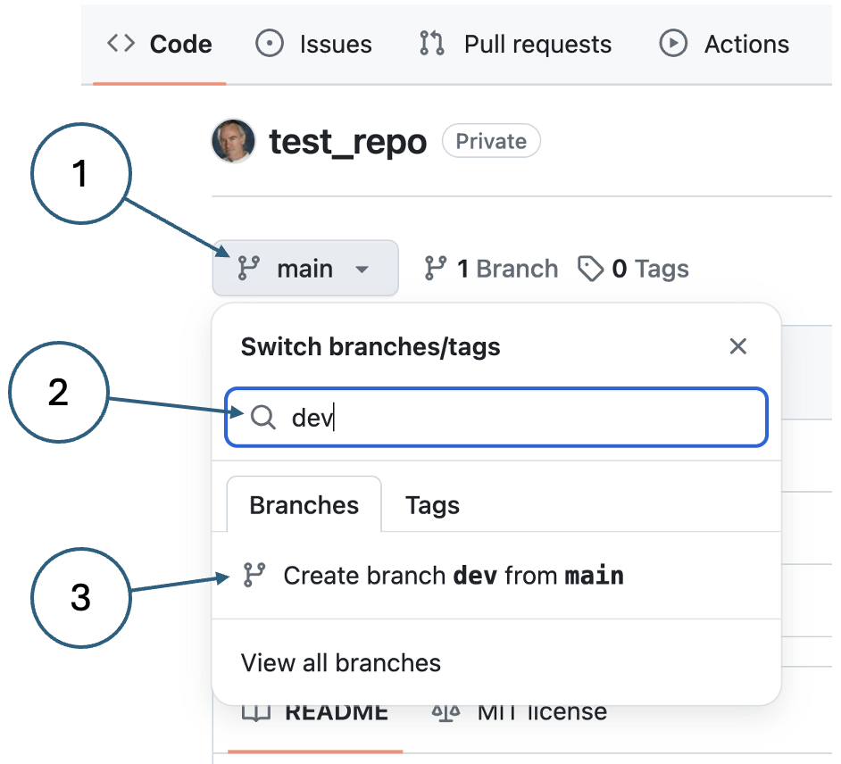
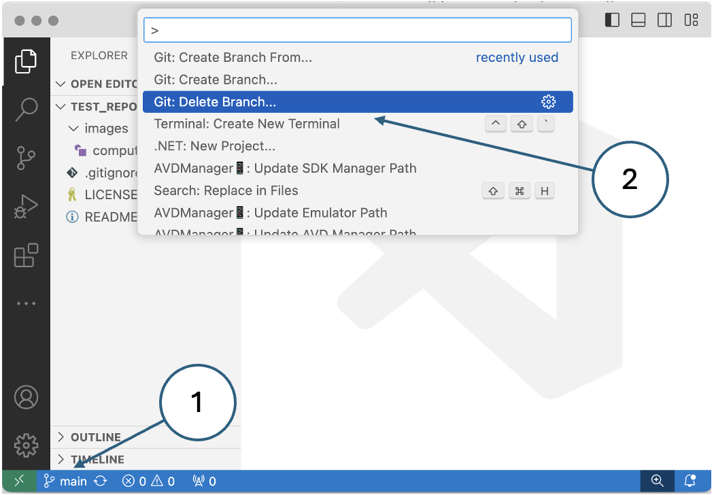
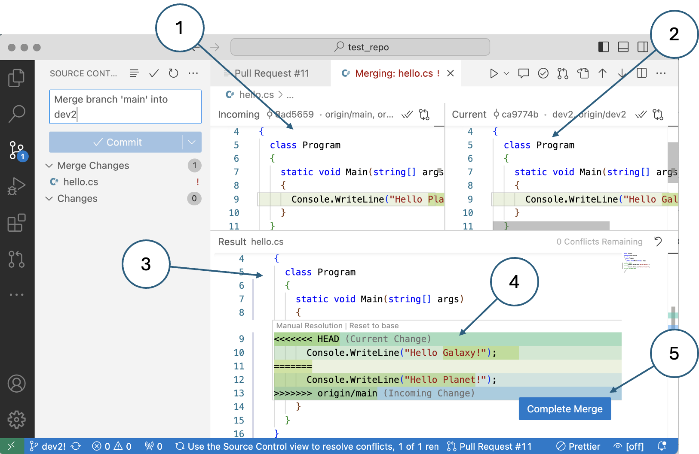

# Using GitHub

[GitHub](https://docs.github.com/en/get-started/start-your-journey/about-github-and-git) is a 
cloud-based platform for storing code. It has many useful features including

*   **Version control**: It automatically tracks [changes to files](https://docs.github.com/en/repositories/working-with-files/using-files/viewing-a-file) and allows for the recovery of earlier versions.
*   **Repositories**: Projects are represented as [repositories](https://docs.github.com/en/repositories) with their own permissions and properties to keep them separate from other code on GitHub.
*   **Branches**: Different but related versions of a codebase can be managed easily through the concept of [branching](https://docs.github.com/en/pull-requests/collaborating-with-pull-requests/proposing-changes-to-your-work-with-pull-requests/about-branches).
*   **Workflow**: The [lifecycle of files](https://docs.github.com/en/get-started/using-github/github-flow) is managed through features such as pull requests and code reviews.
*   **Project management**: GitHub supports the use of agile [task boards](https://docs.github.com/en/issues/planning-and-tracking-with-projects/learning-about-projects/quickstart-for-projects#adding-a-board-layout) in the Kanban style.
*   **Continuous integration**: CI/CD is supported using [GitHub actions](https://docs.github.com/en/actions).

In this tutorial, there will not be time to cover all of the features and services that GitHub 
offers. Instead, we will concentrate on a small number of fundamental features that software 
engineers should be familiar with. In particular, we will not be covering the use of the 
[git command line](https://git-scm.com/book/en/v2/Getting-Started-The-Command-Line) which we 
assume you are already aware of. If not, please find an appropriate tutorial. CI/CD is also beyond 
the scope of this tutorial, but please use the link above to learn more about using GitHub as a 
devops tool if that is of interest.

You will need a personal GitHub account for these exercises.

## 1. Code repositories

<blockquote class="pretty"><span>
A repository is the most basic element of GitHub. It's a place where you can store your code, 
your files, and each file's revision history. Repositories can have multiple collaborators and 
can be either public or private.
</span></blockquote>
<p class="attribution">
[GitHub docs](https://docs.github.com/en/repositories/creating-and-managing-repositories/about-repositories)
</p>

### Create a repository

The repo you create here is only for practising with GitHub features. It is intended to be 
disposable so that you can delete it with confidence at any time.

The simplest way to set up a new repo is to click on your account link in the top right-hand 
corner of the display once you are logged into GitHub. This will reveal an options menu where 
you can select _Your repositories_. On the next page, there is a large green button on the 
right-hand-side labelled _New_.

The next page offers some options for your new repo, but the only mandatory item is the repo name. 
Pick a name and click the green button labelled _Create Repository_ at the foot of the page.

That's all there is to it.

The next page that you see will offer several ways forward. Some of them are to set up additional 
features and invite other people to collaborate. Because the repo is empty, some of the suggestions 
are for creating new files. There are also some recipes for how to connect your new repo with a 
folder on your laptop.

### Create a better repository

In this step, we will repeat the process of creating a repo, but paying more attention to the 
options available. Start by deleting the repo you created in the first step - it does not contain 
any useful content, and deleting it will allow us to re-use the name.

1.  On the main page for your repo, click the _Settings_ button as shown in Fig. 1.
    
    {: standalone #fig1 data-title="Finding the settings button in GitHub" }
    
    The settings page provides many options for you to configure the behaviour of your repo.
    
2.  Scroll to the bottom of the settings page where you will find the **Danger Zone**:
    
    {: standalone #fig2 data-title="The Danger Zone" }
    
    In the Danger Zone, choose the option to delete the repo. Because this is an irreversible 
    action, you will be asked for three types of confirmation before it is complete.
    
3.  Next, start the process of creating the repo over again by pressing the green _New_ button.
    
4.  Specify visibility
    
    You have two options, _Public_ or _Private_. By default, a repo is accessible publicly. 
    Let's make this version private - this still allows you to invite specific people to access 
    it to collaborate on writing code.
    
5.  Add a README file
    
    The README file is an important communication tool because it is displayed automatically 
    when someone accesses the repo via GitHub. This means that it provides an informative home 
    page for the project. You can also have README files in subdirectories as well where they 
    perform a similar function.
    
    Check the box to add a README file to your new repo.
    
6.  Don't add a .gitignore
    
    When you are working on the code for a project, there are many types of file that you do not 
    want to store in the repo. These include object and binary files that are the results of 
    building your project as well as cache files created by your development tools. GitHub 
    provides a large number of templates that correspond to different working environments; 
    however, there are none specifically for working with .NET.
    
    Fortunately, there is a code .NET template available in GitHub's own 
    [repo](https://github.com/github/gitignore/tree/main). We will be able to add the file later on.
    
7.  Choose a licence
    
    Strictly speaking, if your repo is private you don't need to specify a licence. It is always 
    worth planning ahead though for a time when someone else may have access and you want to 
    control what they are allowed to do. Here we will choose the MIT licence which is simple and 
    permissive according to [choosealicense.com](https://choosealicense.com/)
    
8.  Finally, press the _Create repository_ button.
    
    This takes you to the main page of your new repo which should look like Fig. 3.
    
    {: standalone #fig3 data-title="Repository main page" }
    
    * The name of the repo
    * The visibility setting
    * List of files in the repo
    * The name of the file currently being displayed (README by default)
    * The licence that applies to the repo
    * The comment associated with the change that last affected the relevant file
    * Icon that allows you to edit the currently displayed file directly in GitHub
    {: .figure-labels}

## 2 Working with files

Version control is the most basic function of [git](https://github.com/git-guides) and GitHub. 
It eliminates most problems related to file changes by saving stable versions at known checkpoints. 
Say you are working on a file. You make your changes, do your tests, do a little debugging and 
then when you have a stable version you save it to your code repository in an action called a 
[commit](https://github.com/git-guides/git-commit). Thus a complete history of the file from one 
stable version to the next is preserved in the repo and you can always recover an earlier version 
if you need to.

{: standalone #fig4 data-title="Visualising a file lifecycle" }

It is important to provide a meaningful comment with every successive commit. A good comment gives 
anyone looking back at the file history a clear understanding of what changes were made and why. 
This of course depends on how conscientious the developer is.

Follow the steps below to create a new version of the README file.

1.  Click on the pencil icon to edit the file.
    
    The contents of the file is written in [markdown](https://docs.github.com/en/get-started/writing-on-github/getting-started-with-writing-and-formatting-on-github/quickstart-for-writing-on-github), a simplified version of HTML.
    
2.  Edit the contents of the file to match Fig. 5. and use the _Preview_ button to see the effect.
    
    {: standalone #fig5 data-title="Editing a file" }
    
3.  Click the green _Commit changes..._ button.
    
4.  In the commit dialog, make the commit message more meaningful - why did you make the changes?
    
    For more complicated changes, you can use the commit message as a summary and put more detail 
    into the _Extended description_ field.
    
    Notice that you can choose to create a new branch on committing the changes. Branching is 
    covered later, so for now just commit to the main branch.
    
5.  Click the green _Commit changes_ button.
    

After committing, the file is displayed in preview as shown in Fig. 6.

{: standalone #fig6 data-title="The file after editing" }

* The breadcrumbs for this file. Any subdirectories would be included here.
* The commit message that was entered.
* The _Blame_ button - this allows you to see a summary history of the file one commit at a time.
* The _History_ button - this allows you to see all previous versions of the file and recover 
  them if necessary.
{: .figure-labels}

Experiment with the _Blame_ and _History_ functions to see what they do.

### Committing multiple files from VSCode

A unit of development work typically requires changes to more than one file and they are all 
committed at the same time. Also, it is unusual to edit files directly in GitHub - it is much 
more common to make the changes in your code editor or IDE and use the integration features to 
manage communication with GitHub. Follow the instructions below to clone your repo on your laptop 
and manage changes using VSCode.

1.  Clone your repository on your laptop.
    
    Follow the instructions in the [Getting started tutorial](https://moodle.napier.ac.uk/mod/page/view.php?id=2437837#clone-your-repository) if you do not remember how to do this.
    
    When you clone a repo, a link is stored on your local machine back to the remote one on GitHub. 
    You can see the details of the remote repo by executing the following command inn the project 
    root folder in a command shell or terminal window:
    
    git remote -v
    
2.  Open the root folder of your project in VSCode. The view should look similar to Fig. 7.
    
    {: standalone #fig7 data-title="Test project open in VSCode" }
    
    The structure is much simpler than the .NET MAUI project you are working on and there is no 
    **Solution Explorer**. That is a feature added by the .NET Development Kit extension for 
    .NET projects only.
    
3.  Create a _.gitignore_ file.
    
    Create the file as shown in Fig. 8. First, click on the new file icon and then enter the 
    file name and press ENTER. The new file will automatically open in the editor pane.
    
    {: standalone #fig8 data-title="Creating a file in VSCode" }
    
4.  Add content to the file.
    
    Even though this is not a .NET MAUI project, we will take the opportunity to create a 
    _.gitignore_ file with content appropriate for .NET.
    
    In the [GitHub gitignore](https://github.com/github/gitignore/tree/main/community/DotNet) repo, 
    click on the file _core.gitignore_ to view its contents. This is what we need, but copying at 
    this stage will include line numbers and a lot of other things we don't want. Click the _Raw_ 
    button to get a view of just the file contents, copy that and paste it into your new 
    _.gitignore_ file.
    
5.  Save the file
    

Add some more detail to the README file and save it.

You now have two changed files waiting to be committed as indicated by the annotation on the 
source control icon. Click that icon as shown in Fig. 9.

{: standalone #fig9 data-title="Committing changes in VSCode" }

*   Click source control icon
*   Enter commit message
*   Click _Commit_
{: .figure-labels}

Answer _Yes_ when prompted to commit the changes directly.

Your changes are now committed to your _local_ git repository. Because git is a distributed 
system, however, the remote repo on GitHub still needs to be synchronised with the local one. 
This is done through a _Push_ operation as visualised in Fig. 10.

{: standalone #fig10 data-title="Synchronising remote and local repositories with a _Push_ operation" }

After committing locally, VSCode prompts you to push your changes by displaying a _Sync Changes_ 
button. Click the button and answer _OK_ when prompted to push to the main branch.

{: .note-title}
> <i class="fa-solid fa-circle-info"></i> Note
>
> You may need to go through the process of authenticating with GitHub. Follow any instructions 
> that are displayed for generating a personal access token to allow VSCode to interact with the 
> GitHub API.

All done! You can now view your changes on GitHub in your browser.

## 3 Working with branches

> Use a branch to isolate development work without affecting other branches in the repository. 
> Each repository has one default branch, and can have multiple other branches.

[GitHub docs](https://docs.github.com/en/pull-requests/collaborating-with-pull-requests/proposing-changes-to-your-work-with-pull-requests/about-branches)

One of the main problems that can occur in a team of developers is one person overwriting the 
work of someone else. Git solves this problem by isolating one person's changes on a separate 
_branch_. Different strategies can be used for integrating branches into a team workflow. In 
this tutorial, we will take a simple approach.

### Create a new branch in GitHub

Branches can be created in many ways but they always fulfil the same function. Here, we will use 
the GitHub web interface.

1. On your repo's main page, click the branch button as shown in Fig. 11. The button is labelled 
   with the name of the current branch which in this case is _main_.
   
   {: standalone #fig11 data-title="Creating a branch in GitHub" }
    
2. Next, enter the name of the new branch you want to create. Here, we are using _dev_. This may 
   or may not be appropriate in a team situation - each team will have their own conventions for 
   branch naming.
   
3. Finally, click as shown to create the new branch.
    

After creating the new branch it is automatically set as the default branch. This will allow you 
to see any file changes that have been committed and pushed to the _dev_ branch. You can change 
back to viewing the _main_ branch at any time. Currently, the two branches are identical.

### Delete the branch

Sometimes, it can be convenient to abandon a change in progress. Using branches makes this easy: 
you simply delete the branch and any changes are history.

1. List the current branches by clicking the link next to the branch button which currently 
   shows that there are two branches.
   
2. Next, click the dustbin icon on the row corresponding to the _dev_ branch to delete it.
   
3. Navigate back to the repo main page and you will see that all references to the branch have gone.
    

### Create a new branch in VSCode

When working on a project, you spend most of your time in your code editor or IDE. It is 
therefore convenient to perform all of the basic code control operations from within that tool.

1. In VSCode, display the command palette by clicking SHIFT+CTRL+P (Windows) or SHIFT+CMD+P (Mac). 
   Enter _branch_ into the filter field as shown in Fig. 12 and select the _Git: Create Branch..._ 
   option.
   
   {: standalone #fig12 data-title="Creating a new branch in VSCode" }
    
2. Enter _dev_ as the name of the new branch when prompted and press ENTER. This will create the 
   new branch and set it as your current default just like in GitHub.
   
   You can change back to the _main_ branch using the link in the bottom left-hand corner of the 
   VSCode display labelled (3) in Fig. 12. As you will see if you click it, this link also provides 
   an alternative way to create a new branch. 

### Commit on the dev branch

Currently the dev branch only exists in your local repo - it has not been duplicated on GitHub yet. 
The simplest way to create the branch on GitHub is to introduce a change to the codebase and push 
it to the remote repo. As an example, we will add an image subdirectory to our project.

1.  Create a directory called _images_ by clicking the _New folder_ icon in VSCode.
    
2.  Place an image file into the new directory
    
    You can do this either by dragging and dropping an image file from your computer's file 
    browser into the directory in VSCode, or by copying the file into the directory entirely 
    within the file browser. The background change will be automatically picked up by VSCode.
    
    The relationship between the two branches is visualised in Fig. 13.

    ``` mermaid
    ---
    title: Two code branches
    ---
    gitGraph
        commit id: " "
        commit id: "initial"
        branch dev
        checkout dev
        commit id: "change 1"
        checkout main
        commit id: " "
    ```
    *Fig. 13. Two code branches*
    
3.  Commit the change to the _dev_ branch in VSCode.
    
    This time, instead of a simple prompt to synchronise with the remote repo, VSCode offers 
    the action to _Publish branch_. Click the button and then go to GitHub in your browser to 
    see the new branch with its changes.
    
4.  Merge the changes
    
    In GitHub, you should see an alert like the one in Fig. 14. Click the green 
    _Compare & pull request_ button.
    
    {: standalone #fig14 data-title="GitHub detecting a pushed branch" }
    
    The next page shows that the _dev_ branch can be merged with the _main_ branch because it has 
    no merge conflicts. We will investigate those in the next stage. For the time being, click the 
    green button at the foot of the page labelled _Create pull request_. A pull request (PR) is 
    exactly what it says: a _request_ from the developer to have their changes _pulled_ into a 
    different branch. This effectively merges the branches as visualised in Fig. 15.
    
    ``` mermaid
    ---
    title: Merging two code branches
    ---
    gitGraph
       commit id: " "
       commit id: "initial"
       commit id: "checkou"
       branch dev
       checkout dev
       commit id: "change"
       checkout main
       merge dev id: "merge"
       commit id: " "
    ```
    *Fig. 15. Merging two code branches*
    
    On the next page, click the green _Merge pull request_ button, and then click the green 
    _Confirm merge_ button on the subsequent page.
    
5.  Finally, you see a confirmation message with the option to delete the merged branch as shown 
    in Fig. 16.
    
    {: standalone #fig16 data-title="Merge confirmation" }
    
    Whether or not to delete the branch depends on the branching strategy your team is using. It 
    is possible that the branch will be re-used for another change in which case it should not be 
    deleted. In an alternative approach, a separate branch might be created for each change. In 
    that case, this branch will no longer be needed and it can be deleted. This is the option we 
    will choose in this tutorial, so go ahead and delete the branch.

### Synchronise the local repository

If you have been paying close attention, you will realise that the merge has only occurred on 
the remote repo but not in your local copy. Follow the steps below to bring your local repo up 
to date.

1.  Click the code control icon in VSCode as shown in Fig. 17 and then change to the _main_ branch.
    
    {: standalone #fig17 data-title="Synchronising the local repository" }
    
    Click the blue _Sync Changes_ button and answer _Yes_ when prompted to confirm. Your _main_ 
    and _dev_ branches are now identical and contain the merged changes. You can check this by changing from one branch to the other and making sure that both branches contain the new images subdirectory.
    
2.  Delete the local branch
    
    The file changes resulting from the merge have been synchronised, but the _dev_ branch still 
    exists locally. This provides you with some options. For example, if the team branching 
    strategy is that each developer will re-use their own branch and the developer's name is used 
    as the branch name, the local branch might be used for the next change as well. When that 
    change is pushed, the developer's branch will be re-created on the remote repo showing that 
    the developer has changes waiting to be merged. This approach could have some drawbacks, 
    however, and in this tutorial we will delete the local branch to match the remote.
    
    Make sure that your current branch is _main_ by clicking the branch selection link in VSCode 
    as shown in Fig. 18. You are not allowed to delete the current branch. Then invoke the command 
    palette and find the _Git: Delete Branch..._ option as shown and use it to delete the _dev_ 
    branch.
    
    {: standalone #fig18 data-title="Deleting a local branch in VSCode" }

## 4 Handling merge conflicts

In simple cases such as creating a new file or when only one person is making changes to a repo, 
GitHub is able to merge branches automatically. We demonstrated this in the previous section. 
In a team situation, however, it is perfectly possible for two developers to make changes to the 
same file. If they are changing different parts of the file, an automatic merge may still be 
possible. If they are changing the same lines in the file things are more complicated. The 
system cannot resolve the changes automatically and that gives rise to a _merge conflict_ 
that requires human intervention.

The examples below set up a merge conflict and take you through the process of resolving it via 
GitHub and locally in VSCode.

### Resolving a merge conflict in GitHub

1.  Create a new file to work with.
    
    In GitHub, create the file _hello.cs_ and paste in the following content:
    
    using System;
    
    namespace HelloWorld
    {
      class Program
      {
        static void Main(string\[\] args)
        {
          Console.WriteLine("Hello World!");    
        }
      }
    }
    
    Enter an appropriate message and commit the change.
    
2.  Sync the changes in VSCode
    
    Either click the code control icon and then click on the blue _Sync Changes_ button, or 
    invoke the command palette and select the _Git: Sync_ command. Synchronising your local 
    repo will pull the new file from the remote.
    
3.  Create two development branches
    
    Each branch will simulate a different developer. You can either use the branch selection 
    link in the bottom left-hand corner of the VSCode window, or you can invoke the command 
    palette and select the _Git: Create Branch..._ command. Name one branch _dev1_ and the 
    other _dev2_.
    
4.  Make the first change
    
    With the _dev1_ branch active, edit the file _hello.cs_ and change the word _World_ to 
    _Galaxy_. Save the file and then click the code control icon as shown in Fig. 19.
    
    {: standalone #fig19 data-title="Committing and pushing in a single operation" }
    
    Select the combined commit and push operation as shown. If you did not specify a commit 
    message, you will be prompted to enter one in the main file editor pane. The cursor is 
    automatically on the first line - just enter an appropriate message, save and close the file.
    
5.  Make the second change
    
    Activate the _dev2_ branch. If you still have _hello.cs_ open in the editor, you should see 
    the content change back to saying `Hello World!` rather than `Hello Galaxy!`. You are now 
    viewing the copy of the file contained by the _dev2_ branch which has not yet been modified.
    
    Change the word _World_ to _Universe_. Save the file and commit the change as before making 
    sure to push the change to the remote.
    
6.  Merge the first change in GitHub
    
    Go to GitHub. You should see two alerts, one for each of the changes you have made as shown 
    in Fig. 20.
    
    {: standalone #fig20 data-title="Two alerts in GitHub" }
    
    Click the green _Compare & pull request_ button in the alert for _dev1_. You should be able 
    to follow the merge process through as before because the _dev1_ branch has no conflicts with 
    _main_.
    
    Delete the branch as you did previously and go back to the repo main page by clicking the 
    _Code_ link in the top left-hand corner of the GitHub window.
    
7.  Attempt to merge the second change
    
    Use the green _Compare & pull request_ button to launch the merge process for the _dev2_ 
    change. You will see a red warning message saying that the branch cannot be automatically 
    merged. However, you can still create the PR, so go ahead and click the green button at the 
    foot of the page.
    
    This time, you will see a warning that the branch cannot be merged automatically as shown 
    in Fig. 21. Click the button labelled _Resolve conflicts_.
    
    {: standalone #fig21 data-title="Merge conflict warning in VSCode" }
    
8.  Resolve the conflict
    
    The next page presents you with a file editor showing the file containing the conflict:
    
    {: standalone #fig22 data-title="Editing a merge conflict" }
    
    * Incoming change from the _dev2_ branch
    * Existing line in the _main_ branch (previously merged from _dev1_)
    {: .figure-labels}
    
    To resolve the conflict, you need to decide which version of the line you want to keep and 
    remove the other one. Obviously, you also remove the delimiting lines 9, 11 and 13 leaving 
    a correctly formatted C# file.
    
    Keep the incoming change (`Hello Universe!`) and then click _Mark as resolved_ and commit 
    the change when prompted. You will then be returned to the merge page where you can complete 
    the merge operation.
    
    Delete the branch and return to the repo's main page where you will see that the _main_ 
    branch is the only one remaining.

### Resolving a merge conflict in VSCode

Here, we will repeat the process with the same example merge conflict but we will use the 
integration features of VSCode to perform the merges. There are a few things to do to set up 
the exercise before you start:

1.  Activate your _main_ branch and synchronise it with the changes in the remote. To do this, 
    click the code control icon and then click the blue _Sync Changes_ button.
    
2.  Delete the _dev1_ and _dev2_ branches from the local repository.
    
    This allows you to start from a clean slate. It is more complicated trying to re-use the 
    existing branches since they no longer exist on the remote.
    
3.  Install the GitHub pull request extension
    
    PR functionality is not part of the core code control support in VSCode. Using the 
    extensions pane, find and install the one you need as shown in Fig. 23. 
    
    {: standalone #fig23 data-title="Installing the GitHub Pull Requests extension" }
    
    You can see the new features provided by the extension by activating the code control panel 
    as shown in Fig. 24:
    
    {: standalone #fig24 data-title="The GitHub Pull Requests extension" }
    
    * The pull request icon
    * Account notification
    * Link to sign in to GitHub
    {: .figure-labels}
    
    Sign into GitHub as prompted.
    

The scene is now set for merging the changes through the VSCode interface without needing to go 
to GitHub. This is often a more convenient way of working because it means that you do not have 
to leave your code editor.

Follow the steps below to see how the pull requests extension works.

1.  Make the first change
    
    Activate _dev1_ and modify the file. Save it and activate the code control pane.
    
    As before, select the _Commit & Push_ option.
    
    After the push has been completed, the new extension offers the opportunity to create a 
    pull request:
    
    {: standalone #fig25 data-title="Prompt to create a pull request" }
    
    Click the blue _Create Pull Request..._ button. If the alert times out before you have a 
    chance to click it, use the pull request button shown in Fig. 24.
    
2.  Create the pull request
    
    Just as last time, the first change has no conflicts with the main branch and you can 
    therefore just click once to create the PR as shown in Fig. 26 and then click to create 
    the merge commit on the next dialog. Note that this is the end of the process - the 
    subsequent view of the PR extension shows this in the confirmation message labelled (3) in 
    Fig. 26. The other controls such as _Create New Pull Request..._ are there for you to start 
    a new operation. You can, however, go ahead and delete the _dev1_ branch on both the local 
    and remote repos by clicking the _Delete Banch..._ button labelled (4) in the figure.
    
    {: standalone #fig26 data-title="Creating a pull request in VSCode" }
    
3.  Activate your _main_ branch and synchronise the changes from the remote.
    
4.  Make the second change
    
    Activate the _dev2_ branch and modify _hello.cs_. Save the file, commit the change and push 
    it to the remote as before. Create the pull request when prompted. After creating the PR, 
    VSCode will warn you about the merge conflict as shown in Fig. 27.
    
    {: standalone #fig27 data-title="Merge conflict notification in VSCode" }
    
    {: .note-title}
    > <i class="fa-solid fa-circle-info"></i> Note
    >
    > You may need to close the lower pane on the right-hand side of this view and scroll down to 
    > see the _Resolve conflicts_ button.
    
5.  Resolve the conflict
    
    Click on the _Resolve conflicts_ button to enter a file editor like the one shown in Fig. 28.
    
    {: standalone #fig28 data-title="The conflict resolution view in VSCode" }
    
    * Content of the file containing the incoming change (_dev2_)
    * Content of the existing version of the file in _main_
    * Conflict resolution editor
    * Conflicting lines using the same conventions as in GitHub
    * Button to complete the merge once the conflict is resolved
    {: .figure-labels}
    
    {: .note-title}
    > <i class="fa-solid fa-circle-info"></i> Note
    >
    > If an information message like this one obscures the editor pane, don't click _Cancel_. 
    > Instead minimise the message using the icon in its top right-hand corner.
    >
    > 
    >

    Modify the code as required and click the _Complete Merge_ button. You can then commit the 
    resolution change and complete the merge operation as before.

## 5 Workflow

In this section, we will go through the two main levels of control - the project level which 
involves the whole development team, and the issue level which affects only one developer (two 
if you include the code reviewer).

### Project process

In an agile project, user stories are added to a _project backlog_ as illustrated in Fig. 29. 
Throughout the project, developers take items from the backlog for implementation. The figure 
shows a stylised Kanban board being used to track an item's progress from the backlog and 
through development to completion. The figure does not include the end of the project because 
this may be defined differently - one project might be time-limited and must stop when the time 
runs out regardless of whether there are still items in the backlog. Other projects might be 
scope-driven where the project ends when the backlog is cleared.

{: standalone #fig29 data-title="Top-level project process" }

Follow the steps below to set up a project based on your test repo.

1.  Create a project
    
    With your test repo open in GitHub, click the _Project_ link in the horizontal menu as shown 
    in Fig. 30. Then click the drop-down options on the green button and select _New project_
    
    {: standalone #fig30 data-title="Creating a new project in GitHub" }
    
    After clicking the button, you are offered a choice from several different templates. We are 
    going to choose the _Team plannning_ template which has the simple three-column layout shown 
    in Fig. 31.
    
    {: standalone #fig31 data-title="New project layout" }
    
    Click on the placeholder title of the project as shown in Fig. 31. to edit the project details.
    
2.  Configure the project details
    
    GitHub projects are very flexible and there are many ways to customise your project for a 
    particular purpose. For the purposes of this tutorial, we only need to change the title to 
    something meaningful and add a description and README. Enter some appropriate content into 
    those three fields.
    
    You should also take the opportunity to look at some of the other options available, 
    especially the _Manage access_ section where you can invite other people to collaborate 
    on the project with you. You will need to use this options in your coursework.
    
    When you are finished, click the _Save changes_ button and return to the project's main page.
    
3.  Add an item to the project backlog
    
    Each backlog item corresponds to an issue in the repository. You can add a new item/issue 
    from the project view by clicking the _Add item_ link at the foot of the _Todo_ column as 
    shown in Fig. 32.
    
    {: standalone #fig32 data-title="Adding a backlog item" }
    
    * Click _Add item_
    * Type a _#_ character and select the name of your test repo from the list that appears
    * Click on _Create new issue_
    {: .figure-labels}

4.  Add the item/issue details
    
    Enter the details shown in Fig. 33. Then scroll down to the bottom of the dialog as shown in 
    Fig. 34 and click the _Assignees_ button to assign the issue to yourself. Click _Create_ when 
    you have finished.
    
    {: standalone #fig33 data-title="Adding the item/issue details" }
    
    {: standalone #fig34 data-title="Assigning the issue" }
    

After creation, the item is displayed in the _Todo_ column. The next section picks up the story 
of what happens next. During the rest of the project, items are added to the _Todo_ column and 
the goal is to migrate them across the board to the _Done_ column.

### Issue process: GitHub Flow

The term _workflow_ is used in two different ways in the GitHub documentation. The [GitHub actions](https://docs.github.com/en/actions/using-workflows/about-workflows) section uses it to describe the way certain process can be automated. Here, we are using it in the simpler way to mean the branching strategy a developer uses when handling an issue.

There are various standard branching strategies and you can find [comparisons](https://dev.to/arbitrarybytes/comparing-git-branching-strategies-dl4) on the internet. Here, we are going to be using a relatively simple one called [GitHub Flow](https://docs.github.com/en/get-started/using-github/github-flow) whose main steps are:

1.  Create a branch
2.  Make code changes
3.  Create a pull request
4.  Address review comments
5.  Merge your pull request
6.  Delete your branch

The steps below extend the basic GitHub Flow by including some additional actions that the 
developer might be required to carry out.

1.  Drag the item card from the _Todo_ column into the _In Progress_ column.
    
    This shows other people on the team that you have started work on the item/issue. It is 
    important for team communications that you do not do this in advance, and that you add 
    detail to the item as agreed in your team workflow.
    
2.  Elaborate the issue
    
    Elaboration is about developing the detail of the task in hand to get a better understanding 
    of the requirements. At the moment, the issue description is quite vague.
    
    Click the item/issue title to open a details dialog. There are two ways that you could add 
    more detail here. One is to edit the item description and replace "Add some interaction" with 
    a more detailed specification. The other is to leave the original description and add a 
    comment with the additional detail. Which one you choose should be dictated by your team's 
    agreed workflow. Here, we will use the comment option. Add a comment as shown in Fig. 35
    
    {: standalone #fig35 data-title="Detailed requirements in a comment" }
    
    Bear in mind that this is a very simple example. In a more realistic situation, you would 
    spend time investigating the requirements and potentially produce some documentation such as 
    UML diagrams. Comments are written in 
    [markdown](https://docs.github.com/en/get-started/writing-on-github/getting-started-with-writing-and-formatting-on-github/quickstart-for-writing-on-github) 
    which allows you to add images and links to external documents. If you are using a tools 
    such as StarUML, you diagrams may exist as separate documents or image files. The goal when 
    documenting an issue is to make sure that all the relevant information is available to anyone 
    looking at it. Exactly how to link in UML diagrams should be agree in you team's workflow.
    
    Another interesting option for adding diagrams to markdown is to use 
    [mermaid](https://docs.github.com/en/get-started/writing-on-github/working-with-advanced-formatting/creating-diagrams) 
    markup. If you use that option, you should consider whether you will need the generated 
    diagrams in any other formats such as image files of PDF documents and plan accordingly.
    
3.  Start work on the item in VSCode
    
    Although you could use the GitHub web interface to create a new code branch for your issue, 
    it can be more convenient to do this from your editor. In VSCode, activate the GitHub 
    extension as shown in Fig. 36 and notice that the issue you just created appears in the list. 
    That is because it is assigned to you. Click the arrow icon next to the new issue to create 
    a new branch and start work on the issue. The new branch is automatically activated as shown 
    at the bottom of the window in Fig. 36.
    
    {: standalone #fig36 data-title="Starting work on an issue in VSCode" }
    
    The name of the new branch is automatically generated and includes you GitHub username and 
    the number of the issue.
    
4.  Make your code changes.
    
    Replace the content of _hello.cs_ with the following code.
    
    using System;
    
    namespace HelloWorld
    {
      class Program
      {
        static void Main()
        {
          // Original greeting
          Console.WriteLine("Hello, World!");
    
          // Asking for the user's name
          Console.Write("What is your name? ");
    
          // Reading user input
          string userName = Console.ReadLine();
    
          // Personalized greeting
          Console.WriteLine($"Hello, {userName}!");
        }
      }
    }
    
    With a more complex issue than this example, you would also create unit tests for your code 
    at this stage.
    
5.  Save the file and commit the change. Notice that the commit message is also generated 
    automatically. Rather than selecting _Commit & Push_, this time select 
    _Commit & Create Pull Request_ instead as shown in Fig. 37.
    
    {: .warning-title}
    > <i class="fa-solid fa-triangle-exclamation"></i> Warning
    >
    > Once the new pull request appears in the main VSCode pane stop!
    >
    > Do not merge your branch yet - this is only done after a code review.
    
    {: standalone #fig37 data-title="Commit and create a pull request as a single operation" }
    
6.  Assign a reviewer.
    
    Code review is an essential part of working on a development team. It is a way of spreading 
    good practice as well as consolidating familiarity with the team's coding conventions and 
    ensuring code quality.
    
    In the pull request view, do not be tempted to click the _Create Merge Commit_ button at 
    this stage as shown in Fig. 38. Instead, click the settings icon next to _Reviewers_ and 
    select the name of an appropriate team member to review your code. At the moment, you are 
    working with a private repository with no collaborators. For this reason, the list of 
    reviewers will be empty as shown in Fig. 38. It is therefore not possible to ask for a 
    code review - this will be something that you will do for real when working with your team 
    on the coursework project.
    
    Another thing you should do at this stage is explicitly associate the pull request with the 
    project. You can do this by clicking the settings icon next to _Project_ as shown. If you see 
    the message that you need to log in with more permissions, clicking on the icon will take you 
    through the GitHub authentication process. After that, clicking on the settings icon again 
    will let you select the project and associate the pull request with it.
    
    {: standalone #fig38 data-title="Assigning a reviewer to a pull request" }
    
7.  Act on review feedback and merge your branch.
    
    The reviewer's job is to check the quality of your code. They might identify conceptual 
    errors that need to be fixed, but it is not their job to test whether the code works. Review 
    feedback might point out weaknesses of various kinds such as those related to software 
    engineering principles or code smells. This is typically done as a conversation using the 
    comments on the pull request. You can see the comments either using the GitHub web interface 
    or the pull requests extension in VSCode.
    
8.  Merge your branch.
    
    Once you have addressed all of the issues, you can then go ahead and merge your branch.
    
9.  Move the item card into the _Done_ column.
    
    This action lets the rest of the team know that the item has been completed.
    

We have now covered the basic GitHub features and operations that we will need in this module. 
However, there are many details that are not covered. Code repositories like GitHub have become 
essential tools to streamline and coordinate software development. You should make a point of 
finding out more about then and what they can do for you.
