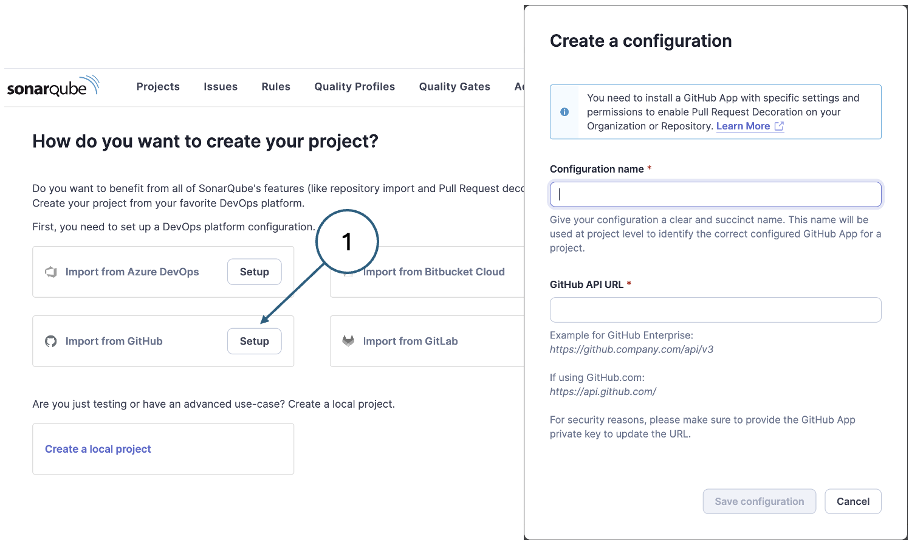
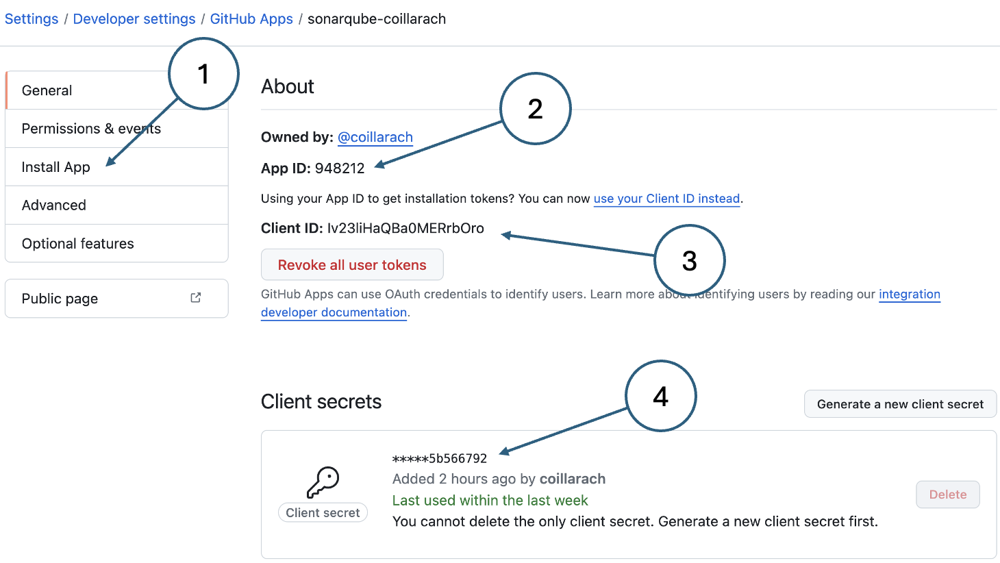
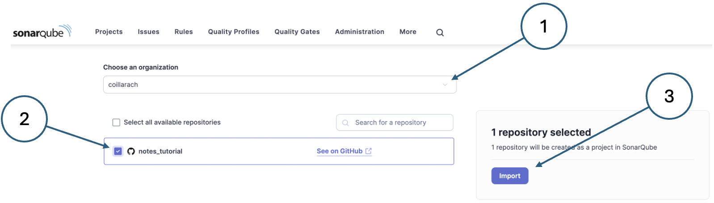
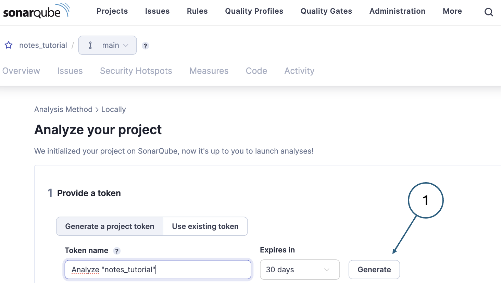
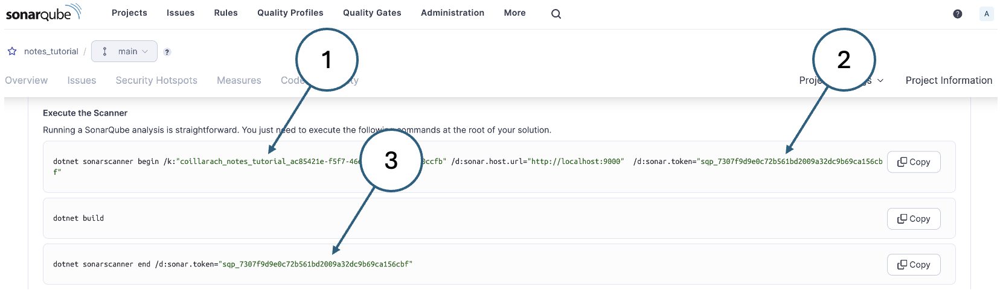
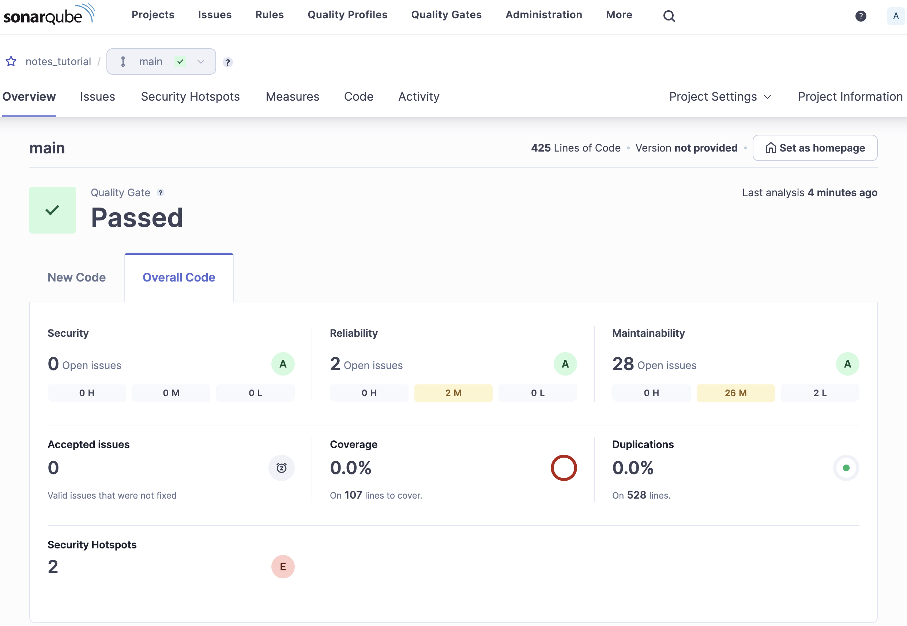
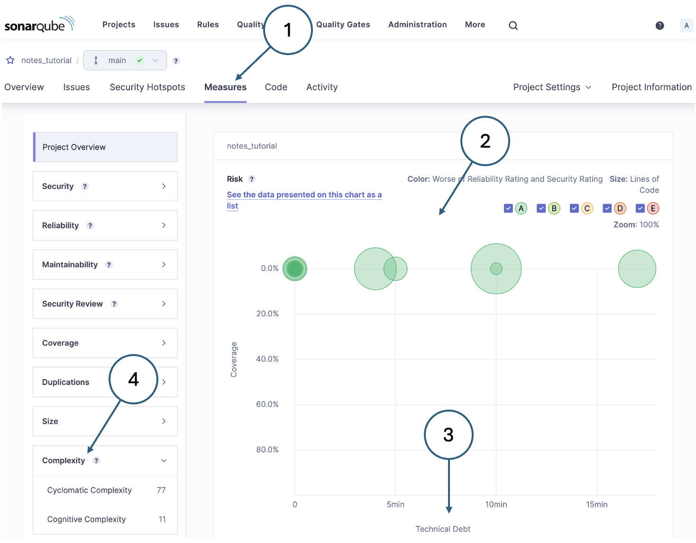

<!-- KaTeX CSS -->
<link rel="stylesheet" href="https://cdn.jsdelivr.net/npm/katex@0.13.18/dist/katex.min.css">

# Using SonarQube for static code analysis

[SonarQube](https://www.sonarsource.com/products/sonarqube/) is a popular tool for static code 
analysis that integrates with many technologies and services including .NET and GitHub. It is 
based on the Clean Code concept and applies a bank of language-specific rules to check code for 
poor quality such as violation of Clean Code conventions, syntax errors and code smells.

In a production environment, SonarQube is installed on a central server and incurs a licence fee. 
However, a free community version can be installed and run locally. It is distributed as a 
standalone executable, so no installation is required. Running the executable starts a local 
web server that provides a dashboard for configuration and viewing the results of an analysis. 
Setting up integration with GitHub provides access to all the project metadata including 
information about different branches. On the local computer, a .NET tool provides the integration 
with SonarQube so that an analysis is run automatically when the code is built.

{: .note-title}
> <i class="fa-solid fa-circle-info"></i> Note
>
> SonarQube integrates with the local .NET installation and not with VSCode. You will not see 
> any commands related to SonarQube on the VSCode command palette. Instead, you need to use some 
> CLI commands to ensure your build is analysed.

## 1. Install and run SonarQube

In this step, we will download the community version of SonarQube, run the local web server and 
access the dashboard.

1.  Download the [community version](https://www.sonarsource.com/products/sonarqube/downloads/) of 
    SonarQube.
    
2.  Unzip the distribution file to an appropriate directory.
    
    For example, this could be the `/opt` directory on Mac or Linux, or `C:\` on Windows.
    
3.  Add the SonarQube executable directory to your PATH.
    
    On Windows, use the [System Settings](https://learn.microsoft.com/en-us/previous-versions/office/developer/sharepoint-2010/ee537574(v=office.14)) dialog to add the directory `C:\sonarqube\bin\windows-x86-64` to your PATH. Adjust the path if necessary depending on where you have installed the application.
    
    On other operating systems, update your shell initialisation file to add the appropriate 
    directory to your PATH. On Mac, this is probably the `~/.zshrc` file and on Linux, the `~/.bashrc` file. In both cases, add a comment followed by the required update command. Both forms of the command are shown in the following snippet. Check that the name of your `sonarqube`directory matches the one shown.
    
    ```sh
    # Add SonarQube executable directory to the PATH
    export PATH="$PATH:/opt/sonarqube-10.6.0.92116/bin/macosx-universal-64"
    export PATH="$PATH:/opt/sonarqube-10.6.0.92116/bin/linux-x86-64"
    ```
    
    Note that for any operating system, the changes will only apply to a new shell. On Mac and Linux 
    you can apply the changes to the current shell by executing the update command at the command 
    prompt.
    
4.  Start SonarQube by executing the appropriate command at a command prompt.
    
    On Windows, the command is
    
    ```sh
    StartSonar.bat start
    ```
    
    On Mac and Linux, the command is
    
    ```sh
    sonar.sh start
    ```
        
5.  Login to SonarQube.
    
    By default, the bundled web server listens on port 9000. You can therefore access SonarQube by 
    navigating to `http://localhost 9000` in a browser.
    
    The default username/password is admin/admin. You will be prompted to change the password on 
    the first login.
    
    Because you have no projects at this stage, you are prompted to create a new project either by 
    creating one locally or by importing a project from a DevOps platform such as GitHub. You should choose the GitHub option as shown in Fig. 1. There are some other steps to complete before you can fill in the required information in the configuration creation dialog.
    
    {: standalone #fig1 data-title="Finding the settings button in GitHub" }

## 2. Configure GitHub integration

This step involves creating a GitHub app and installing it in your GitHub personal account. This is 
all done via the GitHub web interface.

### Register a GitHub App

Follow the [instructions](https://docs.github.com/en/apps/creating-github-apps/registering-a-github-app/registering-a-github-app) 
provided by GitHub to register the SonarQube app. You will need the following values:

*   **App name**: sonarqube-YOUR-GITHUB-USERNAME
    Note that the app name must be unique across GitHub, hence the use of your username as an element.
*   **Homepage URL**: HTTP://localhost:9000
*   **Callback URL**: HTTP://localhost:9000
*   SonaQube provides [guidance](https://docs.sonarsource.com/sonarqube/latest/devops-platform-integration/github-integration/setting-up-at-global-level/setting-up-github-app/) on the values that need to be set on the GitHub app. The main points are:
    *   Generate a client secret. This is a hexadecimal string that can be copied from the GitHub
        page once it has been generated.
    *   Generate a private key. This is in the form of a `*.pem` file which is automatically 
        downloaded on creation.
    *   Disable Webhooks.
    *   Set repository, organisation and account permissions carefully.
    *   Allow the app to be installed on any account.

### Install the GitHub app in your personal account

Fig. 2 shows the page that is displayed once the app is created. To install it, click the button in the menu (1). Before doing so, note the other details that you will need to complete the SonarQube integration.

{: standalone #fig2 data-title="GitHub app details" }

*   Install button
*   App id
*   Client id
*   Client secret. Note that you can only copy a client secret immediately after creation. If you 
    did not copy it at the time, you will need to create a new one.
{: .figure-labels}

Complete the installation by following the prompts. Refer to the [GitHub instructions](https://github.com/settings/apps/sonarqube-coillarach/installations) if you have any difficulties.

## 3. Complete local configuration

In this step we will complete the SonarQube/GitHub integration using the information about the 
GitHub app you have just set up.

1.  Going back to the SonarQube web page, complete the configuration creation dialog using the 
    following values:
    
    *   **Configuration name**: Any descriptive name (e.g. _sonarqube-github_)
    *   **GitHub API URL**: https://api.github.com/
    *   **GitHub App ID**: The app id from the GitHub app details page
    *   **Client ID**: The client id from the GitHub app details page
    *   **Client Secret**: The client secret that you generated during GitHub app creation
    *   **Private Key**: The entire contents of the downloaded `*.pem` file
2.  Specify the account and repository details.
    
    On the project onboarding page, select the organisation and repository as shown in Fig. 3 and 
    click _Import_
    
    {: standalone #fig3 data-title="GitHub project onboarding" }
    
3.  On the next page (_Clean as you Code_), select the option to use the global setting for the 
    project baseline, and then click the _Create Project_ button.
    
4.  The next page gives you options for how to analyse your projects. Choose the _Locally_ option.
    
5.  On the next page, generate a project token as shown in Fig. 4.
    
    {: standalone #fig4 data-title="Generating a project token" }
    
    The token is needed for communications between .NET and SonarQube. You will need to use the 
    value as part of the CLI command so you should copy it and keep it somewhere. The SonarQube interface does not allow you to recover a token value at a later date. If you lose a token value, you can always generate a new one.
    

## 4. Install .NET scanner tool

The instructions for this section are provided in the SonarQube interface after selecting .NET Core 
as the project type. They are reiterated here for completeness. If you run into any kind of 
difficulty, please refer to the 
[detailed instructions](https://docs.sonarsource.com/sonarqube/10.6/analyzing-source-code/scanners/sonarscanner-for-dotnet/).

1.  Install the scanner tool using the command below at a terminal prompt.
    
    dotnet tool install --global dotnet-sonarscanner
    
2.  Add the .NET tools directory to your PATH (if it is not already included).
    
    This is similar to the process above for updating the PATH variable. Use the 
    [System Settings](https://learn.microsoft.com/en-us/previous-versions/office/developer/sharepoint-2010/ee537574(v=office.14)) 
    on Windows or edit the shell initialisation file on Mac or Linux. The directories to add are
    
    *   **Windows**: `%USERPROFILE%\\.dotnet\\tools`
    *   **Mac or Linux**: `~/.dotnet/tools`
    
    The tool installation command also tells you how to do this once it completes.
    
    Remember that updating your shell initialisation only affects new shells. On Mac or Linux, you 
    can add the new PATH configuration in the same way as before. This is also true for the terminal 
    pane in VSCode. The simplest solution is to close it and start a new one.

## 5. Run an analysis

Before using SonarQube, there is one housekeeping task that needs to be done in order to maintain 
control over the GitHub repo. SonarQube creates a cache directory at the root of the solution which 
must be excluded from the codebase.

Edit the `.gitignore` file and add the following line:

```sh
.sonarqube
```

You are now ready to run an analysis for which you need both the _project key_ and the 
_project token_. The SonarQube page allows to to copy and paste the commands that you need 
with these values already embedded as shown in Fig. 5. just after you have created the token. 
However, if you want to re-use the same token you should copy it and save it somewhere. The 
SonarQube interface does not allow you to recover a token value at a later date.

{: standalone #fig5 data-title="SonarQube analysis commands" }

Three commands are needed to run the SonarQube analysis:

1.  `dotnet sonarscanner begin`: This command includes the project key (1) and the project token (2). 
    It essentially primes SonarQube to monitor the .NET build.
2.  `dotnet buld`: This is the standard .NET CLI command for building a project.
3.  `dotnet sonarscanner end`: This command includes the project key (3) and terminates the analysis. 
    The results are then delivered to the web dashboard.

Copy each command in turn and paste it into a VSCode terminal.

Once the last command terminates, go to the SonarQube dashboard to see the results.

## 6. Examine the results

The first analysis page shown in the SonarQube web interface is a summary like the one shown in Fig. 6.

{: standalone #fig6 data-title="SonarQube analysis summary" }

The example analysis shown here was run against the version of the Notes project that includes the 
migrations project. The summary shows that there are two potential reliability issues, 28 potential 
maintainability issues and zero test coverage. You can hover your mouse cursor over some of the 
elements on the page to learn more about what they mean.

Clicking the numerical value in each of the summary sections allows you to drill down to more detail. 
Doing that on the maintainability issues, for example, will display all 28 issues in a list. 
Clicking on one of the issues will let you drill down further to see the part of the codebase that 
contains the issue. The analysis also provides an explanation of why it is a problem and how to fix it.

### Measures and metrics

As well as identifying specific lines of code that might indicate problems, SonarQube also 
calculates some high-level quality measures. You can see them by clicking the _Measures_ item 
in the menu which will take you to a page like the one shown in Fig. 7.

{: standalone #fig7 data-title="SonarQube measures summary page" }

The overall health of the project is presented in graphical form (2) by default. This can be 
changed to a list display if needed, but the graphical version gives a good overall impression. 
Individual code files are shown as circles where the size of the circle indicates the size of the 
file in terms of lines of code. The colour depends on the number of serious issues identified in 
the file. In this case, they are all green indicating no major issues.

The vertical axis of the graph denotes test coverage - in the example, there are no tests and so 
all of the circular symbols apear at the top. The horizontal axis is technical debt (3) and its 
units are the estimated time required to fix the issues identified.

Most of the measures in the list are calculated by counting issues of particular kinds. However, 
the complexity measure (4) is calculated differently.

### Cyclomatic complexity

Cyclomatic complexity is a software metric used to measure the complexity of a program's control 
flow. Defined by [Thomas J. McCabe](https://doi.org/10.1109/TSE.1976.233837) in 1976, it quantifies 
the number of linearly independent paths through a program's source code. This is calculated using 
the formula

$$M = E - N + 2P$$

where

E = the number of edges in the control flow graph

N = the number of nodes

P = the number of connected components (typically 1 for a single program)

A higher cyclomatic complexity indicates a more complex program, which can be harder to understand, 
test, and maintain. This metric helps developers identify potentially problematic areas in the code 
that may require more thorough testing or refactoring to improve readability and maintainability. 
By managing cyclomatic complexity, teams can enhance code quality and reduce the likelihood of defects.

There is no specific value of cyclomatic complexity that can be used as an upper limit in all cases. 
However, [NIST235](http://www.mccabe.com/pdf/mccabe-nist235r.pdf) suggests that a limit of 10 is a 
good starting point:

> The precise number to use as a limit, however, remains somewhat controversial. The original limit 
> of 10 as proposed by McCabe has significant supporting evidence, but limits as high as 15 have 
> been used successfully as well. Limits over 10 should be reserved for projects that have several 
> operational advantages over typical projects, for example experienced staff, formal design, a 
> modern programming language, structured programming, code walkthroughs, and a comprehensive test 
> plan. In other words, an organization can pick a complexity limit greater than 10, but only if 
> it is sure it knows what it is doing and is willing to devote the additional testing effort 
> required by more complex modules.
> 
> [NIST235](http://www.mccabe.com/pdf/mccabe-nist235r.pdf)

Note that the value shown in Fig. 7 appears to be very high at 77; however, that is the sum of the 
values for each individual file. Clicking on the entry in the left-hand list allows you to drill 
done through the directory structure to individual files.

### Cognitive complexity

While cyclomatic complexity accurately calculates the minimum number of test cases required for 
full test coverage, it is not a good indicator of understandability. Methods with equal cyclomatic 
complexity scores are not necessarily equally difficult to maintain and it therefore over-values 
some structures and under-values others. Because it was designed for use on Fortran programs in 1976, 
cyclomatic complexity does not take account of more recent language structures such as try/catch and 
lambdas.

In response to the limitations of cyclomatic complexity, the new metric of _cognitive complexity_ 
was formulated as a way of calculating complexity scores that more accurately reflect methods’ 
relative understandability. It attempts to reflect perceived complexity rather than representing 
it purely as a mathematical derivation. The details of how it works are presented in a 
[SonarQube white paper](https://www.sonarsource.com/resources/cognitive-complexity/) which offers 
the following simple example that illustrates the difference between cyclomatic and cognitive 
complexity scores.


``` c#
// METHOD A
// 
// Cyclomatic complexity = 4
// Cognitive complexity = 7

int sumOfPrimes(int max) {
  int total = 0;
  OUT: for (int i = 1; i <= max; ++i) {
    for (int j = 2; j < i; ++j) {
      if (i % j == 0) {
        continue OUT;
      }
    }
    total += i;
  }
  return total;
}
```
{: .side-by-side}


``` c#
// METHOD B
//
// Cyclomatic complexity = 4
// Cognitive complexity = 1

String getWords(int number) {
  switch (number) {
    case 1:
      return "one";
    case 2:
      return "a couple";
    case 3:
      return "a few";
    default:
      return "lots";
  }
}
```
{: .side-by-side}

The code blocks above show two methods, A and B, with their cyclomatic and cognitive complexity
scores. While the cyclomatic complexity scores are the same, cognitive complexity is intuitively the 
better measure in this simple case.

## 7. Stop SonarQube

SonarQube consumes very few resources where it is not active, and it is safe to leave it running. 
However, you may want to stop it just for tidiness. If so, use one of the following commands at a 
terminal prompt:

Windows:

```sh
StartSonar.bat stop
```

Mac or Linux:

```sh
sonar.sh stop
```
If you would like SonaQube to start automatically where you boot your computer, you can configure 
it as a service. Doing this is beyond the scope of this tutorial, but the SonarQube documentation 
provides clear 
[instructions](https://docs.sonarsource.com/sonarqube/latest/setup-and-upgrade/configure-and-operate-a-server/operating-the-server/).
