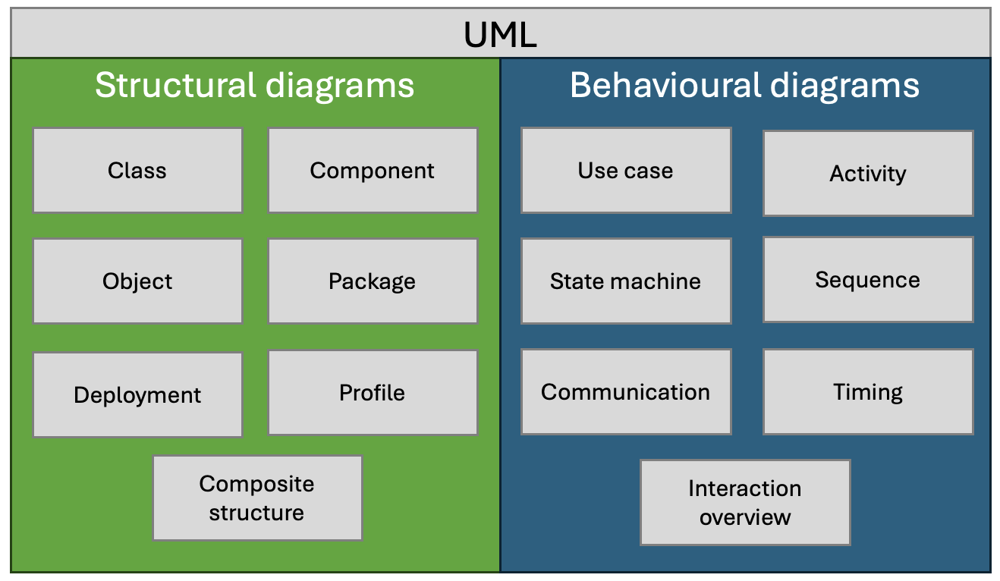
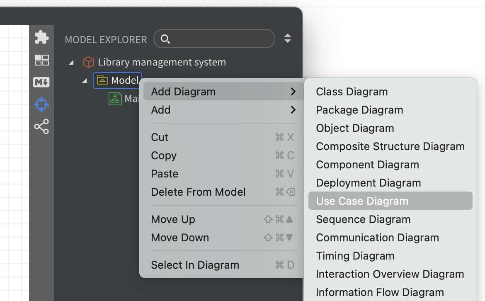
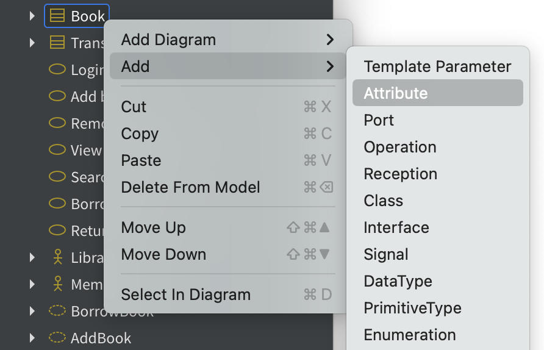
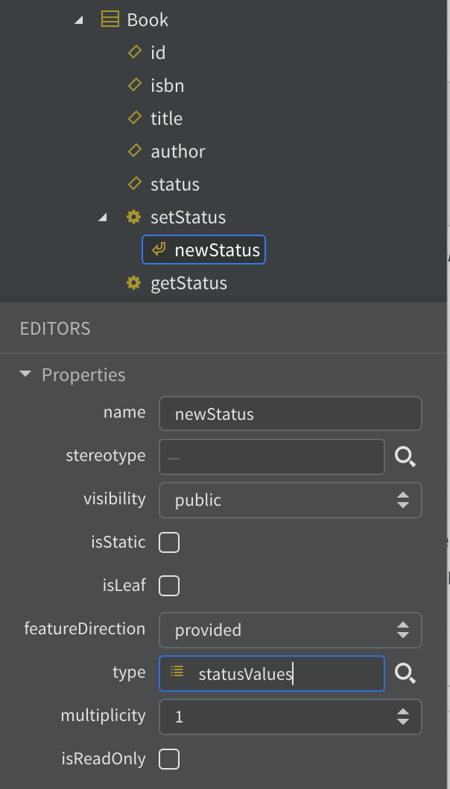
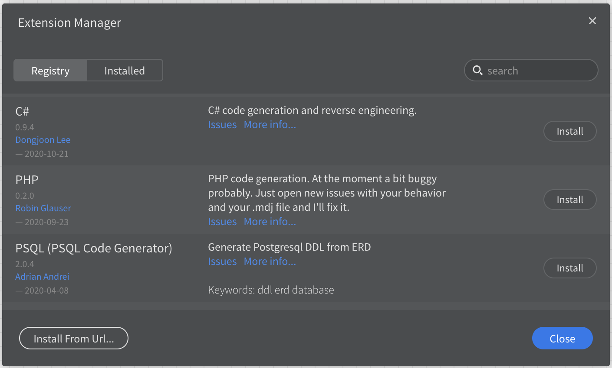
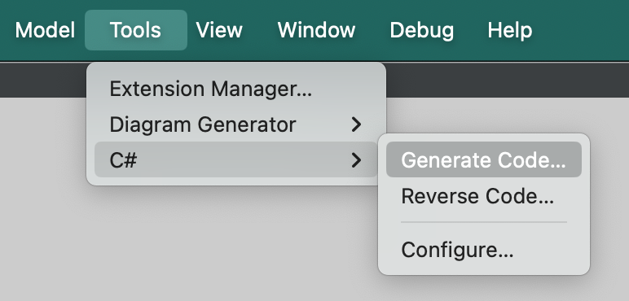

# Creating a UML model using StarUML

## 1. Introduction

Unified Modeling Language ([UML](https://www.omg.org/spec/UML){:target="_blank"}) is a standardized visual
language used to describe, specify, design, and document the artefacts of a software
system. UML provides a set of graphic notation techniques to create abstract models
of the system, which can be understood and used by stakeholders with varying
technical backgrounds. The primary purpose of UML is to help software engineers
visualize the design of a system in a way that is both comprehensive and intuitive,
facilitating better communication, understanding, and collaboration among team
members. In software engineering, UML is of paramount importance as it helps in
planning and structuring complex systems, ensuring that all components and their
interactions are clearly defined and documented. This not only enhances the
quality and maintainability of the software but also streamlines the development
process by providing a common language that bridges the gap between conceptual
design and actual implementation.   

UML is a collection of 14 diagram types that can be broadly categorised as
structural and behavioural as shown in Fig. 1. Structural diagrams and behavioural
diagrams in UML serve different purposes in modelling a software system. Structural
diagrams focus on the static aspects of the system, depicting the system's
components and their relationships. Examples include class diagrams, which show
the system's classes and their attributes, and component diagrams, which illustrate
the organization and dependencies among software components. On the other hand,
behavioural diagrams capture the dynamic aspects of the system, modelling how the
system behaves and interacts over time. Examples include sequence diagrams, which
show the sequence of messages exchanged between objects, and activity diagrams,
which depict the flow of control or activities within the system. Together, these
diagrams provide a comprehensive view of both the structure and behaviour of the
software system.  

{: standalone #fig1}

In an Agile project, UML fits seamlessly into the iterative and incremental
development lifecycle by providing a visual framework for planning, designing,
and communicating complex software structures and behaviours. During the early
stages, UML diagrams such as use case diagrams help capture and clarify user
requirements, ensuring that the development team and stakeholders have a shared
understanding of the project's scope and goals. As the project progresses through
sprints, class diagrams, sequence diagrams, and activity diagrams are used to
design and document the system's architecture and interactions, facilitating
effective planning and implementation of user stories. UML's flexibility allows
for continuous refinement and adaptation of the models, aligning with Agile's
emphasis on responding to change and improving through iterative feedback. By
integrating UML into Agile practices, teams can maintain a clear and organized
design process, improve communication, and ensure that the evolving system meets
both functional and non-functional requirements effectively.  

This set of practical exercises does not aim to explain what each UML diagram
type is for and how it is used - it is assumed that you already have some
experience with the diagrams themselves. Instead, we will focus on the use of
the [StarUML](https://staruml.io/){:target="_blank"} modelling tool to create some example diagrams
for a simple scenario.

## 2. Setting Up the Environment

First, you need to download and install [StarUML](https://staruml.io/){:target="_blank"} using the
instructions on the website.

As the website explains, users often confuse diagramming tools like Microsoft
Visio with modelling tools like StarUML. It is important to understand that a
diagram is not a model. A software _model_ describes aspects of a software system
such as structure, behaviour, or requirements and can be represented textually,
mathematically, or visually. A _diagram_, on the other hand, is a visual
representation of a software model, focusing on specific aspects like class
hierarchy or object interaction. Diagrams consist of view elements that visually
represent model elements. A model _element_ has its own data and can be rendered
in multiple view elements across different diagrams, ensuring changes to the
model element are reflected in all corresponding diagrams.

Familiarise yourself with the [StarUML interface](https://docs.staruml.io/user-guide/user-interface){:target="_blank"} and its
main terminology including the terms

*   Project
*   Fragment
*   Element
*   Extension

## 3. Scenario

We will be modelling an online library management system where users can browse,
borrow, and return books. The system has two main user roles: **Librarian** and
**Member**. The database backend stores information about books, users, and
transactions, while the user interface allows users to interact with the system.

### User Roles

1.  **Librarian**: Manages the library's inventory and oversees member activities.
2.  **Member**: Searches for books, borrows them, and returns them.

### Classes

1.  **User**
    *   Attributes: userID, name, email, password
    *   Methods: login(), logout()
2.  **Librarian** (inherits from User)
    *   Attributes: employeeID
    *   Methods: addBook(), removeBook(), viewMemberActivity()
3.  **Member** (inherits from User)
    *   Attributes: memberID, borrowedBooks
    *   Methods: searchBook(), borrowBook(), returnBook()
4.  **Book**
    *   Attributes: bookID, title, author, ISBN, status
    *   Methods: updateStatus()
5.  **Transaction**
    *   Attributes: transactionID, bookID, memberID, borrowDate, returnDate
    *   Methods: recordTransaction()

### Database Backend

*   Tables: Users, Books, Transactions
*   Relationships: Users to Transactions (one-to-many), Books to Transactions
    (one-to-many)

### User Interface

1.  **Librarian Interface**
    *   Login/Logout
    *   Add/Remove Book
    *   View Member Activity
2.  **Member Interface**
    *   Login/Logout
    *   Search for Books
    *   Borrow Book
    *   Return Book

## 4. Set up a StarUML project

A _project_ in StarUML is a container for a model. As you work through the
modelling process, you will add detail to the model by adding diagrams to the project.

StarUML offers the opportunity to use structural templates for a project. For
simplicity, however, we will be starting with an unstructured model which is
the default when starting the application.

Give the project the name "Library management system" and save it to an
appropriate location on your computer.

For more information, see the relevant part of the
[StarUML documentation](https://docs.staruml.io/user-guide/managing-project){:target="_blank"}.

## 5. Use Case Diagram

As a first step in elaborating the model, we will add a use case diagram.
StarUML provides several options for doing this, but it is important to select
the containing item in the navigator first. For this reason, it is a good idea
to get used to right-clicking the appropriate item and using the popup menu to
create the diagram as shown in Fig. 2.

{: standalone #fig2}

Your diagram should contain the following elements:

*   **Actors**: Librarian, Member
*   **Use Cases**: Login, Add Book, Remove Book, View Member Activity, Search Book,
    Borrow Book, Return Book

For more information, see the relevant part of the
[StarUML documentation](https://docs.staruml.io/working-with-uml-diagrams/use-case-diagram){:target="_blank"}.

Remember to save your diagram after each modification.

## 6. Class Diagram

Next, add a class diagram to the model that includes the following information:

*   **Classes**: User, Librarian, Member, Book, Transaction
*   **Relationships**: Inheritance (Librarian and Member inherit from User),
    Associations (User to Transaction, Book to Transaction)

Note that the StarUML menus are context-sensitive. You may need to close your
use case diagram before the option to create a class diagram is available.

Remember to create your new diagram by right-clicking the model in the navigator.
If you forget, you can either close the model without saving and re-open it, or
delete the unwanted elements from the navigator.

For more information, see the relevant part of the
[StarUML documentation](https://docs.staruml.io/working-with-uml-diagrams/class-diagram){:target="_blank"}.  

## 7. Sequence Diagrams

The next stage is to add sequence diagrams that describe two example processes
as specified below.

1.  **Member Borrows a Book**
    *   Sequence: Member searches for a book, selects a book, system checks
        availability, records transaction, updates book status.
2.  **Librarian Adds a Book**

*   Sequence: Librarian logs in, enters book details, system updates book inventory.

For more information, see the relevant part of the
[StarUML documentation](https://docs.staruml.io/working-with-uml-diagrams/sequence-diagram){:target="_blank"}.  

## 8. Activity Diagram

As a final example in this tutorial, we will add an activity diagram for the
process of borrowing a book as described below.

*   Member searches for a book
*   Member selects a book
*   System checks availability
    *   if available

        *   System records transaction

        *   System updates book status

        *   System confirms borrow action
    *   otherwise

    *   System displays _unavailable_ message

Use swimlanes to separate the actions that are performed by the member from
those performed by the system.

For more information, see the relevant part of the
[StarUML documentation](https://docs.staruml.io/working-with-uml-diagrams/activity-diagram){:target="_blank"}.

## 9. Check your solution

StarUML can export the full model including the various diagrams as HTML pages.
Compare your solution to the one available
[here](images/html-docs/index.html){:target="_blank"}.

You should find some differences since the online solution contains some
additional information. In the next step, you will add the missing information.

## 10. Add more detail

Close any diagrams that you have open and save your work.

This part of the tutorial demonstrates the difference between a model and a diagram.
In the first step, we will add some properties and methods to our classes; however,
instead of updating the class diagram, we will add the details directly to each
class using the navigator.

If you did not give your model elements names as you went along, you may want
to do that now to make navigation easier. Then find the _book_ class in the
navigator and right-click on it. This will display a context menu as shown in
Fig. 3. where you have options to add attributes (properties) and operations
(methods).

{: standalone #fig3}

Add the following properties to your classes:

*   Book
    *   id
    *   isbn
    *   title
    *   author
    *   status
*   User
    *   id
    *   name
    *   email
    *   password
*   Transaction

*   id
*   transactionDate
*   transactionType

Note that a book may have more than one author.

Using a similar approach, add the following methods to your _book_ class:

*   getStatus
*   setStatus

_setStatus_ requires a parameter that represents the new book status. For this,
we first need to add an enumeration called _statusValues_ to the _book_ class
using the context menu.

Once added, use the context menu again to add three statuses:

*   on_shelf
*   on_load
*   lost

Now we can use the enumeration to define a parameter for _setStatus_. Right-click
on _setStatus_ and select **Add->Parameter** from the context menu. One of the
properties of the parameter is _type_ which should be set to the name of the
enumeration as shown in Fig. 4. You can use the magnifying glass icon to search
for the enumeration in the model.

{: standalone #fig4}

Now open the class diagram - you will see that the new information is included
even though the diagram has not been edited. You may need to tidy up the layout
a little.

Save your work and check your solution against the
[online version](images/html-docs/index.html){:target="_blank"} again. You should
find that it is a better match.

You can create similar documentation from your own model by choosing
**File->Export->HTML Docs...** from the menu.

## 11. Put the model to work

In this final stage, we will use the model to generate some C# code that can be
used as the starting point for a development project. To do this, we will need
to add an extension to StarUML.

Open the extension manager from the **Tools** menu. Fin the extension called _C#_
by Dongjoon Lee as shown in Fig. 5 and click _Install_.

{: standalone #fig5}

The extension adds some new options to the **Tools** menu as shown in Fig. 6.
Select the **Generate code...** option.

{: standalone #fig6}

Follow the prompts to generate your code and examine the results with a text
editor. You will see that there is still a lot of detail to fill in, but the
files that have been created provide a structure that corresponds to your model.
Using this structure helps to avoid overlooking details as you start the
implementation.
